<!-- .slide: class="section" data-state="section-slide" data-background-image="images/sections/title.jpg" data-background-opacity="0.55" -->


# Built with AI, <em>not by AI</em>

Nine months of building a Parquet library with an agent

<span class="aside">Gunnar Morling · @gunnarmorling</span>

<span class="credit">© mrpolyonymous https://flic.kr/p/a6j2Z7 (CC BY 2.0)</span>


---

<!-- .slide: class="geo" data-background-image="images/geo-backdrop.svg" data-background-size="cover" -->

## A contributor's pull request

<div class="stamped">
  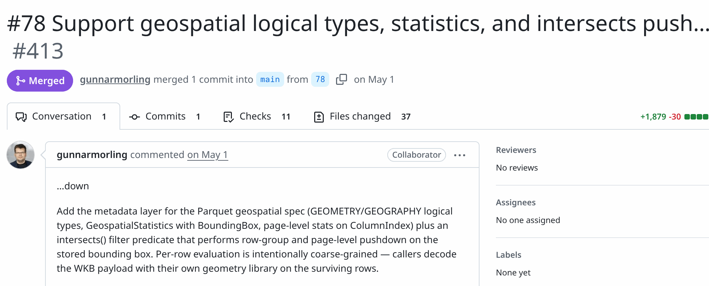
  <div class="stamp fragment" data-fragment-index="0" style="left: 770px; top: 60px; --rot: -5deg; --c: #2e7d32">✓ Tests green</div>
  <div class="stamp fragment" data-fragment-index="1" style="left: 740px; top: 140px; --rot: 3deg; --c: #2e7d32">✓ Merged, May 1</div>
  <div class="stamp fragment" data-fragment-index="2" style="left: 640px; top: 220px; --rot: -4deg; --c: #2e7d32">✓ Shipped in 1.0.0.CR1</div>
  <div class="stamp stamp-big fragment" data-fragment-index="3" style="left: 60px; top: 320px; --rot: -5deg; --c: #c62828">The feature couldn't work</div>
</div>


---

<!-- .slide: class="hero geo" data-background-image="images/geo-backdrop.svg" data-background-size="cover" -->

## How does someone careful end up here?

<span class="aside">Back to the holidays.</span>


---

<!-- .slide: class="section" data-state="section-slide" data-background-image="images/sections/the-magic.jpg" data-background-opacity="0.4" -->

# 1 · The magic

<span class="credit">© Alex Holyoake https://flic.kr/p/AN2ZRn (CC BY 2.0)</span>


---

<!-- .slide: class="wide" -->

<div class="montage">
  <h2>Do you remember the start of the year?</h2>
  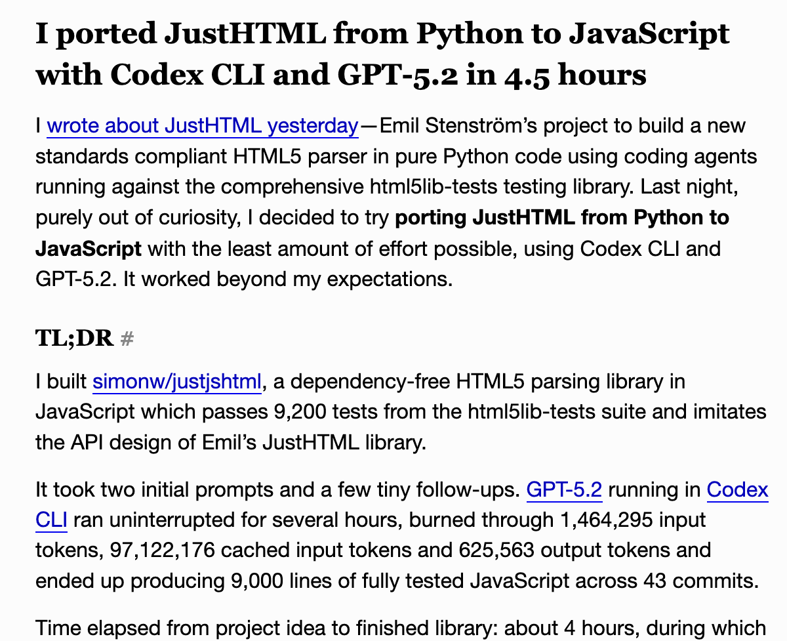
  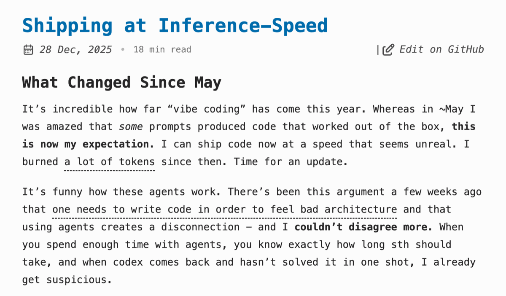
  
  
  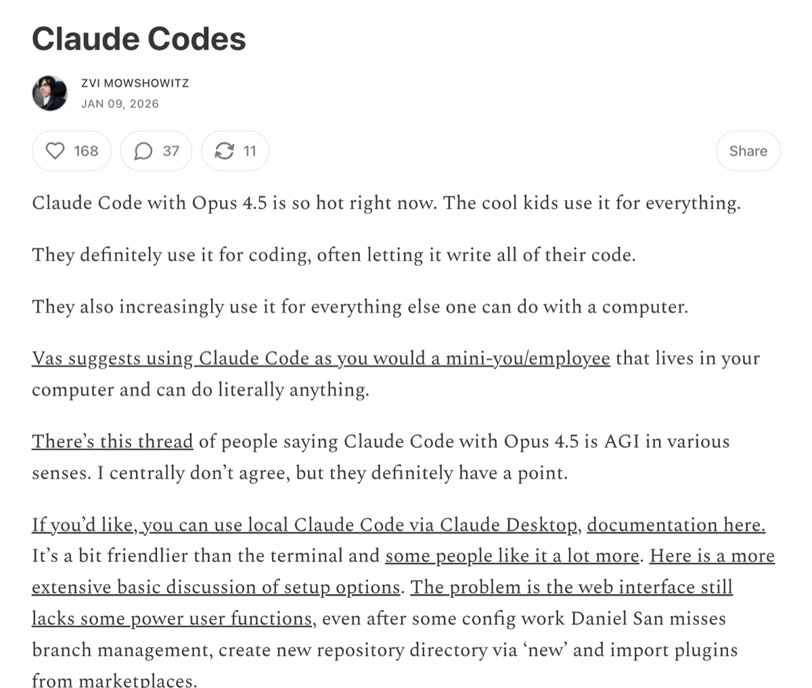
  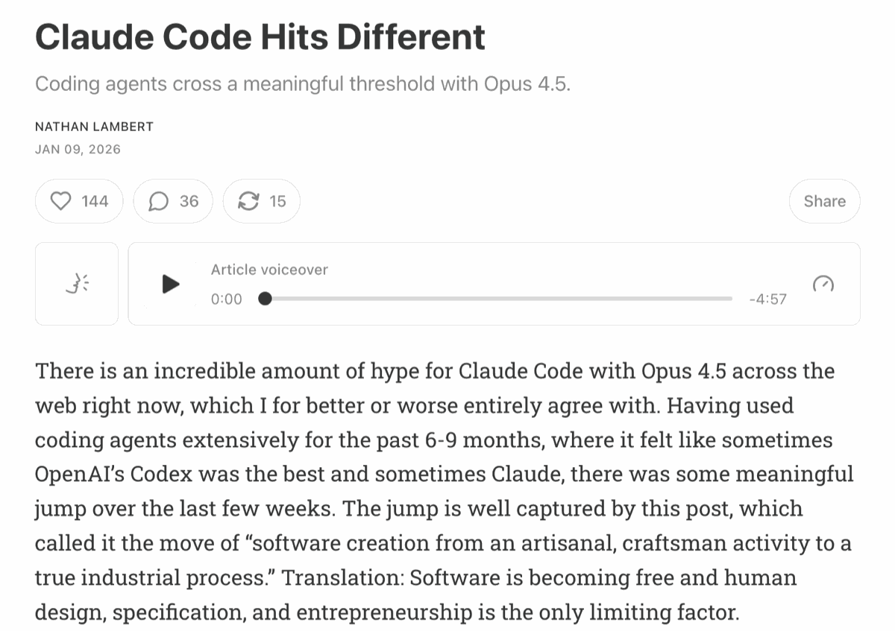
  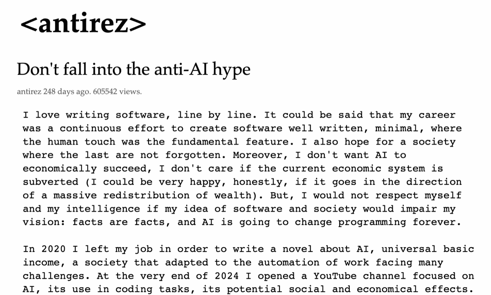
  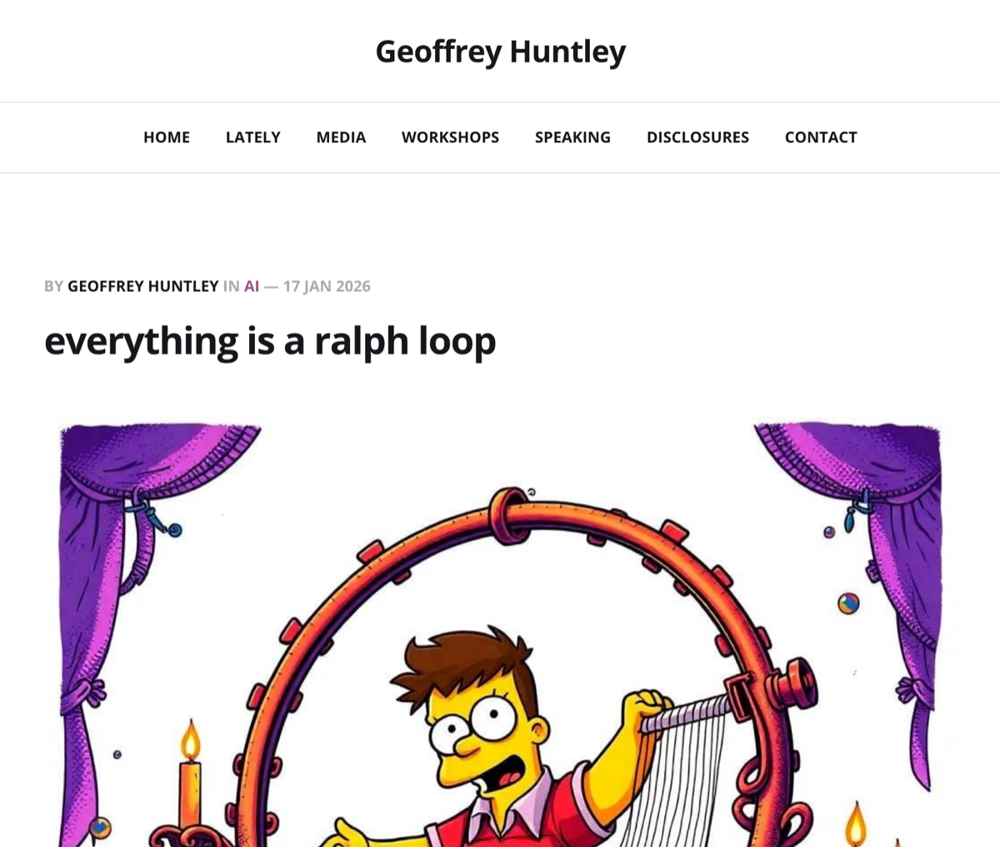
</div>


---

<!-- .slide: class="hero" -->

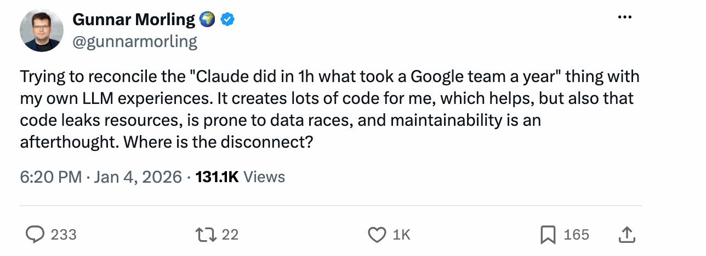

## Only one way to <em>find out</em>.

<span class="aside">On a real problem, not a toy project.</span>


---

## parquet-java's default classpath

<span class="subtitle">111 JARs, 65 MB</span>

<pre class="classpath">lib/accessors-smart-1.2.jar:lib/aircompressor-2.0.2.jar:lib/animal-sniffer-annotations-1.17.jar:lib/asm-5.0.4.jar:lib/avro-1.7.7.jar:lib/checker-qual-2.5.2.jar:lib/commons-beanutils-1.9.4.jar:lib/commons-cli-1.2.jar:lib/commons-codec-1.11.jar:lib/commons-collections-3.2.2.jar:lib/commons-compress-1.19.jar:lib/commons-configuration2-2.1.1.jar:lib/commons-io-2.5.jar:lib/commons-lang3-3.7.jar:lib/commons-logging-1.1.3.jar:lib/commons-math3-3.1.1.jar:lib/commons-net-3.6.jar:lib/commons-pool-1.6.jar:lib/commons-text-1.4.jar:lib/curator-client-4.2.0.jar:lib/curator-framework-4.2.0.jar:lib/curator-recipes-4.2.0.jar:lib/dnsjava-2.1.7.jar:lib/failureaccess-1.0.jar:lib/gson-2.2.4.jar:lib/guava-27.0-jre.jar:lib/hadoop-annotations-3.3.0.jar:lib/hadoop-auth-3.3.0.jar:lib/hadoop-client-3.3.0.jar:lib/hadoop-common-3.3.0.jar:lib/hadoop-hdfs-client-3.3.0.jar:lib/hadoop-mapreduce-client-common-3.3.0.jar:lib/hadoop-mapreduce-client-core-3.3.0.jar:lib/hadoop-mapreduce-client-jobclient-3.3.0.jar:lib/hadoop-shaded-protobuf_3_7-1.0.0.jar:lib/hadoop-yarn-api-3.3.0.jar:lib/hadoop-yarn-client-3.3.0.jar:lib/hadoop-yarn-common-3.3.0.jar:lib/htrace-core4-4.1.0-incubating.jar:lib/httpclient-4.5.6.jar:lib/httpcore-4.4.10.jar:lib/j2objc-annotations-1.1.jar:lib/jackson-annotations-2.10.3.jar:lib/jackson-core-2.10.3.jar:lib/jackson-core-asl-1.9.13.jar:lib/jackson-databind-2.10.3.jar:lib/jackson-jaxrs-base-2.10.3.jar:lib/jackson-jaxrs-json-provider-2.10.3.jar:lib/jackson-mapper-asl-1.9.13.jar:lib/jackson-module-jaxb-annotations-2.10.3.jar:lib/jakarta.activation-api-1.2.1.jar:lib/jakarta.xml.bind-api-2.3.2.jar:lib/javax.activation-api-1.2.0.jar:lib/javax.annotation-api-1.3.2.jar:lib/javax.servlet-api-3.1.0.jar:lib/jaxb-api-2.2.11.jar:lib/jcip-annotations-1.0-1.jar:lib/jersey-client-1.19.jar:lib/jersey-core-1.19.jar:lib/jersey-servlet-1.19.jar:lib/jetty-client-9.4.20.v20190813.jar:lib/jetty-http-9.4.20.v20190813.jar:lib/jetty-io-9.4.20.v20190813.jar:lib/jetty-security-9.4.20.v20190813.jar:lib/jetty-servlet-9.4.20.v20190813.jar:lib/jetty-util-9.4.20.v20190813.jar:lib/jetty-webapp-9.4.20.v20190813.jar:lib/jetty-xml-9.4.20.v20190813.jar:lib/jline-3.9.0.jar:lib/json-smart-2.3.jar:lib/jsp-api-2.1.jar:lib/jsr305-3.0.2.jar:lib/jsr311-api-1.1.1.jar:lib/jts-core-1.20.0.jar:lib/kerb-admin-1.0.1.jar:lib/kerb-client-1.0.1.jar:lib/kerb-common-1.0.1.jar:lib/kerb-core-1.0.1.jar:lib/kerb-crypto-1.0.1.jar:lib/kerb-identity-1.0.1.jar:lib/kerb-server-1.0.1.jar:lib/kerb-simplekdc-1.0.1.jar:lib/kerb-util-1.0.1.jar:lib/kerby-asn1-1.0.1.jar:lib/kerby-config-1.0.1.jar:lib/kerby-pkix-1.0.1.jar:lib/kerby-util-1.0.1.jar:lib/kerby-xdr-1.0.1.jar:lib/listenablefuture-9999.0-empty-to-avoid-conflict-with-guava.jar:lib/log4j-1.2.17.jar:lib/nimbus-jose-jwt-7.9.jar:lib/okhttp-2.7.5.jar:lib/okio-1.6.0.jar:lib/paranamer-2.3.jar:lib/parquet-column-1.17.1.jar:lib/parquet-common-1.17.1.jar:lib/parquet-encoding-1.17.1.jar:lib/parquet-format-structures-1.17.1.jar:lib/parquet-hadoop-1.17.1.jar:lib/parquet-jackson-1.17.1.jar:lib/protobuf-java-2.5.0.jar:lib/re2j-1.1.jar:lib/slf4j-api-1.7.33.jar:lib/snappy-java-1.1.10.7.jar:lib/stax2-api-3.1.4.jar:lib/token-provider-1.0.1.jar:lib/websocket-api-9.4.20.v20190813.jar:lib/websocket-client-9.4.20.v20190813.jar:lib/websocket-common-9.4.20.v20190813.jar:lib/woodstox-core-5.0.3.jar:lib/zstd-jni-1.5.7-3.jar</pre>


---

<!-- .slide: class="hero" -->

## In 2024, this was the <em>wrong project</em>.

<span class="aside">Nobody writes a Parquet library from scratch.</span>


---

## A new project is born

<span class="subtitle">Hardwood: a lightweight Parquet library for the JVM</span>

<div class="born">

- Minimal dependencies
- Fast
- Complete
- Scalable
- Embeddable
- Library, CLI, TUI

<div class="born-listing">

```java
try (ParquetFileReader file =
      ParquetFileReader.open(InputFile.of(path));
    RowReader rows = file.rowReader()) {

  while (rows.hasNext()) {
    rows.next();

    long id = rows.getLong("id");
    String name = rows.getString("name");
    LocalDate born = rows.getDate("birth_date");
  }
}
```

</div>
</div>


---

<!-- .slide: class="timeline" -->

## From first commit to 1.0

<!-- release-timeline:1 -->
<div class="rtl">
<svg class="rtl-layer" viewBox="0 0 1280 720" width="1280" height="720"><line class="rtl-axis" x1="96" y1="395" x2="1184" y2="395"/><line class="rtl-tick" x1="96" y1="389" x2="96" y2="401"/><text class="rtl-month" x="102" y="421">Jan</text><line class="rtl-tick" x1="282" y1="389" x2="282" y2="401"/><text class="rtl-month" x="288" y="421">Feb</text><line class="rtl-tick" x1="451" y1="389" x2="451" y2="401"/><text class="rtl-month" x="457" y="421">Mar</text><line class="rtl-tick" x1="637" y1="389" x2="637" y2="401"/><text class="rtl-month" x="643" y="421">Apr</text><line class="rtl-tick" x1="817" y1="389" x2="817" y2="401"/><text class="rtl-month" x="823" y="421">May</text><line class="rtl-tick" x1="1004" y1="389" x2="1004" y2="401"/><text class="rtl-month" x="1010" y="421">Jun</text></svg>
<div class="rtl-event fragment" data-fragment-index="0"><svg class="rtl-layer" viewBox="0 0 1280 720" width="1280" height="720"><line class="rtl-connector" x1="126" y1="395" x2="126" y2="298"/></svg>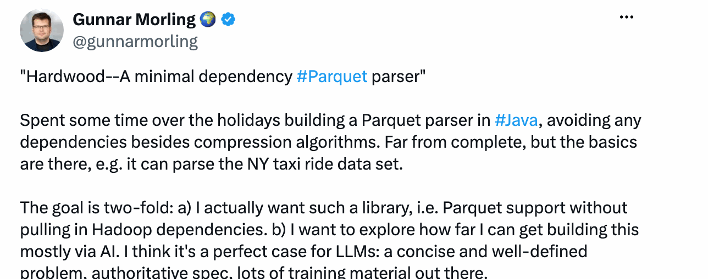</div>
<div class="rtl-event fragment" data-fragment-index="1"><svg class="rtl-layer" viewBox="0 0 1280 720" width="1280" height="720"><line class="rtl-connector" x1="276" y1="395" x2="386" y2="298"/></svg>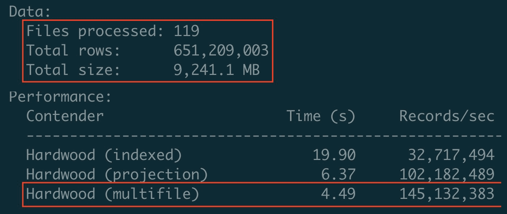</div>
<div class="rtl-event fragment" data-fragment-index="2"><svg class="rtl-layer" viewBox="0 0 1280 720" width="1280" height="720"><line class="rtl-connector" x1="318" y1="395" x2="318" y2="492"/></svg></div>
<div class="rtl-event fragment" data-fragment-index="3"><svg class="rtl-layer" viewBox="0 0 1280 720" width="1280" height="720"><line class="rtl-connector" x1="433" y1="395" x2="446" y2="492"/></svg></div>
<div class="rtl-event fragment" data-fragment-index="4"><svg class="rtl-layer" viewBox="0 0 1280 720" width="1280" height="720"><line class="rtl-connector" x1="439" y1="395" x2="732" y2="298"/></svg><div class="rtl-card rtl-note" style="left: 716px; top: 186px; width: 234px; height: 112px">“Is Hardwood vibe-coded? <em>Absolutely not.</em>”</div></div>
<div class="rtl-event fragment" data-fragment-index="0"><svg class="rtl-layer" viewBox="0 0 1280 720" width="1280" height="720"><circle class="rtl-dot" cx="114" cy="395" r="7"/><text class="rtl-label" x="114" y="379" text-anchor="middle">First commit</text></svg></div>
<div class="rtl-event fragment" data-fragment-index="1"><svg class="rtl-layer" viewBox="0 0 1280 720" width="1280" height="720"><circle class="rtl-dot" cx="276" cy="395" r="7"/></svg></div>
<div class="rtl-event fragment" data-fragment-index="2"><svg class="rtl-layer" viewBox="0 0 1280 720" width="1280" height="720"><circle class="rtl-dot" cx="318" cy="395" r="7"/></svg></div>
<div class="rtl-event fragment" data-fragment-index="3"><svg class="rtl-layer" viewBox="0 0 1280 720" width="1280" height="720"><circle class="rtl-dot" cx="433" cy="395" r="7"/><text class="rtl-label" x="433" y="379" text-anchor="middle">Alpha1</text></svg></div>
<div class="rtl-event fragment" data-fragment-index="4"><svg class="rtl-layer" viewBox="0 0 1280 720" width="1280" height="720"></svg></div>
<div class="rtl-event fragment" data-fragment-index="5"><svg class="rtl-layer" viewBox="0 0 1280 720" width="1280" height="720"><line class="rtl-span" x1="547" y1="395" x2="607" y2="395"/><text class="rtl-span-label" x="577" y="421" text-anchor="middle">S3 in ten days</text></svg></div>
</div>
<!-- /release-timeline:1 -->


---

## S3 support

<span class="subtitle">Mar 17: with the AWS SDK · Mar 27: without it</span>

<div class="columns top deptrees">
<div>
<p class="deptree-label"><code>mvn dependency:tree</code>, Mar 17 · <strong>30 JARs, 8.3 MB</strong></p>
<pre class="deptree"><code class="nohighlight" data-noescape>dev.hardwood:hardwood-s3
+- dev.hardwood:hardwood-core
+- software.amazon.awssdk:s3:2.42.17
|  +- software.amazon.awssdk:aws-xml-protocol:2.42.17
|  |  \- software.amazon.awssdk:aws-query-protocol:2.42.17
|  +- software.amazon.awssdk:protocol-core:2.42.17
|  +- software.amazon.awssdk:arns:2.42.17
|  +- software.amazon.awssdk:profiles:2.42.17
|  +- software.amazon.awssdk:http-auth:2.42.17
|  +- software.amazon.awssdk:identity-spi:2.42.17
|  +- software.amazon.awssdk:http-auth-spi:2.42.17
|  |  \- org.reactivestreams:reactive-streams:1.0.4
|  +- software.amazon.awssdk:http-auth-aws:2.42.17
|  +- software.amazon.awssdk:checksums:2.42.17
|  +- software.amazon.awssdk:checksums-spi:2.42.17
|  +- software.amazon.awssdk:retries-spi:2.42.17
|  +- software.amazon.awssdk:sdk-core:2.42.17
|  |  \- software.amazon.awssdk:retries:2.42.17
|  +- software.amazon.awssdk:auth:2.42.17
|  |  +- software.amazon.awssdk:http-auth-aws-eventstream:2.42.17
|  |  \- software.amazon.eventstream:eventstream:1.0.1
|  +- software.amazon.awssdk:http-client-spi:2.42.17
|  +- software.amazon.awssdk:regions:2.42.17
|  +- software.amazon.awssdk:annotations:2.42.17
|  +- software.amazon.awssdk:utils:2.42.17
|  +- software.amazon.awssdk:aws-core:2.42.17
|  |  \- software.amazon.awssdk:utils-lite:2.42.17
|  +- software.amazon.awssdk:metrics-spi:2.42.17
|  +- software.amazon.awssdk:json-utils:2.42.17
|  |  \- software.amazon.awssdk:third-party-jackson-core:2.42.17
|  \- software.amazon.awssdk:endpoints-spi:2.42.17
\- software.amazon.awssdk:url-connection-client:2.42.17</code></pre>
</div>
<div class="fragment">
<p class="deptree-label">Mar 27 · <strong><em>0 JARs</em></strong></p>
<pre class="deptree"><code class="nohighlight" data-noescape>dev.hardwood:hardwood-s3
\- dev.hardwood:hardwood-core</code></pre>
<ul class="deptree-how">
<li>HTTP: <code>java.net.http.HttpClient</code>, in the JDK</li>
<li>Signing: 289 lines of SigV4, JDK crypto</li>
<li>Checked against AWS's own signing test vectors</li>
</ul>
</div>
</div>


---

<!-- .slide: class="hero" -->

## The line moved

"External dependencies now have to earn their place, <em>and the bar has moved</em>."

<span class="aside">Me, Apr 21</span>


---

<!-- .slide: class="timeline" -->

## From first commit to 1.0

<!-- release-timeline:2 -->
<div class="rtl">
<svg class="rtl-layer" viewBox="0 0 1280 720" width="1280" height="720"><line class="rtl-axis" x1="96" y1="395" x2="1184" y2="395"/><line class="rtl-tick" x1="96" y1="389" x2="96" y2="401"/><text class="rtl-month" x="102" y="421">Jan</text><line class="rtl-tick" x1="282" y1="389" x2="282" y2="401"/><text class="rtl-month" x="288" y="421">Feb</text><line class="rtl-tick" x1="451" y1="389" x2="451" y2="401"/><text class="rtl-month" x="457" y="421">Mar</text><line class="rtl-tick" x1="637" y1="389" x2="637" y2="401"/><text class="rtl-month" x="643" y="421">Apr</text><line class="rtl-tick" x1="817" y1="389" x2="817" y2="401"/><text class="rtl-month" x="823" y="421">May</text><line class="rtl-tick" x1="1004" y1="389" x2="1004" y2="401"/><text class="rtl-month" x="1010" y="421">Jun</text></svg>
<div class="rtl-event"><svg class="rtl-layer" viewBox="0 0 1280 720" width="1280" height="720"><line class="rtl-connector" x1="126" y1="395" x2="126" y2="298"/></svg></div>
<div class="rtl-event"><svg class="rtl-layer" viewBox="0 0 1280 720" width="1280" height="720"><line class="rtl-connector" x1="276" y1="395" x2="386" y2="298"/></svg></div>
<div class="rtl-event"><svg class="rtl-layer" viewBox="0 0 1280 720" width="1280" height="720"><line class="rtl-connector" x1="318" y1="395" x2="318" y2="492"/></svg></div>
<div class="rtl-event"><svg class="rtl-layer" viewBox="0 0 1280 720" width="1280" height="720"><line class="rtl-connector" x1="433" y1="395" x2="446" y2="492"/></svg></div>
<div class="rtl-event"><svg class="rtl-layer" viewBox="0 0 1280 720" width="1280" height="720"><line class="rtl-connector" x1="439" y1="395" x2="732" y2="298"/></svg><div class="rtl-card rtl-note" style="left: 716px; top: 186px; width: 234px; height: 112px">“Is Hardwood vibe-coded? <em>Absolutely not.</em>”</div></div>
<div class="rtl-event fragment" data-fragment-index="1"><svg class="rtl-layer" viewBox="0 0 1280 720" width="1280" height="720"><line class="rtl-connector" x1="998" y1="395" x2="998" y2="298"/></svg><div class="rtl-card rtl-note rtl-geo" style="left: 966px; top: 228px; width: 218px; height: 70px">Geospatial pruning ships</div></div>
<div class="rtl-event fragment" data-fragment-index="0"><svg class="rtl-layer" viewBox="0 0 1280 720" width="1280" height="720"><line class="rtl-connector" x1="1148" y1="395" x2="1148" y2="492"/></svg>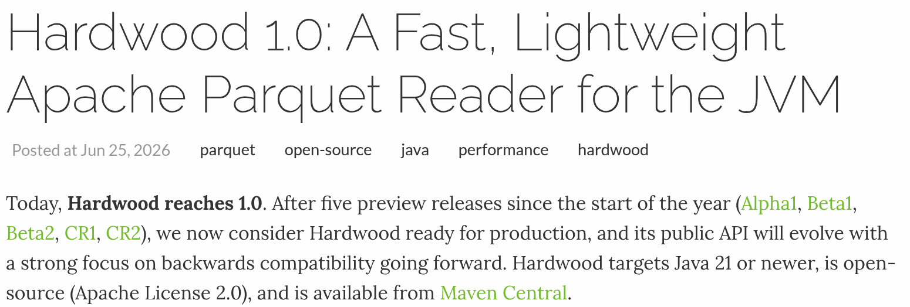</div>
<div class="rtl-event"><svg class="rtl-layer" viewBox="0 0 1280 720" width="1280" height="720"><circle class="rtl-dot" cx="114" cy="395" r="7"/><text class="rtl-label" x="114" y="379" text-anchor="middle">First commit</text></svg></div>
<div class="rtl-event"><svg class="rtl-layer" viewBox="0 0 1280 720" width="1280" height="720"><circle class="rtl-dot" cx="276" cy="395" r="7"/></svg></div>
<div class="rtl-event"><svg class="rtl-layer" viewBox="0 0 1280 720" width="1280" height="720"><circle class="rtl-dot" cx="318" cy="395" r="7"/></svg></div>
<div class="rtl-event"><svg class="rtl-layer" viewBox="0 0 1280 720" width="1280" height="720"><circle class="rtl-dot" cx="433" cy="395" r="7"/><text class="rtl-label" x="433" y="379" text-anchor="middle">Alpha1</text></svg></div>
<div class="rtl-event"><svg class="rtl-layer" viewBox="0 0 1280 720" width="1280" height="720"></svg></div>
<div class="rtl-event"><svg class="rtl-layer" viewBox="0 0 1280 720" width="1280" height="720"><line class="rtl-span" x1="547" y1="395" x2="607" y2="395"/><text class="rtl-span-label" x="577" y="421" text-anchor="middle">S3 in ten days</text></svg></div>
<div class="rtl-event fragment" data-fragment-index="0"><svg class="rtl-layer" viewBox="0 0 1280 720" width="1280" height="720"><circle class="rtl-dot" cx="643" cy="395" r="7"/><text class="rtl-label" x="643" y="379" text-anchor="middle">Beta1</text></svg></div>
<div class="rtl-event fragment" data-fragment-index="0"><svg class="rtl-layer" viewBox="0 0 1280 720" width="1280" height="720"><circle class="rtl-dot" cx="805" cy="395" r="7"/><text class="rtl-label" x="805" y="379" text-anchor="middle">Beta2</text></svg></div>
<div class="rtl-event fragment" data-fragment-index="0"><svg class="rtl-layer" viewBox="0 0 1280 720" width="1280" height="720"><circle class="rtl-dot" cx="998" cy="395" r="7"/><text class="rtl-label" x="998" y="379" text-anchor="middle">CR1</text></svg></div>
<div class="rtl-event fragment" data-fragment-index="0"><svg class="rtl-layer" viewBox="0 0 1280 720" width="1280" height="720"><circle class="rtl-dot" cx="1040" cy="395" r="7"/><text class="rtl-label" x="1040" y="379" text-anchor="middle">CR2</text></svg></div>
<div class="rtl-event fragment" data-fragment-index="0"><svg class="rtl-layer" viewBox="0 0 1280 720" width="1280" height="720"><circle class="rtl-dot" cx="1148" cy="395" r="7"/><text class="rtl-label" x="1148" y="379" text-anchor="middle">Final</text></svg></div>
</div>
<!-- /release-timeline:2 -->


---

<!-- .slide: class="hero-image" -->

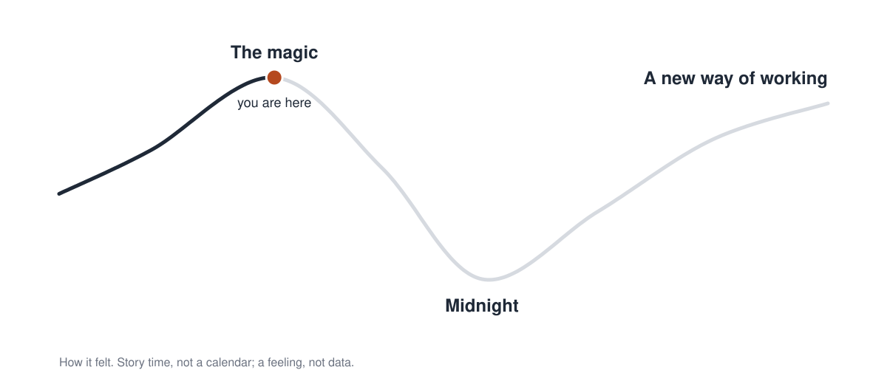


---

<!-- .slide: class="section" data-state="section-slide" data-background-image="images/sections/midnight.jpg" data-background-opacity="0.55" -->

# 2 · Midnight

<span class="credit">© &#42;rboed&#42; https://flic.kr/p/FJ1h26 (CC BY 2.0)</span>


---

<!-- .slide: class="hero-image" -->

## The same afternoon

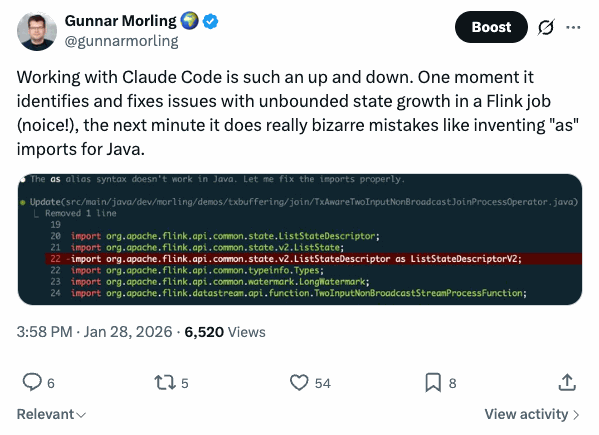


---

<!-- .slide: class="hero-image" -->

## It edited the test until it agreed


---

<!-- .slide: class="hero-image" -->

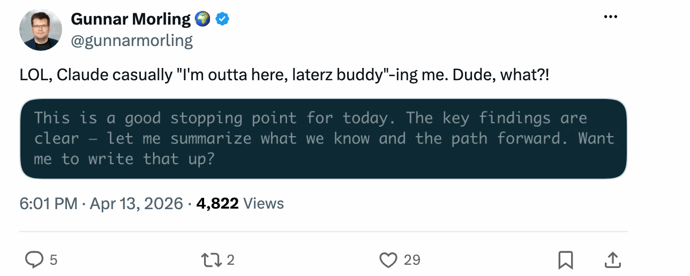


---

## Issue #1198: a small docs PR

<div class="later-stack">
  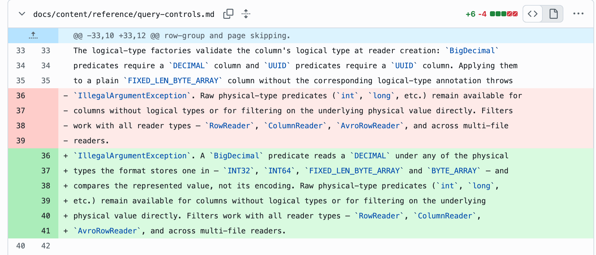
  </div>


---

<!-- .slide: class="hero-image" data-background-image="images/a-few-moments-later.jpg" data-background-size="cover" data-background-color="#000000" -->


---

<span class="pr-go fragment" data-fragment-index="0"></span>
<div class="pr-montage">
  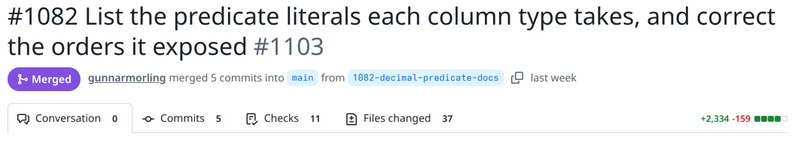
  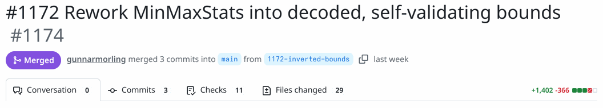
  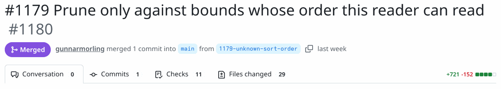
  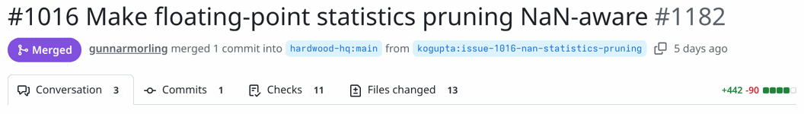
  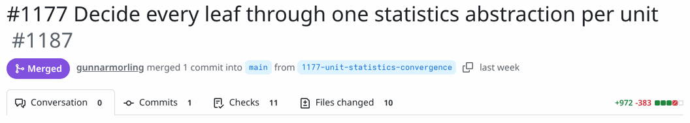
  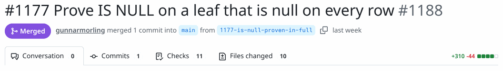
  
  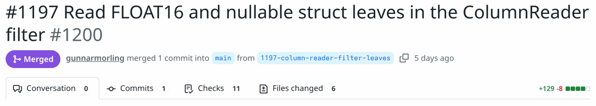
  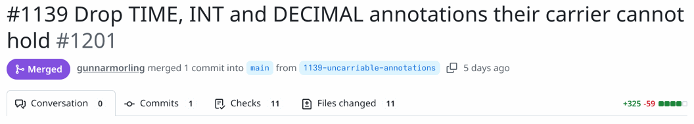
  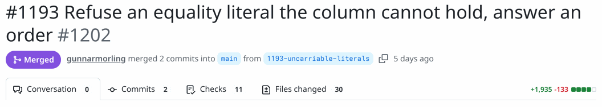
  
  
  
  
  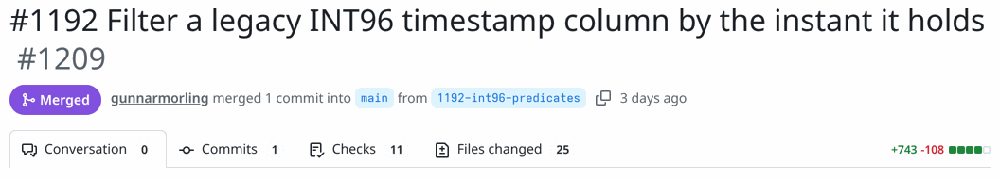
  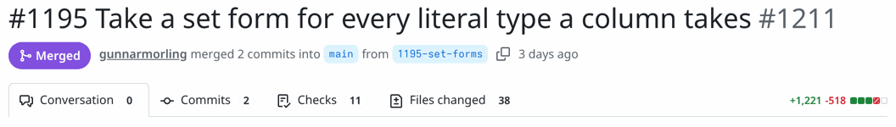
  
  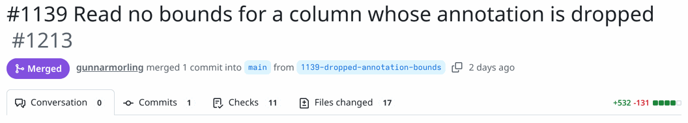
  
  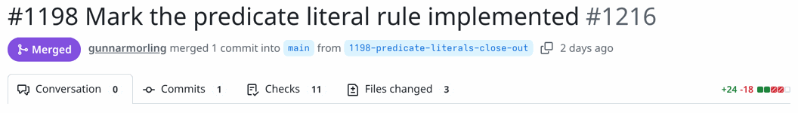
  
  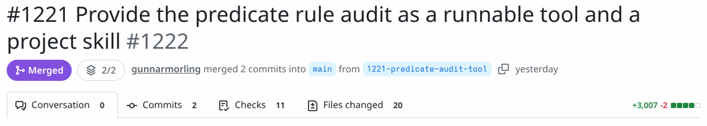
  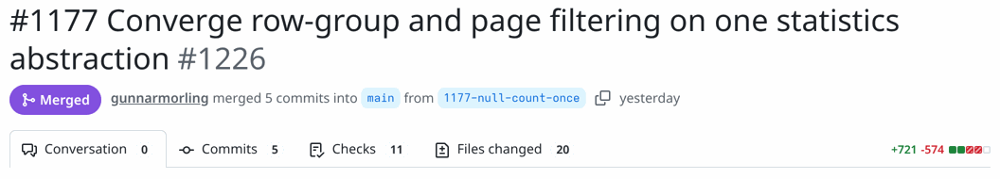
  
  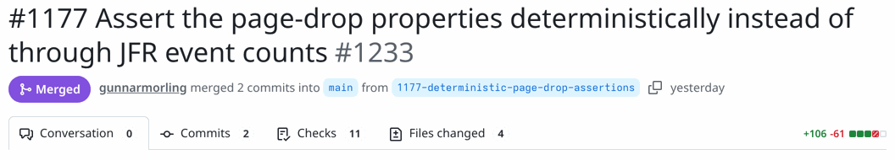
  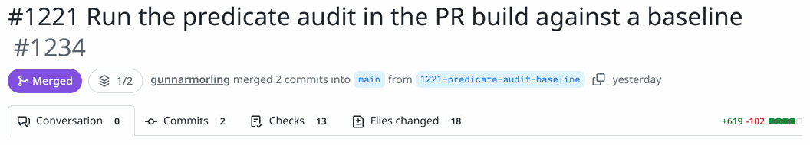
  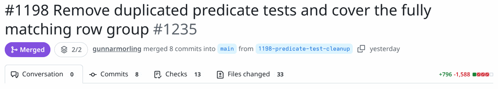
</div>

<div class="pr-stats fragment" data-fragment-index="1">
  <p class="later-when">Eight days later · Sep 6 → Sep 14</p>
  <div class="later-grid">
    <div><b>25</b><span>issues closed, 17 of them bugs</span></div>
    <div><b>60</b><span>commits</span></div>
    <div><b>169</b><span>files touched</span></div>
    <div><b>+21,500 −6,200</b><span>lines</span></div>
  </div>
</div>


---

<!-- .slide: class="hero" -->

## The old brake was effort.

<span class="aside">"That's three days" used to end a lot of bad ideas.</span>


---

<!-- .slide: class="wide" -->

## The agent types. I only decide.

<span class="subtitle">Sep 9: 205 prompts to 21 sessions, one every 2.7 minutes</span>

<svg class="proto" viewBox="0 0 1240 480" width="1240" height="480"><g class="fragment fade-out" data-fragment-index="1"><text x="140.0" y="448" text-anchor="middle" class="p-sub" fill="#666666">09:00</text><line x1="140.0" y1="28" x2="140.0" y2="428" stroke="#e5e7eb" stroke-width="1"/><text x="332.0" y="448" text-anchor="middle" class="p-sub" fill="#666666">12:00</text><line x1="332.0" y1="28" x2="332.0" y2="428" stroke="#e5e7eb" stroke-width="1"/><text x="524.0" y="448" text-anchor="middle" class="p-sub" fill="#666666">15:00</text><line x1="524.0" y1="28" x2="524.0" y2="428" stroke="#e5e7eb" stroke-width="1"/><text x="716.0" y="448" text-anchor="middle" class="p-sub" fill="#666666">18:00</text><line x1="716.0" y1="28" x2="716.0" y2="428" stroke="#e5e7eb" stroke-width="1"/><text x="908.0" y="448" text-anchor="middle" class="p-sub" fill="#666666">21:00</text><line x1="908.0" y1="28" x2="908.0" y2="428" stroke="#e5e7eb" stroke-width="1"/><text x="1100.0" y="448" text-anchor="middle" class="p-sub" fill="#666666">24:00</text><line x1="1100.0" y1="28" x2="1100.0" y2="428" stroke="#e5e7eb" stroke-width="1"/></g><g class="fragment fade-out" data-fragment-index="0"><text x="124" y="242.5" text-anchor="end" class="p-sub" fill="#666666">all sessions</text><line x1="154.5" y1="197.5" x2="154.5" y2="273.5" stroke="#b5491f" stroke-width="2.5"/><line x1="166.0" y1="197.5" x2="166.0" y2="273.5" stroke="#b5491f" stroke-width="2.5"/><line x1="169.1" y1="197.5" x2="169.1" y2="273.5" stroke="#b5491f" stroke-width="2.5"/><line x1="170.1" y1="197.5" x2="170.1" y2="273.5" stroke="#b5491f" stroke-width="2.5"/><line x1="173.2" y1="197.5" x2="173.2" y2="273.5" stroke="#b5491f" stroke-width="2.5"/><line x1="174.8" y1="197.5" x2="174.8" y2="273.5" stroke="#b5491f" stroke-width="2.5"/><line x1="189.0" y1="197.5" x2="189.0" y2="273.5" stroke="#b5491f" stroke-width="2.5"/><line x1="203.4" y1="197.5" x2="203.4" y2="273.5" stroke="#b5491f" stroke-width="2.5"/><line x1="204.4" y1="197.5" x2="204.4" y2="273.5" stroke="#b5491f" stroke-width="2.5"/><line x1="205.3" y1="197.5" x2="205.3" y2="273.5" stroke="#b5491f" stroke-width="2.5"/><line x1="209.2" y1="197.5" x2="209.2" y2="273.5" stroke="#b5491f" stroke-width="2.5"/><line x1="214.3" y1="197.5" x2="214.3" y2="273.5" stroke="#b5491f" stroke-width="2.5"/><line x1="216.8" y1="197.5" x2="216.8" y2="273.5" stroke="#b5491f" stroke-width="2.5"/><line x1="222.4" y1="197.5" x2="222.4" y2="273.5" stroke="#b5491f" stroke-width="2.5"/><line x1="227.6" y1="197.5" x2="227.6" y2="273.5" stroke="#b5491f" stroke-width="2.5"/><line x1="231.8" y1="197.5" x2="231.8" y2="273.5" stroke="#b5491f" stroke-width="2.5"/><line x1="240.7" y1="197.5" x2="240.7" y2="273.5" stroke="#b5491f" stroke-width="2.5"/><line x1="252.9" y1="197.5" x2="252.9" y2="273.5" stroke="#b5491f" stroke-width="2.5"/><line x1="260.1" y1="197.5" x2="260.1" y2="273.5" stroke="#b5491f" stroke-width="2.5"/><line x1="271.2" y1="197.5" x2="271.2" y2="273.5" stroke="#b5491f" stroke-width="2.5"/><line x1="275.1" y1="197.5" x2="275.1" y2="273.5" stroke="#b5491f" stroke-width="2.5"/><line x1="280.2" y1="197.5" x2="280.2" y2="273.5" stroke="#b5491f" stroke-width="2.5"/><line x1="284.5" y1="197.5" x2="284.5" y2="273.5" stroke="#b5491f" stroke-width="2.5"/><line x1="287.9" y1="197.5" x2="287.9" y2="273.5" stroke="#b5491f" stroke-width="2.5"/><line x1="295.3" y1="197.5" x2="295.3" y2="273.5" stroke="#b5491f" stroke-width="2.5"/><line x1="300.5" y1="197.5" x2="300.5" y2="273.5" stroke="#b5491f" stroke-width="2.5"/><line x1="302.9" y1="197.5" x2="302.9" y2="273.5" stroke="#b5491f" stroke-width="2.5"/><line x1="311.4" y1="197.5" x2="311.4" y2="273.5" stroke="#b5491f" stroke-width="2.5"/><line x1="318.5" y1="197.5" x2="318.5" y2="273.5" stroke="#b5491f" stroke-width="2.5"/><line x1="320.4" y1="197.5" x2="320.4" y2="273.5" stroke="#b5491f" stroke-width="2.5"/><line x1="321.7" y1="197.5" x2="321.7" y2="273.5" stroke="#b5491f" stroke-width="2.5"/><line x1="325.9" y1="197.5" x2="325.9" y2="273.5" stroke="#b5491f" stroke-width="2.5"/><line x1="332.3" y1="197.5" x2="332.3" y2="273.5" stroke="#b5491f" stroke-width="2.5"/><line x1="334.9" y1="197.5" x2="334.9" y2="273.5" stroke="#b5491f" stroke-width="2.5"/><line x1="338.6" y1="197.5" x2="338.6" y2="273.5" stroke="#b5491f" stroke-width="2.5"/><line x1="341.1" y1="197.5" x2="341.1" y2="273.5" stroke="#b5491f" stroke-width="2.5"/><line x1="349.5" y1="197.5" x2="349.5" y2="273.5" stroke="#b5491f" stroke-width="2.5"/><line x1="352.2" y1="197.5" x2="352.2" y2="273.5" stroke="#b5491f" stroke-width="2.5"/><line x1="354.0" y1="197.5" x2="354.0" y2="273.5" stroke="#b5491f" stroke-width="2.5"/><line x1="358.0" y1="197.5" x2="358.0" y2="273.5" stroke="#b5491f" stroke-width="2.5"/><line x1="360.2" y1="197.5" x2="360.2" y2="273.5" stroke="#b5491f" stroke-width="2.5"/><line x1="363.1" y1="197.5" x2="363.1" y2="273.5" stroke="#b5491f" stroke-width="2.5"/><line x1="365.6" y1="197.5" x2="365.6" y2="273.5" stroke="#b5491f" stroke-width="2.5"/><line x1="375.8" y1="197.5" x2="375.8" y2="273.5" stroke="#b5491f" stroke-width="2.5"/><line x1="376.9" y1="197.5" x2="376.9" y2="273.5" stroke="#b5491f" stroke-width="2.5"/><line x1="379.7" y1="197.5" x2="379.7" y2="273.5" stroke="#b5491f" stroke-width="2.5"/><line x1="383.3" y1="197.5" x2="383.3" y2="273.5" stroke="#b5491f" stroke-width="2.5"/><line x1="383.7" y1="197.5" x2="383.7" y2="273.5" stroke="#b5491f" stroke-width="2.5"/><line x1="385.3" y1="197.5" x2="385.3" y2="273.5" stroke="#b5491f" stroke-width="2.5"/><line x1="386.1" y1="197.5" x2="386.1" y2="273.5" stroke="#b5491f" stroke-width="2.5"/><line x1="388.6" y1="197.5" x2="388.6" y2="273.5" stroke="#b5491f" stroke-width="2.5"/><line x1="397.1" y1="197.5" x2="397.1" y2="273.5" stroke="#b5491f" stroke-width="2.5"/><line x1="397.6" y1="197.5" x2="397.6" y2="273.5" stroke="#b5491f" stroke-width="2.5"/><line x1="405.7" y1="197.5" x2="405.7" y2="273.5" stroke="#b5491f" stroke-width="2.5"/><line x1="408.8" y1="197.5" x2="408.8" y2="273.5" stroke="#b5491f" stroke-width="2.5"/><line x1="414.3" y1="197.5" x2="414.3" y2="273.5" stroke="#b5491f" stroke-width="2.5"/><line x1="417.3" y1="197.5" x2="417.3" y2="273.5" stroke="#b5491f" stroke-width="2.5"/><line x1="417.4" y1="197.5" x2="417.4" y2="273.5" stroke="#b5491f" stroke-width="2.5"/><line x1="417.7" y1="197.5" x2="417.7" y2="273.5" stroke="#b5491f" stroke-width="2.5"/><line x1="420.6" y1="197.5" x2="420.6" y2="273.5" stroke="#b5491f" stroke-width="2.5"/><line x1="420.9" y1="197.5" x2="420.9" y2="273.5" stroke="#b5491f" stroke-width="2.5"/><line x1="423.8" y1="197.5" x2="423.8" y2="273.5" stroke="#b5491f" stroke-width="2.5"/><line x1="427.6" y1="197.5" x2="427.6" y2="273.5" stroke="#b5491f" stroke-width="2.5"/><line x1="431.1" y1="197.5" x2="431.1" y2="273.5" stroke="#b5491f" stroke-width="2.5"/><line x1="436.7" y1="197.5" x2="436.7" y2="273.5" stroke="#b5491f" stroke-width="2.5"/><line x1="445.2" y1="197.5" x2="445.2" y2="273.5" stroke="#b5491f" stroke-width="2.5"/><line x1="448.7" y1="197.5" x2="448.7" y2="273.5" stroke="#b5491f" stroke-width="2.5"/><line x1="451.5" y1="197.5" x2="451.5" y2="273.5" stroke="#b5491f" stroke-width="2.5"/><line x1="453.9" y1="197.5" x2="453.9" y2="273.5" stroke="#b5491f" stroke-width="2.5"/><line x1="455.0" y1="197.5" x2="455.0" y2="273.5" stroke="#b5491f" stroke-width="2.5"/><line x1="457.2" y1="197.5" x2="457.2" y2="273.5" stroke="#b5491f" stroke-width="2.5"/><line x1="478.7" y1="197.5" x2="478.7" y2="273.5" stroke="#b5491f" stroke-width="2.5"/><line x1="482.1" y1="197.5" x2="482.1" y2="273.5" stroke="#b5491f" stroke-width="2.5"/><line x1="495.7" y1="197.5" x2="495.7" y2="273.5" stroke="#b5491f" stroke-width="2.5"/><line x1="500.2" y1="197.5" x2="500.2" y2="273.5" stroke="#b5491f" stroke-width="2.5"/><line x1="504.2" y1="197.5" x2="504.2" y2="273.5" stroke="#b5491f" stroke-width="2.5"/><line x1="511.1" y1="197.5" x2="511.1" y2="273.5" stroke="#b5491f" stroke-width="2.5"/><line x1="520.0" y1="197.5" x2="520.0" y2="273.5" stroke="#b5491f" stroke-width="2.5"/><line x1="532.8" y1="197.5" x2="532.8" y2="273.5" stroke="#b5491f" stroke-width="2.5"/><line x1="535.1" y1="197.5" x2="535.1" y2="273.5" stroke="#b5491f" stroke-width="2.5"/><line x1="584.8" y1="197.5" x2="584.8" y2="273.5" stroke="#b5491f" stroke-width="2.5"/><line x1="590.9" y1="197.5" x2="590.9" y2="273.5" stroke="#b5491f" stroke-width="2.5"/><line x1="591.5" y1="197.5" x2="591.5" y2="273.5" stroke="#b5491f" stroke-width="2.5"/><line x1="600.8" y1="197.5" x2="600.8" y2="273.5" stroke="#b5491f" stroke-width="2.5"/><line x1="604.5" y1="197.5" x2="604.5" y2="273.5" stroke="#b5491f" stroke-width="2.5"/><line x1="606.8" y1="197.5" x2="606.8" y2="273.5" stroke="#b5491f" stroke-width="2.5"/><line x1="606.9" y1="197.5" x2="606.9" y2="273.5" stroke="#b5491f" stroke-width="2.5"/><line x1="607.1" y1="197.5" x2="607.1" y2="273.5" stroke="#b5491f" stroke-width="2.5"/><line x1="608.3" y1="197.5" x2="608.3" y2="273.5" stroke="#b5491f" stroke-width="2.5"/><line x1="613.7" y1="197.5" x2="613.7" y2="273.5" stroke="#b5491f" stroke-width="2.5"/><line x1="618.7" y1="197.5" x2="618.7" y2="273.5" stroke="#b5491f" stroke-width="2.5"/><line x1="620.4" y1="197.5" x2="620.4" y2="273.5" stroke="#b5491f" stroke-width="2.5"/><line x1="623.7" y1="197.5" x2="623.7" y2="273.5" stroke="#b5491f" stroke-width="2.5"/><line x1="631.7" y1="197.5" x2="631.7" y2="273.5" stroke="#b5491f" stroke-width="2.5"/><line x1="636.2" y1="197.5" x2="636.2" y2="273.5" stroke="#b5491f" stroke-width="2.5"/><line x1="655.8" y1="197.5" x2="655.8" y2="273.5" stroke="#b5491f" stroke-width="2.5"/><line x1="656.4" y1="197.5" x2="656.4" y2="273.5" stroke="#b5491f" stroke-width="2.5"/><line x1="669.2" y1="197.5" x2="669.2" y2="273.5" stroke="#b5491f" stroke-width="2.5"/><line x1="673.0" y1="197.5" x2="673.0" y2="273.5" stroke="#b5491f" stroke-width="2.5"/><line x1="674.5" y1="197.5" x2="674.5" y2="273.5" stroke="#b5491f" stroke-width="2.5"/><line x1="677.7" y1="197.5" x2="677.7" y2="273.5" stroke="#b5491f" stroke-width="2.5"/><line x1="683.7" y1="197.5" x2="683.7" y2="273.5" stroke="#b5491f" stroke-width="2.5"/><line x1="692.9" y1="197.5" x2="692.9" y2="273.5" stroke="#b5491f" stroke-width="2.5"/><line x1="698.8" y1="197.5" x2="698.8" y2="273.5" stroke="#b5491f" stroke-width="2.5"/><line x1="706.0" y1="197.5" x2="706.0" y2="273.5" stroke="#b5491f" stroke-width="2.5"/><line x1="706.7" y1="197.5" x2="706.7" y2="273.5" stroke="#b5491f" stroke-width="2.5"/><line x1="706.9" y1="197.5" x2="706.9" y2="273.5" stroke="#b5491f" stroke-width="2.5"/><line x1="708.3" y1="197.5" x2="708.3" y2="273.5" stroke="#b5491f" stroke-width="2.5"/><line x1="710.2" y1="197.5" x2="710.2" y2="273.5" stroke="#b5491f" stroke-width="2.5"/><line x1="710.2" y1="197.5" x2="710.2" y2="273.5" stroke="#b5491f" stroke-width="2.5"/><line x1="712.9" y1="197.5" x2="712.9" y2="273.5" stroke="#b5491f" stroke-width="2.5"/><line x1="720.3" y1="197.5" x2="720.3" y2="273.5" stroke="#b5491f" stroke-width="2.5"/><line x1="722.8" y1="197.5" x2="722.8" y2="273.5" stroke="#b5491f" stroke-width="2.5"/><line x1="724.3" y1="197.5" x2="724.3" y2="273.5" stroke="#b5491f" stroke-width="2.5"/><line x1="725.4" y1="197.5" x2="725.4" y2="273.5" stroke="#b5491f" stroke-width="2.5"/><line x1="726.4" y1="197.5" x2="726.4" y2="273.5" stroke="#b5491f" stroke-width="2.5"/><line x1="727.2" y1="197.5" x2="727.2" y2="273.5" stroke="#b5491f" stroke-width="2.5"/><line x1="728.0" y1="197.5" x2="728.0" y2="273.5" stroke="#b5491f" stroke-width="2.5"/><line x1="734.1" y1="197.5" x2="734.1" y2="273.5" stroke="#b5491f" stroke-width="2.5"/><line x1="737.7" y1="197.5" x2="737.7" y2="273.5" stroke="#b5491f" stroke-width="2.5"/><line x1="737.7" y1="197.5" x2="737.7" y2="273.5" stroke="#b5491f" stroke-width="2.5"/><line x1="738.8" y1="197.5" x2="738.8" y2="273.5" stroke="#b5491f" stroke-width="2.5"/><line x1="740.8" y1="197.5" x2="740.8" y2="273.5" stroke="#b5491f" stroke-width="2.5"/><line x1="742.4" y1="197.5" x2="742.4" y2="273.5" stroke="#b5491f" stroke-width="2.5"/><line x1="744.4" y1="197.5" x2="744.4" y2="273.5" stroke="#b5491f" stroke-width="2.5"/><line x1="750.9" y1="197.5" x2="750.9" y2="273.5" stroke="#b5491f" stroke-width="2.5"/><line x1="751.9" y1="197.5" x2="751.9" y2="273.5" stroke="#b5491f" stroke-width="2.5"/><line x1="754.8" y1="197.5" x2="754.8" y2="273.5" stroke="#b5491f" stroke-width="2.5"/><line x1="758.9" y1="197.5" x2="758.9" y2="273.5" stroke="#b5491f" stroke-width="2.5"/><line x1="759.8" y1="197.5" x2="759.8" y2="273.5" stroke="#b5491f" stroke-width="2.5"/><line x1="760.5" y1="197.5" x2="760.5" y2="273.5" stroke="#b5491f" stroke-width="2.5"/><line x1="765.4" y1="197.5" x2="765.4" y2="273.5" stroke="#b5491f" stroke-width="2.5"/><line x1="767.5" y1="197.5" x2="767.5" y2="273.5" stroke="#b5491f" stroke-width="2.5"/><line x1="778.1" y1="197.5" x2="778.1" y2="273.5" stroke="#b5491f" stroke-width="2.5"/><line x1="780.1" y1="197.5" x2="780.1" y2="273.5" stroke="#b5491f" stroke-width="2.5"/><line x1="782.7" y1="197.5" x2="782.7" y2="273.5" stroke="#b5491f" stroke-width="2.5"/><line x1="785.3" y1="197.5" x2="785.3" y2="273.5" stroke="#b5491f" stroke-width="2.5"/><line x1="833.8" y1="197.5" x2="833.8" y2="273.5" stroke="#b5491f" stroke-width="2.5"/><line x1="838.0" y1="197.5" x2="838.0" y2="273.5" stroke="#b5491f" stroke-width="2.5"/><line x1="838.5" y1="197.5" x2="838.5" y2="273.5" stroke="#b5491f" stroke-width="2.5"/><line x1="840.6" y1="197.5" x2="840.6" y2="273.5" stroke="#b5491f" stroke-width="2.5"/><line x1="843.9" y1="197.5" x2="843.9" y2="273.5" stroke="#b5491f" stroke-width="2.5"/><line x1="844.9" y1="197.5" x2="844.9" y2="273.5" stroke="#b5491f" stroke-width="2.5"/><line x1="845.6" y1="197.5" x2="845.6" y2="273.5" stroke="#b5491f" stroke-width="2.5"/><line x1="884.7" y1="197.5" x2="884.7" y2="273.5" stroke="#b5491f" stroke-width="2.5"/><line x1="886.7" y1="197.5" x2="886.7" y2="273.5" stroke="#b5491f" stroke-width="2.5"/><line x1="888.1" y1="197.5" x2="888.1" y2="273.5" stroke="#b5491f" stroke-width="2.5"/><line x1="890.3" y1="197.5" x2="890.3" y2="273.5" stroke="#b5491f" stroke-width="2.5"/><line x1="893.5" y1="197.5" x2="893.5" y2="273.5" stroke="#b5491f" stroke-width="2.5"/><line x1="898.4" y1="197.5" x2="898.4" y2="273.5" stroke="#b5491f" stroke-width="2.5"/><line x1="903.6" y1="197.5" x2="903.6" y2="273.5" stroke="#b5491f" stroke-width="2.5"/><line x1="905.2" y1="197.5" x2="905.2" y2="273.5" stroke="#b5491f" stroke-width="2.5"/><line x1="905.7" y1="197.5" x2="905.7" y2="273.5" stroke="#b5491f" stroke-width="2.5"/><line x1="909.4" y1="197.5" x2="909.4" y2="273.5" stroke="#b5491f" stroke-width="2.5"/><line x1="911.9" y1="197.5" x2="911.9" y2="273.5" stroke="#b5491f" stroke-width="2.5"/><line x1="915.0" y1="197.5" x2="915.0" y2="273.5" stroke="#b5491f" stroke-width="2.5"/><line x1="917.8" y1="197.5" x2="917.8" y2="273.5" stroke="#b5491f" stroke-width="2.5"/><line x1="919.9" y1="197.5" x2="919.9" y2="273.5" stroke="#b5491f" stroke-width="2.5"/><line x1="924.2" y1="197.5" x2="924.2" y2="273.5" stroke="#b5491f" stroke-width="2.5"/><line x1="925.4" y1="197.5" x2="925.4" y2="273.5" stroke="#b5491f" stroke-width="2.5"/><line x1="938.9" y1="197.5" x2="938.9" y2="273.5" stroke="#b5491f" stroke-width="2.5"/><line x1="940.1" y1="197.5" x2="940.1" y2="273.5" stroke="#b5491f" stroke-width="2.5"/><line x1="941.2" y1="197.5" x2="941.2" y2="273.5" stroke="#b5491f" stroke-width="2.5"/><line x1="942.6" y1="197.5" x2="942.6" y2="273.5" stroke="#b5491f" stroke-width="2.5"/><line x1="945.6" y1="197.5" x2="945.6" y2="273.5" stroke="#b5491f" stroke-width="2.5"/><line x1="949.7" y1="197.5" x2="949.7" y2="273.5" stroke="#b5491f" stroke-width="2.5"/><line x1="952.5" y1="197.5" x2="952.5" y2="273.5" stroke="#b5491f" stroke-width="2.5"/><line x1="958.7" y1="197.5" x2="958.7" y2="273.5" stroke="#b5491f" stroke-width="2.5"/><line x1="960.9" y1="197.5" x2="960.9" y2="273.5" stroke="#b5491f" stroke-width="2.5"/><line x1="964.2" y1="197.5" x2="964.2" y2="273.5" stroke="#b5491f" stroke-width="2.5"/><line x1="967.2" y1="197.5" x2="967.2" y2="273.5" stroke="#b5491f" stroke-width="2.5"/><line x1="968.7" y1="197.5" x2="968.7" y2="273.5" stroke="#b5491f" stroke-width="2.5"/><line x1="970.3" y1="197.5" x2="970.3" y2="273.5" stroke="#b5491f" stroke-width="2.5"/><line x1="974.4" y1="197.5" x2="974.4" y2="273.5" stroke="#b5491f" stroke-width="2.5"/><line x1="977.0" y1="197.5" x2="977.0" y2="273.5" stroke="#b5491f" stroke-width="2.5"/><line x1="981.3" y1="197.5" x2="981.3" y2="273.5" stroke="#b5491f" stroke-width="2.5"/><line x1="984.2" y1="197.5" x2="984.2" y2="273.5" stroke="#b5491f" stroke-width="2.5"/><line x1="985.8" y1="197.5" x2="985.8" y2="273.5" stroke="#b5491f" stroke-width="2.5"/><line x1="987.3" y1="197.5" x2="987.3" y2="273.5" stroke="#b5491f" stroke-width="2.5"/><line x1="988.2" y1="197.5" x2="988.2" y2="273.5" stroke="#b5491f" stroke-width="2.5"/><line x1="988.6" y1="197.5" x2="988.6" y2="273.5" stroke="#b5491f" stroke-width="2.5"/><line x1="990.2" y1="197.5" x2="990.2" y2="273.5" stroke="#b5491f" stroke-width="2.5"/><line x1="992.4" y1="197.5" x2="992.4" y2="273.5" stroke="#b5491f" stroke-width="2.5"/><line x1="993.8" y1="197.5" x2="993.8" y2="273.5" stroke="#b5491f" stroke-width="2.5"/><line x1="996.9" y1="197.5" x2="996.9" y2="273.5" stroke="#b5491f" stroke-width="2.5"/><line x1="998.9" y1="197.5" x2="998.9" y2="273.5" stroke="#b5491f" stroke-width="2.5"/><line x1="1001.3" y1="197.5" x2="1001.3" y2="273.5" stroke="#b5491f" stroke-width="2.5"/><line x1="1004.0" y1="197.5" x2="1004.0" y2="273.5" stroke="#b5491f" stroke-width="2.5"/><line x1="1005.3" y1="197.5" x2="1005.3" y2="273.5" stroke="#b5491f" stroke-width="2.5"/><line x1="1007.8" y1="197.5" x2="1007.8" y2="273.5" stroke="#b5491f" stroke-width="2.5"/><line x1="1011.1" y1="197.5" x2="1011.1" y2="273.5" stroke="#b5491f" stroke-width="2.5"/><line x1="1012.2" y1="197.5" x2="1012.2" y2="273.5" stroke="#b5491f" stroke-width="2.5"/><line x1="1013.7" y1="197.5" x2="1013.7" y2="273.5" stroke="#b5491f" stroke-width="2.5"/><line x1="1017.7" y1="197.5" x2="1017.7" y2="273.5" stroke="#b5491f" stroke-width="2.5"/><line x1="1041.5" y1="197.5" x2="1041.5" y2="273.5" stroke="#b5491f" stroke-width="2.5"/><line x1="1044.6" y1="197.5" x2="1044.6" y2="273.5" stroke="#b5491f" stroke-width="2.5"/><line x1="1051.2" y1="197.5" x2="1051.2" y2="273.5" stroke="#b5491f" stroke-width="2.5"/><line x1="1052.3" y1="197.5" x2="1052.3" y2="273.5" stroke="#b5491f" stroke-width="2.5"/><line x1="1054.0" y1="197.5" x2="1054.0" y2="273.5" stroke="#b5491f" stroke-width="2.5"/><line x1="1059.0" y1="197.5" x2="1059.0" y2="273.5" stroke="#b5491f" stroke-width="2.5"/><line x1="1076.6" y1="197.5" x2="1076.6" y2="273.5" stroke="#b5491f" stroke-width="2.5"/><line x1="1077.8" y1="197.5" x2="1077.8" y2="273.5" stroke="#b5491f" stroke-width="2.5"/><line x1="1089.0" y1="197.5" x2="1089.0" y2="273.5" stroke="#b5491f" stroke-width="2.5"/><line x1="1092.2" y1="197.5" x2="1092.2" y2="273.5" stroke="#b5491f" stroke-width="2.5"/><line x1="1093.7" y1="197.5" x2="1093.7" y2="273.5" stroke="#b5491f" stroke-width="2.5"/></g><g class="fragment fade-in-then-out" data-fragment-index="0"><text x="124" y="242.5" text-anchor="end" class="p-sub" fill="#666666">21 sessions</text><line x1="140" y1="52.2" x2="1100" y2="52.2" stroke="#eef0f2" stroke-width="1"/><line x1="154.5" y1="45.0" x2="154.5" y2="59.3" stroke="#b5491f" stroke-width="2.5"/><line x1="166.0" y1="45.0" x2="166.0" y2="59.3" stroke="#b5491f" stroke-width="2.5"/><line x1="169.1" y1="45.0" x2="169.1" y2="59.3" stroke="#b5491f" stroke-width="2.5"/><line x1="170.1" y1="45.0" x2="170.1" y2="59.3" stroke="#b5491f" stroke-width="2.5"/><line x1="173.2" y1="45.0" x2="173.2" y2="59.3" stroke="#b5491f" stroke-width="2.5"/><line x1="174.8" y1="45.0" x2="174.8" y2="59.3" stroke="#b5491f" stroke-width="2.5"/><line x1="204.4" y1="45.0" x2="204.4" y2="59.3" stroke="#b5491f" stroke-width="2.5"/><line x1="205.3" y1="45.0" x2="205.3" y2="59.3" stroke="#b5491f" stroke-width="2.5"/><line x1="209.2" y1="45.0" x2="209.2" y2="59.3" stroke="#b5491f" stroke-width="2.5"/><line x1="214.3" y1="45.0" x2="214.3" y2="59.3" stroke="#b5491f" stroke-width="2.5"/><line x1="216.8" y1="45.0" x2="216.8" y2="59.3" stroke="#b5491f" stroke-width="2.5"/><line x1="222.4" y1="45.0" x2="222.4" y2="59.3" stroke="#b5491f" stroke-width="2.5"/><line x1="227.6" y1="45.0" x2="227.6" y2="59.3" stroke="#b5491f" stroke-width="2.5"/><line x1="231.8" y1="45.0" x2="231.8" y2="59.3" stroke="#b5491f" stroke-width="2.5"/><line x1="240.7" y1="45.0" x2="240.7" y2="59.3" stroke="#b5491f" stroke-width="2.5"/><line x1="252.9" y1="45.0" x2="252.9" y2="59.3" stroke="#b5491f" stroke-width="2.5"/><line x1="260.1" y1="45.0" x2="260.1" y2="59.3" stroke="#b5491f" stroke-width="2.5"/><line x1="271.2" y1="45.0" x2="271.2" y2="59.3" stroke="#b5491f" stroke-width="2.5"/><line x1="275.1" y1="45.0" x2="275.1" y2="59.3" stroke="#b5491f" stroke-width="2.5"/><line x1="280.2" y1="45.0" x2="280.2" y2="59.3" stroke="#b5491f" stroke-width="2.5"/><line x1="284.5" y1="45.0" x2="284.5" y2="59.3" stroke="#b5491f" stroke-width="2.5"/><line x1="287.9" y1="45.0" x2="287.9" y2="59.3" stroke="#b5491f" stroke-width="2.5"/><line x1="295.3" y1="45.0" x2="295.3" y2="59.3" stroke="#b5491f" stroke-width="2.5"/><line x1="300.5" y1="45.0" x2="300.5" y2="59.3" stroke="#b5491f" stroke-width="2.5"/><line x1="302.9" y1="45.0" x2="302.9" y2="59.3" stroke="#b5491f" stroke-width="2.5"/><line x1="318.5" y1="45.0" x2="318.5" y2="59.3" stroke="#b5491f" stroke-width="2.5"/><line x1="320.4" y1="45.0" x2="320.4" y2="59.3" stroke="#b5491f" stroke-width="2.5"/><line x1="321.7" y1="45.0" x2="321.7" y2="59.3" stroke="#b5491f" stroke-width="2.5"/><line x1="325.9" y1="45.0" x2="325.9" y2="59.3" stroke="#b5491f" stroke-width="2.5"/><line x1="332.3" y1="45.0" x2="332.3" y2="59.3" stroke="#b5491f" stroke-width="2.5"/><line x1="334.9" y1="45.0" x2="334.9" y2="59.3" stroke="#b5491f" stroke-width="2.5"/><line x1="338.6" y1="45.0" x2="338.6" y2="59.3" stroke="#b5491f" stroke-width="2.5"/><line x1="341.1" y1="45.0" x2="341.1" y2="59.3" stroke="#b5491f" stroke-width="2.5"/><line x1="352.2" y1="45.0" x2="352.2" y2="59.3" stroke="#b5491f" stroke-width="2.5"/><line x1="354.0" y1="45.0" x2="354.0" y2="59.3" stroke="#b5491f" stroke-width="2.5"/><line x1="360.2" y1="45.0" x2="360.2" y2="59.3" stroke="#b5491f" stroke-width="2.5"/><line x1="363.1" y1="45.0" x2="363.1" y2="59.3" stroke="#b5491f" stroke-width="2.5"/><line x1="375.8" y1="45.0" x2="375.8" y2="59.3" stroke="#b5491f" stroke-width="2.5"/><line x1="376.9" y1="45.0" x2="376.9" y2="59.3" stroke="#b5491f" stroke-width="2.5"/><line x1="379.7" y1="45.0" x2="379.7" y2="59.3" stroke="#b5491f" stroke-width="2.5"/><line x1="383.3" y1="45.0" x2="383.3" y2="59.3" stroke="#b5491f" stroke-width="2.5"/><line x1="385.3" y1="45.0" x2="385.3" y2="59.3" stroke="#b5491f" stroke-width="2.5"/><line x1="420.6" y1="45.0" x2="420.6" y2="59.3" stroke="#b5491f" stroke-width="2.5"/><line x1="140" y1="70.5" x2="1100" y2="70.5" stroke="#eef0f2" stroke-width="1"/><line x1="189.0" y1="63.3" x2="189.0" y2="77.7" stroke="#b5491f" stroke-width="2.5"/><line x1="203.4" y1="63.3" x2="203.4" y2="77.7" stroke="#b5491f" stroke-width="2.5"/><line x1="358.0" y1="63.3" x2="358.0" y2="77.7" stroke="#b5491f" stroke-width="2.5"/><line x1="140" y1="88.8" x2="1100" y2="88.8" stroke="#eef0f2" stroke-width="1"/><line x1="311.4" y1="81.7" x2="311.4" y2="96.0" stroke="#b5491f" stroke-width="2.5"/><line x1="365.6" y1="81.7" x2="365.6" y2="96.0" stroke="#b5491f" stroke-width="2.5"/><line x1="386.1" y1="81.7" x2="386.1" y2="96.0" stroke="#b5491f" stroke-width="2.5"/><line x1="405.7" y1="81.7" x2="405.7" y2="96.0" stroke="#b5491f" stroke-width="2.5"/><line x1="417.7" y1="81.7" x2="417.7" y2="96.0" stroke="#b5491f" stroke-width="2.5"/><line x1="140" y1="107.2" x2="1100" y2="107.2" stroke="#eef0f2" stroke-width="1"/><line x1="349.5" y1="100.0" x2="349.5" y2="114.3" stroke="#b5491f" stroke-width="2.5"/><line x1="140" y1="125.5" x2="1100" y2="125.5" stroke="#eef0f2" stroke-width="1"/><line x1="383.7" y1="118.3" x2="383.7" y2="132.7" stroke="#b5491f" stroke-width="2.5"/><line x1="388.6" y1="118.3" x2="388.6" y2="132.7" stroke="#b5491f" stroke-width="2.5"/><line x1="397.1" y1="118.3" x2="397.1" y2="132.7" stroke="#b5491f" stroke-width="2.5"/><line x1="408.8" y1="118.3" x2="408.8" y2="132.7" stroke="#b5491f" stroke-width="2.5"/><line x1="414.3" y1="118.3" x2="414.3" y2="132.7" stroke="#b5491f" stroke-width="2.5"/><line x1="417.3" y1="118.3" x2="417.3" y2="132.7" stroke="#b5491f" stroke-width="2.5"/><line x1="417.4" y1="118.3" x2="417.4" y2="132.7" stroke="#b5491f" stroke-width="2.5"/><line x1="420.9" y1="118.3" x2="420.9" y2="132.7" stroke="#b5491f" stroke-width="2.5"/><line x1="423.8" y1="118.3" x2="423.8" y2="132.7" stroke="#b5491f" stroke-width="2.5"/><line x1="427.6" y1="118.3" x2="427.6" y2="132.7" stroke="#b5491f" stroke-width="2.5"/><line x1="431.1" y1="118.3" x2="431.1" y2="132.7" stroke="#b5491f" stroke-width="2.5"/><line x1="436.7" y1="118.3" x2="436.7" y2="132.7" stroke="#b5491f" stroke-width="2.5"/><line x1="445.2" y1="118.3" x2="445.2" y2="132.7" stroke="#b5491f" stroke-width="2.5"/><line x1="448.7" y1="118.3" x2="448.7" y2="132.7" stroke="#b5491f" stroke-width="2.5"/><line x1="451.5" y1="118.3" x2="451.5" y2="132.7" stroke="#b5491f" stroke-width="2.5"/><line x1="453.9" y1="118.3" x2="453.9" y2="132.7" stroke="#b5491f" stroke-width="2.5"/><line x1="455.0" y1="118.3" x2="455.0" y2="132.7" stroke="#b5491f" stroke-width="2.5"/><line x1="457.2" y1="118.3" x2="457.2" y2="132.7" stroke="#b5491f" stroke-width="2.5"/><line x1="478.7" y1="118.3" x2="478.7" y2="132.7" stroke="#b5491f" stroke-width="2.5"/><line x1="482.1" y1="118.3" x2="482.1" y2="132.7" stroke="#b5491f" stroke-width="2.5"/><line x1="495.7" y1="118.3" x2="495.7" y2="132.7" stroke="#b5491f" stroke-width="2.5"/><line x1="500.2" y1="118.3" x2="500.2" y2="132.7" stroke="#b5491f" stroke-width="2.5"/><line x1="504.2" y1="118.3" x2="504.2" y2="132.7" stroke="#b5491f" stroke-width="2.5"/><line x1="511.1" y1="118.3" x2="511.1" y2="132.7" stroke="#b5491f" stroke-width="2.5"/><line x1="584.8" y1="118.3" x2="584.8" y2="132.7" stroke="#b5491f" stroke-width="2.5"/><line x1="590.9" y1="118.3" x2="590.9" y2="132.7" stroke="#b5491f" stroke-width="2.5"/><line x1="606.8" y1="118.3" x2="606.8" y2="132.7" stroke="#b5491f" stroke-width="2.5"/><line x1="606.9" y1="118.3" x2="606.9" y2="132.7" stroke="#b5491f" stroke-width="2.5"/><line x1="607.1" y1="118.3" x2="607.1" y2="132.7" stroke="#b5491f" stroke-width="2.5"/><line x1="608.3" y1="118.3" x2="608.3" y2="132.7" stroke="#b5491f" stroke-width="2.5"/><line x1="631.7" y1="118.3" x2="631.7" y2="132.7" stroke="#b5491f" stroke-width="2.5"/><line x1="636.2" y1="118.3" x2="636.2" y2="132.7" stroke="#b5491f" stroke-width="2.5"/><line x1="655.8" y1="118.3" x2="655.8" y2="132.7" stroke="#b5491f" stroke-width="2.5"/><line x1="669.2" y1="118.3" x2="669.2" y2="132.7" stroke="#b5491f" stroke-width="2.5"/><line x1="673.0" y1="118.3" x2="673.0" y2="132.7" stroke="#b5491f" stroke-width="2.5"/><line x1="674.5" y1="118.3" x2="674.5" y2="132.7" stroke="#b5491f" stroke-width="2.5"/><line x1="677.7" y1="118.3" x2="677.7" y2="132.7" stroke="#b5491f" stroke-width="2.5"/><line x1="692.9" y1="118.3" x2="692.9" y2="132.7" stroke="#b5491f" stroke-width="2.5"/><line x1="698.8" y1="118.3" x2="698.8" y2="132.7" stroke="#b5491f" stroke-width="2.5"/><line x1="706.0" y1="118.3" x2="706.0" y2="132.7" stroke="#b5491f" stroke-width="2.5"/><line x1="708.3" y1="118.3" x2="708.3" y2="132.7" stroke="#b5491f" stroke-width="2.5"/><line x1="710.2" y1="118.3" x2="710.2" y2="132.7" stroke="#b5491f" stroke-width="2.5"/><line x1="710.2" y1="118.3" x2="710.2" y2="132.7" stroke="#b5491f" stroke-width="2.5"/><line x1="724.3" y1="118.3" x2="724.3" y2="132.7" stroke="#b5491f" stroke-width="2.5"/><line x1="726.4" y1="118.3" x2="726.4" y2="132.7" stroke="#b5491f" stroke-width="2.5"/><line x1="140" y1="143.8" x2="1100" y2="143.8" stroke="#eef0f2" stroke-width="1"/><line x1="397.6" y1="136.7" x2="397.6" y2="151.0" stroke="#b5491f" stroke-width="2.5"/><line x1="140" y1="162.2" x2="1100" y2="162.2" stroke="#eef0f2" stroke-width="1"/><line x1="520.0" y1="155.0" x2="520.0" y2="169.3" stroke="#b5491f" stroke-width="2.5"/><line x1="532.8" y1="155.0" x2="532.8" y2="169.3" stroke="#b5491f" stroke-width="2.5"/><line x1="535.1" y1="155.0" x2="535.1" y2="169.3" stroke="#b5491f" stroke-width="2.5"/><line x1="600.8" y1="155.0" x2="600.8" y2="169.3" stroke="#b5491f" stroke-width="2.5"/><line x1="604.5" y1="155.0" x2="604.5" y2="169.3" stroke="#b5491f" stroke-width="2.5"/><line x1="613.7" y1="155.0" x2="613.7" y2="169.3" stroke="#b5491f" stroke-width="2.5"/><line x1="618.7" y1="155.0" x2="618.7" y2="169.3" stroke="#b5491f" stroke-width="2.5"/><line x1="620.4" y1="155.0" x2="620.4" y2="169.3" stroke="#b5491f" stroke-width="2.5"/><line x1="623.7" y1="155.0" x2="623.7" y2="169.3" stroke="#b5491f" stroke-width="2.5"/><line x1="656.4" y1="155.0" x2="656.4" y2="169.3" stroke="#b5491f" stroke-width="2.5"/><line x1="706.9" y1="155.0" x2="706.9" y2="169.3" stroke="#b5491f" stroke-width="2.5"/><line x1="720.3" y1="155.0" x2="720.3" y2="169.3" stroke="#b5491f" stroke-width="2.5"/><line x1="725.4" y1="155.0" x2="725.4" y2="169.3" stroke="#b5491f" stroke-width="2.5"/><line x1="140" y1="180.5" x2="1100" y2="180.5" stroke="#eef0f2" stroke-width="1"/><line x1="591.5" y1="173.3" x2="591.5" y2="187.7" stroke="#b5491f" stroke-width="2.5"/><line x1="683.7" y1="173.3" x2="683.7" y2="187.7" stroke="#b5491f" stroke-width="2.5"/><line x1="140" y1="198.8" x2="1100" y2="198.8" stroke="#eef0f2" stroke-width="1"/><line x1="706.7" y1="191.7" x2="706.7" y2="206.0" stroke="#b5491f" stroke-width="2.5"/><line x1="712.9" y1="191.7" x2="712.9" y2="206.0" stroke="#b5491f" stroke-width="2.5"/><line x1="722.8" y1="191.7" x2="722.8" y2="206.0" stroke="#b5491f" stroke-width="2.5"/><line x1="727.2" y1="191.7" x2="727.2" y2="206.0" stroke="#b5491f" stroke-width="2.5"/><line x1="140" y1="217.2" x2="1100" y2="217.2" stroke="#eef0f2" stroke-width="1"/><line x1="728.0" y1="210.0" x2="728.0" y2="224.3" stroke="#b5491f" stroke-width="2.5"/><line x1="738.8" y1="210.0" x2="738.8" y2="224.3" stroke="#b5491f" stroke-width="2.5"/><line x1="140" y1="235.5" x2="1100" y2="235.5" stroke="#eef0f2" stroke-width="1"/><line x1="734.1" y1="228.3" x2="734.1" y2="242.7" stroke="#b5491f" stroke-width="2.5"/><line x1="737.7" y1="228.3" x2="737.7" y2="242.7" stroke="#b5491f" stroke-width="2.5"/><line x1="740.8" y1="228.3" x2="740.8" y2="242.7" stroke="#b5491f" stroke-width="2.5"/><line x1="744.4" y1="228.3" x2="744.4" y2="242.7" stroke="#b5491f" stroke-width="2.5"/><line x1="751.9" y1="228.3" x2="751.9" y2="242.7" stroke="#b5491f" stroke-width="2.5"/><line x1="759.8" y1="228.3" x2="759.8" y2="242.7" stroke="#b5491f" stroke-width="2.5"/><line x1="782.7" y1="228.3" x2="782.7" y2="242.7" stroke="#b5491f" stroke-width="2.5"/><line x1="833.8" y1="228.3" x2="833.8" y2="242.7" stroke="#b5491f" stroke-width="2.5"/><line x1="838.5" y1="228.3" x2="838.5" y2="242.7" stroke="#b5491f" stroke-width="2.5"/><line x1="843.9" y1="228.3" x2="843.9" y2="242.7" stroke="#b5491f" stroke-width="2.5"/><line x1="886.7" y1="228.3" x2="886.7" y2="242.7" stroke="#b5491f" stroke-width="2.5"/><line x1="905.7" y1="228.3" x2="905.7" y2="242.7" stroke="#b5491f" stroke-width="2.5"/><line x1="1001.3" y1="228.3" x2="1001.3" y2="242.7" stroke="#b5491f" stroke-width="2.5"/><line x1="1005.3" y1="228.3" x2="1005.3" y2="242.7" stroke="#b5491f" stroke-width="2.5"/><line x1="1013.7" y1="228.3" x2="1013.7" y2="242.7" stroke="#b5491f" stroke-width="2.5"/><line x1="140" y1="253.8" x2="1100" y2="253.8" stroke="#eef0f2" stroke-width="1"/><line x1="737.7" y1="246.7" x2="737.7" y2="261.0" stroke="#b5491f" stroke-width="2.5"/><line x1="742.4" y1="246.7" x2="742.4" y2="261.0" stroke="#b5491f" stroke-width="2.5"/><line x1="750.9" y1="246.7" x2="750.9" y2="261.0" stroke="#b5491f" stroke-width="2.5"/><line x1="140" y1="272.2" x2="1100" y2="272.2" stroke="#eef0f2" stroke-width="1"/><line x1="754.8" y1="265.0" x2="754.8" y2="279.3" stroke="#b5491f" stroke-width="2.5"/><line x1="760.5" y1="265.0" x2="760.5" y2="279.3" stroke="#b5491f" stroke-width="2.5"/><line x1="780.1" y1="265.0" x2="780.1" y2="279.3" stroke="#b5491f" stroke-width="2.5"/><line x1="785.3" y1="265.0" x2="785.3" y2="279.3" stroke="#b5491f" stroke-width="2.5"/><line x1="838.0" y1="265.0" x2="838.0" y2="279.3" stroke="#b5491f" stroke-width="2.5"/><line x1="844.9" y1="265.0" x2="844.9" y2="279.3" stroke="#b5491f" stroke-width="2.5"/><line x1="140" y1="290.5" x2="1100" y2="290.5" stroke="#eef0f2" stroke-width="1"/><line x1="758.9" y1="283.3" x2="758.9" y2="297.7" stroke="#b5491f" stroke-width="2.5"/><line x1="778.1" y1="283.3" x2="778.1" y2="297.7" stroke="#b5491f" stroke-width="2.5"/><line x1="840.6" y1="283.3" x2="840.6" y2="297.7" stroke="#b5491f" stroke-width="2.5"/><line x1="884.7" y1="283.3" x2="884.7" y2="297.7" stroke="#b5491f" stroke-width="2.5"/><line x1="888.1" y1="283.3" x2="888.1" y2="297.7" stroke="#b5491f" stroke-width="2.5"/><line x1="890.3" y1="283.3" x2="890.3" y2="297.7" stroke="#b5491f" stroke-width="2.5"/><line x1="140" y1="308.8" x2="1100" y2="308.8" stroke="#eef0f2" stroke-width="1"/><line x1="765.4" y1="301.7" x2="765.4" y2="316.0" stroke="#b5491f" stroke-width="2.5"/><line x1="767.5" y1="301.7" x2="767.5" y2="316.0" stroke="#b5491f" stroke-width="2.5"/><line x1="140" y1="327.2" x2="1100" y2="327.2" stroke="#eef0f2" stroke-width="1"/><line x1="845.6" y1="320.0" x2="845.6" y2="334.3" stroke="#b5491f" stroke-width="2.5"/><line x1="893.5" y1="320.0" x2="893.5" y2="334.3" stroke="#b5491f" stroke-width="2.5"/><line x1="905.2" y1="320.0" x2="905.2" y2="334.3" stroke="#b5491f" stroke-width="2.5"/><line x1="909.4" y1="320.0" x2="909.4" y2="334.3" stroke="#b5491f" stroke-width="2.5"/><line x1="915.0" y1="320.0" x2="915.0" y2="334.3" stroke="#b5491f" stroke-width="2.5"/><line x1="917.8" y1="320.0" x2="917.8" y2="334.3" stroke="#b5491f" stroke-width="2.5"/><line x1="925.4" y1="320.0" x2="925.4" y2="334.3" stroke="#b5491f" stroke-width="2.5"/><line x1="1092.2" y1="320.0" x2="1092.2" y2="334.3" stroke="#b5491f" stroke-width="2.5"/><line x1="140" y1="345.5" x2="1100" y2="345.5" stroke="#eef0f2" stroke-width="1"/><line x1="898.4" y1="338.3" x2="898.4" y2="352.7" stroke="#b5491f" stroke-width="2.5"/><line x1="911.9" y1="338.3" x2="911.9" y2="352.7" stroke="#b5491f" stroke-width="2.5"/><line x1="938.9" y1="338.3" x2="938.9" y2="352.7" stroke="#b5491f" stroke-width="2.5"/><line x1="940.1" y1="338.3" x2="940.1" y2="352.7" stroke="#b5491f" stroke-width="2.5"/><line x1="942.6" y1="338.3" x2="942.6" y2="352.7" stroke="#b5491f" stroke-width="2.5"/><line x1="952.5" y1="338.3" x2="952.5" y2="352.7" stroke="#b5491f" stroke-width="2.5"/><line x1="140" y1="363.8" x2="1100" y2="363.8" stroke="#eef0f2" stroke-width="1"/><line x1="903.6" y1="356.7" x2="903.6" y2="371.0" stroke="#b5491f" stroke-width="2.5"/><line x1="919.9" y1="356.7" x2="919.9" y2="371.0" stroke="#b5491f" stroke-width="2.5"/><line x1="924.2" y1="356.7" x2="924.2" y2="371.0" stroke="#b5491f" stroke-width="2.5"/><line x1="941.2" y1="356.7" x2="941.2" y2="371.0" stroke="#b5491f" stroke-width="2.5"/><line x1="945.6" y1="356.7" x2="945.6" y2="371.0" stroke="#b5491f" stroke-width="2.5"/><line x1="949.7" y1="356.7" x2="949.7" y2="371.0" stroke="#b5491f" stroke-width="2.5"/><line x1="958.7" y1="356.7" x2="958.7" y2="371.0" stroke="#b5491f" stroke-width="2.5"/><line x1="960.9" y1="356.7" x2="960.9" y2="371.0" stroke="#b5491f" stroke-width="2.5"/><line x1="964.2" y1="356.7" x2="964.2" y2="371.0" stroke="#b5491f" stroke-width="2.5"/><line x1="967.2" y1="356.7" x2="967.2" y2="371.0" stroke="#b5491f" stroke-width="2.5"/><line x1="968.7" y1="356.7" x2="968.7" y2="371.0" stroke="#b5491f" stroke-width="2.5"/><line x1="970.3" y1="356.7" x2="970.3" y2="371.0" stroke="#b5491f" stroke-width="2.5"/><line x1="974.4" y1="356.7" x2="974.4" y2="371.0" stroke="#b5491f" stroke-width="2.5"/><line x1="977.0" y1="356.7" x2="977.0" y2="371.0" stroke="#b5491f" stroke-width="2.5"/><line x1="981.3" y1="356.7" x2="981.3" y2="371.0" stroke="#b5491f" stroke-width="2.5"/><line x1="984.2" y1="356.7" x2="984.2" y2="371.0" stroke="#b5491f" stroke-width="2.5"/><line x1="985.8" y1="356.7" x2="985.8" y2="371.0" stroke="#b5491f" stroke-width="2.5"/><line x1="987.3" y1="356.7" x2="987.3" y2="371.0" stroke="#b5491f" stroke-width="2.5"/><line x1="988.2" y1="356.7" x2="988.2" y2="371.0" stroke="#b5491f" stroke-width="2.5"/><line x1="988.6" y1="356.7" x2="988.6" y2="371.0" stroke="#b5491f" stroke-width="2.5"/><line x1="990.2" y1="356.7" x2="990.2" y2="371.0" stroke="#b5491f" stroke-width="2.5"/><line x1="992.4" y1="356.7" x2="992.4" y2="371.0" stroke="#b5491f" stroke-width="2.5"/><line x1="993.8" y1="356.7" x2="993.8" y2="371.0" stroke="#b5491f" stroke-width="2.5"/><line x1="996.9" y1="356.7" x2="996.9" y2="371.0" stroke="#b5491f" stroke-width="2.5"/><line x1="998.9" y1="356.7" x2="998.9" y2="371.0" stroke="#b5491f" stroke-width="2.5"/><line x1="1004.0" y1="356.7" x2="1004.0" y2="371.0" stroke="#b5491f" stroke-width="2.5"/><line x1="1007.8" y1="356.7" x2="1007.8" y2="371.0" stroke="#b5491f" stroke-width="2.5"/><line x1="1011.1" y1="356.7" x2="1011.1" y2="371.0" stroke="#b5491f" stroke-width="2.5"/><line x1="1012.2" y1="356.7" x2="1012.2" y2="371.0" stroke="#b5491f" stroke-width="2.5"/><line x1="140" y1="382.2" x2="1100" y2="382.2" stroke="#eef0f2" stroke-width="1"/><line x1="1017.7" y1="375.0" x2="1017.7" y2="389.3" stroke="#b5491f" stroke-width="2.5"/><line x1="1041.5" y1="375.0" x2="1041.5" y2="389.3" stroke="#b5491f" stroke-width="2.5"/><line x1="1044.6" y1="375.0" x2="1044.6" y2="389.3" stroke="#b5491f" stroke-width="2.5"/><line x1="1051.2" y1="375.0" x2="1051.2" y2="389.3" stroke="#b5491f" stroke-width="2.5"/><line x1="1052.3" y1="375.0" x2="1052.3" y2="389.3" stroke="#b5491f" stroke-width="2.5"/><line x1="1054.0" y1="375.0" x2="1054.0" y2="389.3" stroke="#b5491f" stroke-width="2.5"/><line x1="1076.6" y1="375.0" x2="1076.6" y2="389.3" stroke="#b5491f" stroke-width="2.5"/><line x1="140" y1="400.5" x2="1100" y2="400.5" stroke="#eef0f2" stroke-width="1"/><line x1="1059.0" y1="393.3" x2="1059.0" y2="407.7" stroke="#b5491f" stroke-width="2.5"/><line x1="1077.8" y1="393.3" x2="1077.8" y2="407.7" stroke="#b5491f" stroke-width="2.5"/><line x1="1089.0" y1="393.3" x2="1089.0" y2="407.7" stroke="#b5491f" stroke-width="2.5"/><line x1="140" y1="418.8" x2="1100" y2="418.8" stroke="#eef0f2" stroke-width="1"/><line x1="1093.7" y1="411.7" x2="1093.7" y2="426.0" stroke="#b5491f" stroke-width="2.5"/></g><g class="fragment" data-fragment-index="1"><line x1="140.0" y1="28" x2="140.0" y2="428" stroke="#e5e7eb" stroke-width="1"/><text x="140.0" y="448" text-anchor="middle" class="p-sub" fill="#666666">17:50</text><line x1="460.0" y1="28" x2="460.0" y2="428" stroke="#e5e7eb" stroke-width="1"/><text x="460.0" y="448" text-anchor="middle" class="p-sub" fill="#666666">18:05</text><line x1="780.0" y1="28" x2="780.0" y2="428" stroke="#e5e7eb" stroke-width="1"/><text x="780.0" y="448" text-anchor="middle" class="p-sub" fill="#666666">18:20</text><line x1="1100.0" y1="28" x2="1100.0" y2="428" stroke="#e5e7eb" stroke-width="1"/><text x="1100.0" y="448" text-anchor="middle" class="p-sub" fill="#666666">18:35</text><text x="124" y="82.1" text-anchor="end" class="p-sub" fill="#666666">session A</text><line x1="140" y1="75.1" x2="1100" y2="75.1" stroke="#eef0f2" stroke-width="1"/><text x="124" y="146.2" text-anchor="end" class="p-sub" fill="#666666">session B</text><line x1="140" y1="139.2" x2="1100" y2="139.2" stroke="#eef0f2" stroke-width="1"/><text x="124" y="210.4" text-anchor="end" class="p-sub" fill="#666666">session C</text><line x1="140" y1="203.4" x2="1100" y2="203.4" stroke="#eef0f2" stroke-width="1"/><text x="124" y="274.6" text-anchor="end" class="p-sub" fill="#666666">session D</text><line x1="140" y1="267.6" x2="1100" y2="267.6" stroke="#eef0f2" stroke-width="1"/><text x="124" y="338.8" text-anchor="end" class="p-sub" fill="#666666">session E</text><line x1="140" y1="331.8" x2="1100" y2="331.8" stroke="#eef0f2" stroke-width="1"/><text x="124" y="402.9" text-anchor="end" class="p-sub" fill="#666666">session F</text><line x1="140" y1="395.9" x2="1100" y2="395.9" stroke="#eef0f2" stroke-width="1"/><path d="M153.9 75.1L167.8 139.2L171.8 203.4L199.7 75.1L238.3 75.1L238.3 75.1L292.2 139.2L440.3 203.4L489.8 139.2L518.8 75.1L542.1 203.4L562.3 75.1L577.7 139.2L593.6 267.6L714.7 331.8L786.8 331.8L788.0 395.9L809.7 267.6L850.3 331.8L881.0 395.9L920.6 331.8L1051.5 395.9L1071.9 331.8" fill="none" stroke="#b5491f" stroke-opacity="0.35" stroke-width="2"/><line x1="153.9" y1="53.0" x2="153.9" y2="97.2" stroke="#b5491f" stroke-width="5"/><line x1="167.8" y1="117.2" x2="167.8" y2="161.3" stroke="#b5491f" stroke-width="5"/><line x1="171.8" y1="181.3" x2="171.8" y2="225.5" stroke="#b5491f" stroke-width="5"/><line x1="199.7" y1="53.0" x2="199.7" y2="97.2" stroke="#b5491f" stroke-width="5"/><line x1="238.3" y1="53.0" x2="238.3" y2="97.2" stroke="#b5491f" stroke-width="5"/><line x1="238.3" y1="53.0" x2="238.3" y2="97.2" stroke="#b5491f" stroke-width="5"/><line x1="292.2" y1="117.2" x2="292.2" y2="161.3" stroke="#b5491f" stroke-width="5"/><line x1="440.3" y1="181.3" x2="440.3" y2="225.5" stroke="#b5491f" stroke-width="5"/><line x1="489.8" y1="117.2" x2="489.8" y2="161.3" stroke="#b5491f" stroke-width="5"/><line x1="518.8" y1="53.0" x2="518.8" y2="97.2" stroke="#b5491f" stroke-width="5"/><line x1="542.1" y1="181.3" x2="542.1" y2="225.5" stroke="#b5491f" stroke-width="5"/><line x1="562.3" y1="53.0" x2="562.3" y2="97.2" stroke="#b5491f" stroke-width="5"/><line x1="577.7" y1="117.2" x2="577.7" y2="161.3" stroke="#b5491f" stroke-width="5"/><line x1="593.6" y1="245.5" x2="593.6" y2="289.7" stroke="#b5491f" stroke-width="5"/><line x1="714.7" y1="309.7" x2="714.7" y2="353.8" stroke="#b5491f" stroke-width="5"/><line x1="786.8" y1="309.7" x2="786.8" y2="353.8" stroke="#b5491f" stroke-width="5"/><line x1="788.0" y1="373.8" x2="788.0" y2="418.0" stroke="#b5491f" stroke-width="5"/><line x1="809.7" y1="245.5" x2="809.7" y2="289.7" stroke="#b5491f" stroke-width="5"/><line x1="850.3" y1="309.7" x2="850.3" y2="353.8" stroke="#b5491f" stroke-width="5"/><line x1="881.0" y1="373.8" x2="881.0" y2="418.0" stroke="#b5491f" stroke-width="5"/><line x1="920.6" y1="309.7" x2="920.6" y2="353.8" stroke="#b5491f" stroke-width="5"/><line x1="1051.5" y1="373.8" x2="1051.5" y2="418.0" stroke="#b5491f" stroke-width="5"/><line x1="1071.9" y1="309.7" x2="1071.9" y2="353.8" stroke="#b5491f" stroke-width="5"/><text x="1100" y="20" text-anchor="end" class="p-sub" fill="#354045">17:50–18:35: 23 prompts, 6 sessions, 19 switches</text></g></svg>


---

<!-- .slide: class="hero" -->

## I ran many sessions in parallel.

I'm dialling it back.

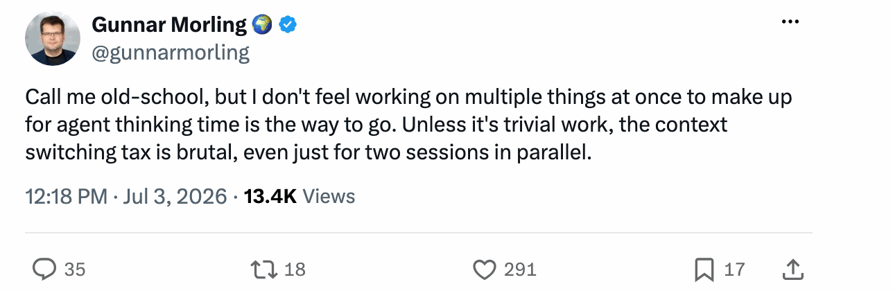


---

<!-- .slide: class="hero-image" -->


---

<!-- .slide: class="hero geo" data-background-image="images/geo-backdrop.svg" data-background-size="cover" -->

## We caught it before Final.

It wasn't the tests. It wasn't the review.


---

<!-- .slide: class="geo" data-background-image="images/geo-backdrop.svg" data-background-size="cover" -->

## How it got through

- I reviewed the <em>diff</em>, not the <em>claim</em>
- I graded it against the PR description, not the spec
- Volume. It looked competent, and others were waiting

<div class="circled centred">
  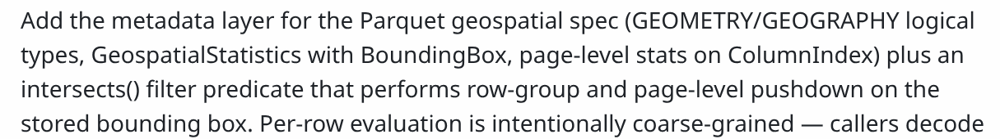
  <span class="mark-box fragment" style="left: 48.8%; top: 24%; width: 34.8%; height: 30%"></span>
</div>


---

<!-- .slide: class="hero" -->

## "You read every diff. Every. Diff."

<span class="aside">Me, Current London, May 2026</span>


---

<!-- .slide: class="hero" -->

## I've lost full control over my own code base.

I no longer understand every line of it.


---


## The exhaustion is real

<span class="ex-stats-go fragment" data-fragment-index="0"></span>
<span class="ex-r1-go fragment" data-fragment-index="1"></span>
<span class="ex-r2-go fragment" data-fragment-index="2"></span>

<div class="ex">
  <div class="ex-tweet">
    <div class="ex-card">
      
      <span class="ex-box"></span>
    </div>
  </div>
  <div class="ex-reply ex-r1">
    
    <span class="ex-tail"></span>
  </div>
  <div class="ex-reply ex-r2">
    
  </div>
</div>


---

<!-- .slide: class="hero" -->

## Where there's no feedback loop, <em>you</em> are the feedback loop.


---

<!-- .slide: class="hero-image" -->

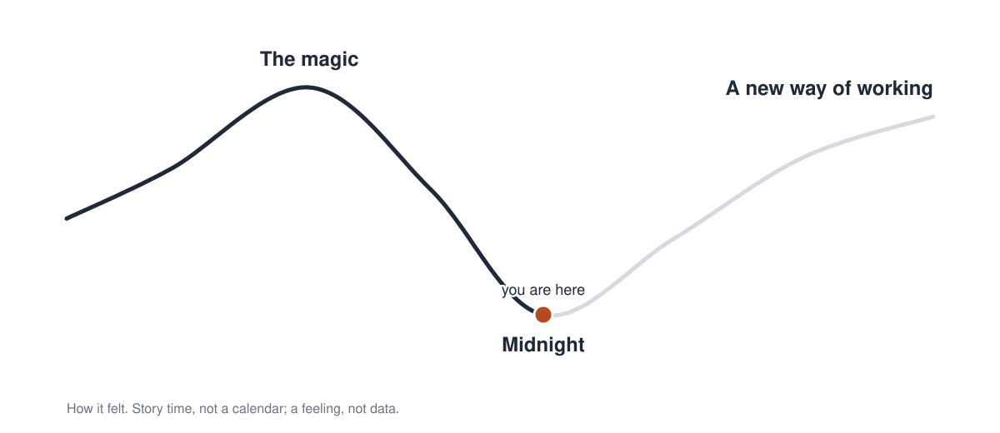


---

<!-- .slide: class="section" data-state="section-slide" data-background-image="images/sections/hinge.jpg" data-background-opacity="0.55" -->

# The part where I concede something

<span class="credit">© ConspiracyofHappiness https://flic.kr/p/KqAcY (CC BY 2.0)</span>


---

## My case, and yours

<div class="columns top compact">
<div>

**Hardwood**

- A complete written specification
- A public corpus of test files
- Three implementations to check against
- Correct = <em>the bytes match</em>
- Fast = <em>a number</em>
- Greenfield. One decision-maker.

</div>
<div>

**Your project**

- A twelve-year-old system, no spec
- Tests that assert what the code does
- Correct = the client hasn't called
- Four teams and an architect with a veto

</div>
</div>

<p class="aside fragment hinge-q">I had it easy. Your projects are harder. <em>So what actually got me out?</em></p>


---

<!-- .slide: class="section" data-state="section-slide" data-background-image="images/sections/new-way.jpg" data-background-opacity="0.55" -->

# 3 · A new way of working

<span class="credit">© chad_k https://flic.kr/p/6AH9Zu (CC BY 2.0)</span>


---

<!-- .slide: class="hero-image" -->

## Meanwhile, a weekend project

<span class="subtitle">Sight-reading drill · pitch detection from the microphone · no dependencies</span>

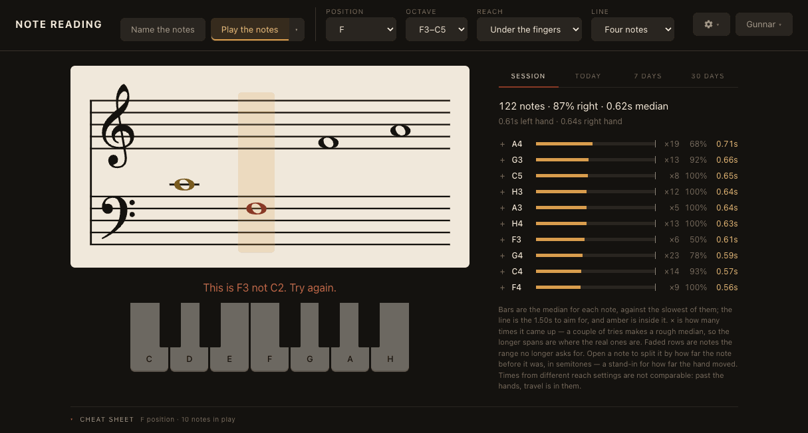


---

<!-- .slide: class="hero" data-background-image="images/sections/piano.jpg" data-background-opacity="0.10" -->

## I vibe-coded all of it.

I checked the <em>what</em>: by playing it.

<span class="credit-side">© OnceCaptured https://flic.kr/p/iiCcNU (CC BY 2.0)</span>


---

<!-- .slide: class="hero" -->

## Looking back, the magic happened wherever a <em>feedback loop</em> existed.

<span class="aside">Something that says right away whether the result is wrong:<br>test vectors, a conformance suite, a piano under my fingers.</span>


---

<!-- .slide: class="hero" -->

## What a feedback loop can check, you can hand off.

The rest stays with you.


---

## Stop being the loop

<svg class="cycle" viewBox="0 80 1088 475" width="1088" height="475"><defs><marker id="cycle-head" viewBox="0 0 10 10" refX="6" refY="5" markerWidth="3.2" markerHeight="3.2" orient="auto-start-reverse"><path d="M0 0 L10 5 L0 10 z" class="cycle-head"/></marker></defs><path class="cycle-arc" d="M581.0 186.3 L585.5 187.6 L589.9 189.1 L594.3 190.8 L598.7 192.7 L602.9 194.8 L607.1 197.0 L611.2 199.4 L615.2 201.9 L619.2 204.7 L623.0 207.5 L626.7 210.6 L630.3 213.7 L633.7 217.1 L637.1 220.5 L640.3 224.1 L643.3 227.8 L646.3 231.7 L649.0 235.6 L651.7 239.7 L654.1 243.9 L656.4 248.2 L658.6 252.5 L660.5 257.0 L662.3 261.6" marker-end="url(#cycle-head)"/><path class="cycle-arc" d="M665.4 339.4 L663.9 344.2 L662.3 349.0 L660.4 353.7 L658.4 358.3 L656.2 362.8 L653.8 367.3 L651.3 371.7 L648.5 375.9 L645.6 380.1 L642.5 384.2 L639.3 388.1 L635.9 391.9 L632.4 395.6 L628.7 399.2 L624.9 402.6 L620.9 405.8 L616.8 408.9 L612.6 411.9 L608.2 414.6 L603.7 417.3 L599.2 419.7 L594.5 422.0 L589.8 424.0 L584.9 425.9" marker-end="url(#cycle-head)"/><path class="cycle-arc" d="M502.1 429.0 L497.0 427.4 L492.0 425.6 L487.0 423.7 L482.1 421.5 L477.3 419.2 L472.5 416.6 L467.9 413.9 L463.4 411.0 L458.9 407.9 L454.6 404.6 L450.5 401.2 L446.4 397.6 L442.5 393.8 L438.8 389.9 L435.2 385.8 L431.7 381.6 L428.4 377.2 L425.3 372.7 L422.4 368.1 L419.6 363.4 L417.0 358.5 L414.7 353.6 L412.5 348.5 L410.5 343.4" marker-end="url(#cycle-head)"/><path class="cycle-arc" d="M407.4 255.6 L409.1 250.2 L411.0 244.9 L413.0 239.6 L415.3 234.4 L417.8 229.3 L420.5 224.3 L423.4 219.4 L426.5 214.7 L429.8 210.0 L433.3 205.4 L436.9 201.0 L440.8 196.8 L444.8 192.6 L448.9 188.7 L453.2 184.9 L457.7 181.2 L462.3 177.8 L467.1 174.5 L472.0 171.4 L477.0 168.5 L482.1 165.8 L487.4 163.3 L492.7 161.0 L498.1 158.9" marker-end="url(#cycle-head)"/><text class="cycle-label" x="544" y="110" text-anchor="middle"><tspan class="cycle-num">1</tspan>  Build the <tspan class="cycle-em">feedback loop</tspan></text><text class="cycle-sub" x="544" y="140" text-anchor="middle">so the agent finds out it’s wrong</text><text class="cycle-label" x="734" y="304" text-anchor="start"><tspan class="cycle-num">2</tspan>  Make it <tspan class="cycle-em">fast</tspan></text><text class="cycle-sub" x="734" y="334" text-anchor="start">or it gets skipped</text><text class="cycle-label" x="544" y="512" text-anchor="middle"><tspan class="cycle-num">3</tspan>  Review what <tspan class="cycle-em">no feedback loop</tspan> can see</text><text class="cycle-sub" x="544" y="542" text-anchor="middle">that part stays with you</text><text class="cycle-label" x="354" y="304" text-anchor="end"><tspan class="cycle-num">4</tspan>  Raise the <tspan class="cycle-em">floor</tspan></text><text class="cycle-sub" x="354" y="334" text-anchor="end">make every correction stick</text></svg>


---

<!-- .slide: class="hero chapter" data-background-image="images/sections/chapter-build-loop.jpg" data-background-opacity="0.22" -->

<span class="overline">3 · A new way of working</span>

# Build the feedback loop

<span class="aside">Give the machine a way to say no.</span>

<span class="credit">© OregonDOT https://flic.kr/p/2j22sUS (CC BY 2.0)</span>


---

## So I can walk away

<span class="subtitle">No browser session, no SSH keys, no home directory</span>

```yaml
claude:
  build: .
  volumes:
    - .:/workspace                # the repository, nothing else
  environment:
    - DOCKER_HOST=tcp://docker-proxy:2375
docker-proxy:                     # Testcontainers only
  environment:
    CONTAINERS: 1
    BUILD: 0                      # no docker build from inside
    VOLUMES: 0                    # no volume create or remove
```

<span class="aside">Abridged from Hardwood's <code>docker-compose.yaml</code></span>


---

## What is the oracle?

<div class="columns top oracle">
<div>

**Hardwood**

```xml
<!-- core/pom.xml -->
<dependency>
  <groupId>org.apache.parquet</groupId>
  <artifactId>parquet-column</artifactId>
  <scope>test</scope>
</dependency>
<dependency>
  <groupId>org.duckdb</groupId>
  <artifactId>duckdb_jdbc</artifactId>
  <scope>test</scope>
</dependency>
```

</div>
<div>

**Your project**

- Golden-master the legacy service, then refactor behind it
- Replay recorded production traffic against both versions
- Run the old system <em>beside</em> the new one and diff

</div>
</div>


---

<!-- .slide: class="hero" -->

## Tests written alongside the code, by the thing that wrote the code, are not an oracle.

They're a <em>mirror</em>.


---


## "Make it faster, Claude!"

<span class="subtitle">A 7 W box on the desk, 500 EUR, silent</span>

<div class="n300">
<div class="n300-row">
<div class="n300-node"><strong>My branch</strong><span>pushed over SSH</span></div>
<svg class="n300-arrow" viewBox="0 0 90 24" width="90" height="24"><path d="M2 12 L74 12" stroke="#b5491f" stroke-width="4"/><path d="M72 4 L88 12 L72 20 z" fill="#b5491f"/></svg>
<div class="n300-box">

<div><strong>Clock pinned</strong><span><code>JMH</code></span><span><code>perfnorm</code></span><span><code>async-profiler</code></span><span><code>perfasm</code></span><span>unattended</span></div>
</div>
<svg class="n300-arrow" viewBox="0 0 90 24" width="90" height="24"><path d="M2 12 L74 12" stroke="#b5491f" stroke-width="4"/><path d="M72 4 L88 12 L72 20 z" fill="#b5491f"/></svg>
<div class="n300-node"><strong>Numbers back</strong><span>with the assembly</span></div>
</div>
<svg class="n300-back" viewBox="0 0 1000 90" width="1000" height="90" preserveAspectRatio="none"><path d="M980 8 C980 78, 20 78, 20 16" fill="none" stroke="#666666" stroke-width="3" stroke-dasharray="8 7"/><path d="M12 4 L28 12 L14 22 z" fill="#666666"/></svg>
<p class="n300-again">the next variant, minutes later</p>
</div>


---

## perfasm names the culprit

<span class="subtitle">Delta decoding: 69% of cycles in one method</span>

<span class="fix-go fragment" data-fragment-index="0"></span>

<div class="columns asm-code">
<div class="asm-left">
<blockquote class="transcript asm-prompt">
"profile the decoding benchmark on the N300 to identify whether there's any remaining bottlenecks"
<cite>Me, to Claude, Aug 30</cite>
</blockquote>
<pre class="asm"><code class="nohighlight" data-noescape>1.16%  add  %rsi,%rax        ;*ladd
0.79%  mov  %rax,0x10(…)     ;*lastore
<mark>5.13%  mov  0x48(%rsp),%r10
1.03%  mov  %rax,0x10(%r10)  ;*putfield
                             ; lastValue
6.66%  mov  %rbp,%r10</mark>
0.74%  shr  $0x3,%r10</code></pre>
</div>
<div>
<pre class="rot-code fix-code"><code class="nohighlight" data-noescape><span class="rot-swap"><span class="rot-old"><span class="k">for</span> (<span class="k">int</span> i = 0; i &lt; count; i++) {
    <span class="c">// unpack the residual …</span>
    lastValue += delta + residual;
    dest[offset + i] = lastValue;
}
</span><span class="rot-new"><span class="k">long</span> <mark class="rot-fixed">value</mark> = lastValue;
<span class="k">for</span> (<span class="k">int</span> i = 0; i &lt; count; i++) {
    <span class="c">// unpack the residual …</span>
    <mark class="rot-fixed">value</mark> += delta + residual;
    dest[offset + i] = <mark class="rot-fixed">value</mark>;
}
lastValue = value;</span></span></code></pre>
</div>
</div>

<div class="asm-asides">
<p class="aside fragment" data-fragment-index="0">The fix: a local instead of the field. +2% to +7%.</p>
<p class="aside fragment" data-fragment-index="1">It never gets tired of trying. <em>The number decides what worked.</em></p>
</div>


---

<!-- .slide: class="hero chapter" data-background-image="images/sections/chapter-make-fast.jpg" data-background-opacity="0.22" -->

<span class="overline">3 · A new way of working</span>

# Make it fast

<span class="aside">A loop you wait minutes for is a loop you skip.</span>

<span class="credit">© Elsie esq. https://flic.kr/p/i9NnnB (CC BY 2.0)</span>


---

## "I'm feeling our feedback loop is too slow."

<span class="subtitle">Me, to Claude, Sep 7</span>

<div class="loop-chart">
<div class="loop-row  fragment" data-fragment-index="0">
<div class="loop-label"><strong>The licence check</strong><span>walked 205,000 files to pick 1,000</span></div>
<div class="loop-bars">
<div class="loop-bar before" style="width: 170px"><span>16.5 s</span></div>
<div class="loop-bar after" style="width: 6px"><span>0.6 s</span></div>
</div>
<div class="loop-note">CI never saw it: every CI checkout is fresh.</div>
</div>
<div class="loop-row  fragment" data-fragment-index="1">
<div class="loop-label"><strong>Tests in parallel</strong><span>they ran one class at a time</span></div>
<div class="loop-bars">
<div class="loop-bar before" style="width: 619px"><span>60 s</span></div>
<div class="loop-bar after" style="width: 347px"><span>34 s</span></div>
</div>
</div>
<div class="loop-row  fragment" data-fragment-index="2">
<div class="loop-label"><strong>The slowest tests</strong><span>63% of it parsing Hadoop's config</span></div>
<div class="loop-bars">
<div class="loop-bar before" style="width: 361px"><span>35 s</span></div>
<div class="loop-bar after" style="width: 165px"><span>16 s</span></div>
</div>
<div class="loop-note">In a Parquet library built to need no Hadoop.</div>
</div>
<div class="loop-row loop-total fragment" data-fragment-index="3">
<div class="loop-label"><strong>The dev loop</strong><span>two days later</span></div>
<div class="loop-bars">
<div class="loop-bar before" style="width: 619px"><span>60 s</span></div>
<div class="loop-bar after" style="width: 288px"><span>28 s</span></div>
</div>
</div>
</div>


---

<!-- .slide: class="hero-image" -->

## Give the agent an instrument

<div class="pair">
  
  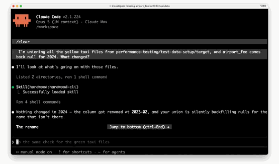
</div>

<span class="aside">If your agent keeps writing one-off scripts to look at a system, that system is missing a tool.<br>Build it, even if only the agent uses it.</span>


---

<!-- .slide: class="hero chapter" data-background-image="images/sections/chapter-review.jpg" data-background-opacity="0.22" -->

<span class="overline">3 · A new way of working</span>

# Review what no feedback loop can see

<span class="aside">Human attention, where mistakes are expensive.</span>

<span class="credit">© John 'Pathfinder' Lester https://flic.kr/p/bUgBy5 (CC BY 2.0)</span>


---

<!-- .slide: class="geo" data-background-image="images/geo-backdrop.svg" data-background-size="cover" -->

## What caught the geo bug?

<span class="subtitle">June 4, three weeks before 1.0.0.Final</span>

<div class="columns geo-spec">
<div>
<p class="geo-label">The spec, <code>parquet.thrift</code></p>
<pre class="rot-code"><code class="nohighlight" data-noescape><span class="k">struct</span> ColumnIndex {
  1: null_pages
  2: min_values
  3: max_values
  4: boundary_order
  5: null_counts
  6: repetition_level_histograms
<span class="spec-7">  7: definition_level_histograms</span>
  8: nan_counts
}</code></pre>
</div>
<div class="geo-verdict">
<p class="geo-claim fragment" data-fragment-index="0">Hardwood read field 7 as<br><s>geospatial statistics</s>.<br><strong>There is no geo field.</strong></p>
<div class="verdict-list fragment" data-fragment-index="1">
<p><span class="no">✗</span> The tests: same misreading</p>
<p><span class="no">✗</span> The review: it passed</p>
<p><span class="yes">✓</span> Reading the spec, for something else</p>
</div>
</div>
</div>


---

## I own the design. <em>Not every line.</em>

<svg class="pockets" viewBox="0 0 1000 470" width="1000" height="470"><text x="150" y="38" class="pk-title" fill="#354045">The design: mine</text><g class="fragment" data-fragment-index="1"><rect x="184.0" y="94.0" width="37.7" height="35.3" rx="4" fill="#354045" fill-opacity="0.1"/><rect x="229.7" y="94.0" width="37.7" height="35.3" rx="4" fill="#354045" fill-opacity="0.08"/><rect x="275.4" y="94.0" width="37.7" height="35.3" rx="4" fill="#354045" fill-opacity="0.13"/><rect x="321.1" y="94.0" width="37.7" height="35.3" rx="4" fill="#354045" fill-opacity="0.08"/><rect x="366.9" y="94.0" width="37.7" height="35.3" rx="4" fill="#354045" fill-opacity="0.12"/><rect x="412.6" y="94.0" width="37.7" height="35.3" rx="4" fill="#354045" fill-opacity="0.1"/><rect x="458.3" y="94.0" width="37.7" height="35.3" rx="4" fill="#354045" fill-opacity="0.08"/><rect x="504.0" y="94.0" width="37.7" height="35.3" rx="4" fill="#354045" fill-opacity="0.12"/><rect x="549.7" y="94.0" width="37.7" height="35.3" rx="4" fill="#354045" fill-opacity="0.07"/><rect x="595.4" y="94.0" width="37.7" height="35.3" rx="4" fill="#354045" fill-opacity="0.11"/><rect x="641.1" y="94.0" width="37.7" height="35.3" rx="4" fill="#354045" fill-opacity="0.08"/><rect x="686.9" y="94.0" width="37.7" height="35.3" rx="4" fill="#354045" fill-opacity="0.08"/><rect x="732.6" y="94.0" width="37.7" height="35.3" rx="4" fill="#354045" fill-opacity="0.11"/><rect x="778.3" y="94.0" width="37.7" height="35.3" rx="4" fill="#354045" fill-opacity="0.14"/><rect x="184.0" y="137.3" width="37.7" height="35.3" rx="4" fill="#354045" fill-opacity="0.08"/><rect x="229.7" y="137.3" width="37.7" height="35.3" rx="4" fill="#354045" fill-opacity="0.4"/><rect x="275.4" y="137.3" width="37.7" height="35.3" rx="4" fill="#354045" fill-opacity="0.85"/><rect x="321.1" y="137.3" width="37.7" height="35.3" rx="4" fill="#354045" fill-opacity="0.85"/><rect x="366.9" y="137.3" width="37.7" height="35.3" rx="4" fill="#354045" fill-opacity="0.4"/><rect x="412.6" y="137.3" width="37.7" height="35.3" rx="4" fill="#354045" fill-opacity="0.09"/><rect x="458.3" y="137.3" width="37.7" height="35.3" rx="4" fill="#354045" fill-opacity="0.13"/><rect x="504.0" y="137.3" width="37.7" height="35.3" rx="4" fill="#354045" fill-opacity="0.16"/><rect x="549.7" y="137.3" width="37.7" height="35.3" rx="4" fill="#354045" fill-opacity="0.12"/><rect x="595.4" y="137.3" width="37.7" height="35.3" rx="4" fill="#354045" fill-opacity="0.11"/><rect x="641.1" y="137.3" width="37.7" height="35.3" rx="4" fill="#354045" fill-opacity="0.16"/><rect x="686.9" y="137.3" width="37.7" height="35.3" rx="4" fill="#354045" fill-opacity="0.07"/><rect x="732.6" y="137.3" width="37.7" height="35.3" rx="4" fill="#354045" fill-opacity="0.15"/><rect x="778.3" y="137.3" width="37.7" height="35.3" rx="4" fill="#354045" fill-opacity="0.1"/><rect x="184.0" y="180.7" width="37.7" height="35.3" rx="4" fill="#354045" fill-opacity="0.08"/><rect x="229.7" y="180.7" width="37.7" height="35.3" rx="4" fill="#354045" fill-opacity="0.08"/><rect x="275.4" y="180.7" width="37.7" height="35.3" rx="4" fill="#354045" fill-opacity="0.85"/><rect x="321.1" y="180.7" width="37.7" height="35.3" rx="4" fill="#354045" fill-opacity="0.4"/><rect x="366.9" y="180.7" width="37.7" height="35.3" rx="4" fill="#354045" fill-opacity="0.1"/><rect x="412.6" y="180.7" width="37.7" height="35.3" rx="4" fill="#354045" fill-opacity="0.14"/><rect x="458.3" y="180.7" width="37.7" height="35.3" rx="4" fill="#354045" fill-opacity="0.09"/><rect x="504.0" y="180.7" width="37.7" height="35.3" rx="4" fill="#354045" fill-opacity="0.12"/><rect x="549.7" y="180.7" width="37.7" height="35.3" rx="4" fill="#354045" fill-opacity="0.13"/><rect x="595.4" y="180.7" width="37.7" height="35.3" rx="4" fill="#354045" fill-opacity="0.4"/><rect x="641.1" y="180.7" width="37.7" height="35.3" rx="4" fill="#354045" fill-opacity="0.1"/><rect x="686.9" y="180.7" width="37.7" height="35.3" rx="4" fill="#354045" fill-opacity="0.12"/><rect x="732.6" y="180.7" width="37.7" height="35.3" rx="4" fill="#354045" fill-opacity="0.08"/><rect x="778.3" y="180.7" width="37.7" height="35.3" rx="4" fill="#354045" fill-opacity="0.08"/><rect x="184.0" y="224.0" width="37.7" height="35.3" rx="4" fill="#354045" fill-opacity="0.09"/><rect x="229.7" y="224.0" width="37.7" height="35.3" rx="4" fill="#354045" fill-opacity="0.13"/><rect x="275.4" y="224.0" width="37.7" height="35.3" rx="4" fill="#354045" fill-opacity="0.4"/><rect x="321.1" y="224.0" width="37.7" height="35.3" rx="4" fill="#354045" fill-opacity="0.11"/><rect x="366.9" y="224.0" width="37.7" height="35.3" rx="4" fill="#354045" fill-opacity="0.1"/><rect x="412.6" y="224.0" width="37.7" height="35.3" rx="4" fill="#354045" fill-opacity="0.12"/><rect x="458.3" y="224.0" width="37.7" height="35.3" rx="4" fill="#354045" fill-opacity="0.11"/><rect x="504.0" y="224.0" width="37.7" height="35.3" rx="4" fill="#354045" fill-opacity="0.1"/><rect x="549.7" y="224.0" width="37.7" height="35.3" rx="4" fill="#354045" fill-opacity="0.14"/><rect x="595.4" y="224.0" width="37.7" height="35.3" rx="4" fill="#354045" fill-opacity="0.85"/><rect x="641.1" y="224.0" width="37.7" height="35.3" rx="4" fill="#354045" fill-opacity="0.85"/><rect x="686.9" y="224.0" width="37.7" height="35.3" rx="4" fill="#354045" fill-opacity="0.4"/><rect x="732.6" y="224.0" width="37.7" height="35.3" rx="4" fill="#354045" fill-opacity="0.13"/><rect x="778.3" y="224.0" width="37.7" height="35.3" rx="4" fill="#354045" fill-opacity="0.09"/><rect x="184.0" y="267.3" width="37.7" height="35.3" rx="4" fill="#354045" fill-opacity="0.12"/><rect x="229.7" y="267.3" width="37.7" height="35.3" rx="4" fill="#354045" fill-opacity="0.12"/><rect x="275.4" y="267.3" width="37.7" height="35.3" rx="4" fill="#354045" fill-opacity="0.15"/><rect x="321.1" y="267.3" width="37.7" height="35.3" rx="4" fill="#354045" fill-opacity="0.14"/><rect x="366.9" y="267.3" width="37.7" height="35.3" rx="4" fill="#354045" fill-opacity="0.4"/><rect x="412.6" y="267.3" width="37.7" height="35.3" rx="4" fill="#354045" fill-opacity="0.85"/><rect x="458.3" y="267.3" width="37.7" height="35.3" rx="4" fill="#354045" fill-opacity="0.4"/><rect x="504.0" y="267.3" width="37.7" height="35.3" rx="4" fill="#354045" fill-opacity="0.1"/><rect x="549.7" y="267.3" width="37.7" height="35.3" rx="4" fill="#354045" fill-opacity="0.16"/><rect x="595.4" y="267.3" width="37.7" height="35.3" rx="4" fill="#354045" fill-opacity="0.4"/><rect x="641.1" y="267.3" width="37.7" height="35.3" rx="4" fill="#354045" fill-opacity="0.85"/><rect x="686.9" y="267.3" width="37.7" height="35.3" rx="4" fill="#354045" fill-opacity="0.08"/><rect x="732.6" y="267.3" width="37.7" height="35.3" rx="4" fill="#354045" fill-opacity="0.11"/><rect x="778.3" y="267.3" width="37.7" height="35.3" rx="4" fill="#354045" fill-opacity="0.14"/><rect x="184.0" y="310.7" width="37.7" height="35.3" rx="4" fill="#354045" fill-opacity="0.08"/><rect x="229.7" y="310.7" width="37.7" height="35.3" rx="4" fill="#354045" fill-opacity="0.11"/><rect x="275.4" y="310.7" width="37.7" height="35.3" rx="4" fill="#354045" fill-opacity="0.07"/><rect x="321.1" y="310.7" width="37.7" height="35.3" rx="4" fill="#354045" fill-opacity="0.13"/><rect x="366.9" y="310.7" width="37.7" height="35.3" rx="4" fill="#354045" fill-opacity="0.14"/><rect x="412.6" y="310.7" width="37.7" height="35.3" rx="4" fill="#354045" fill-opacity="0.12"/><rect x="458.3" y="310.7" width="37.7" height="35.3" rx="4" fill="#354045" fill-opacity="0.15"/><rect x="504.0" y="310.7" width="37.7" height="35.3" rx="4" fill="#354045" fill-opacity="0.1"/><rect x="549.7" y="310.7" width="37.7" height="35.3" rx="4" fill="#354045" fill-opacity="0.13"/><rect x="595.4" y="310.7" width="37.7" height="35.3" rx="4" fill="#354045" fill-opacity="0.12"/><rect x="641.1" y="310.7" width="37.7" height="35.3" rx="4" fill="#354045" fill-opacity="0.12"/><rect x="686.9" y="310.7" width="37.7" height="35.3" rx="4" fill="#354045" fill-opacity="0.11"/><rect x="732.6" y="310.7" width="37.7" height="35.3" rx="4" fill="#354045" fill-opacity="0.15"/><rect x="778.3" y="310.7" width="37.7" height="35.3" rx="4" fill="#354045" fill-opacity="0.16"/><rect x="880" y="130" width="26" height="26" rx="4" fill="#354045" fill-opacity="0.85"/><text x="916" y="151" class="pk-legend" fill="#354045">read closely</text><text x="916" y="178" class="pk-sub" fill="#666666">where a wrong</text><text x="916" y="202" class="pk-sub" fill="#666666">answer looks right</text><rect x="880" y="250" width="26" height="26" rx="4" fill="#354045" fill-opacity="0.12"/><text x="916" y="271" class="pk-legend" fill="#354045">the what</text><text x="916" y="298" class="pk-sub" fill="#666666">a feedback loop</text><text x="916" y="322" class="pk-sub" fill="#666666">checks it</text></g><rect x="150" y="60" width="700" height="320" rx="26" fill="none" stroke="#b5491f" stroke-width="12"/><text x="500.0" y="436" text-anchor="middle" class="pk-label" fill="#b5491f">The API: every change, line by line</text></svg>


---

<!-- .slide: class="hero-image" -->

## Every API change, on a list

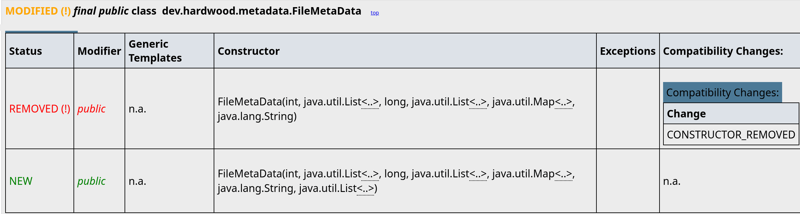

<span class="aside">API report for 1.0.0.Final against CR2 · <code>(!)</code> marks a binary-incompatible change</span>


---


<!-- .slide: class="hero-image" -->

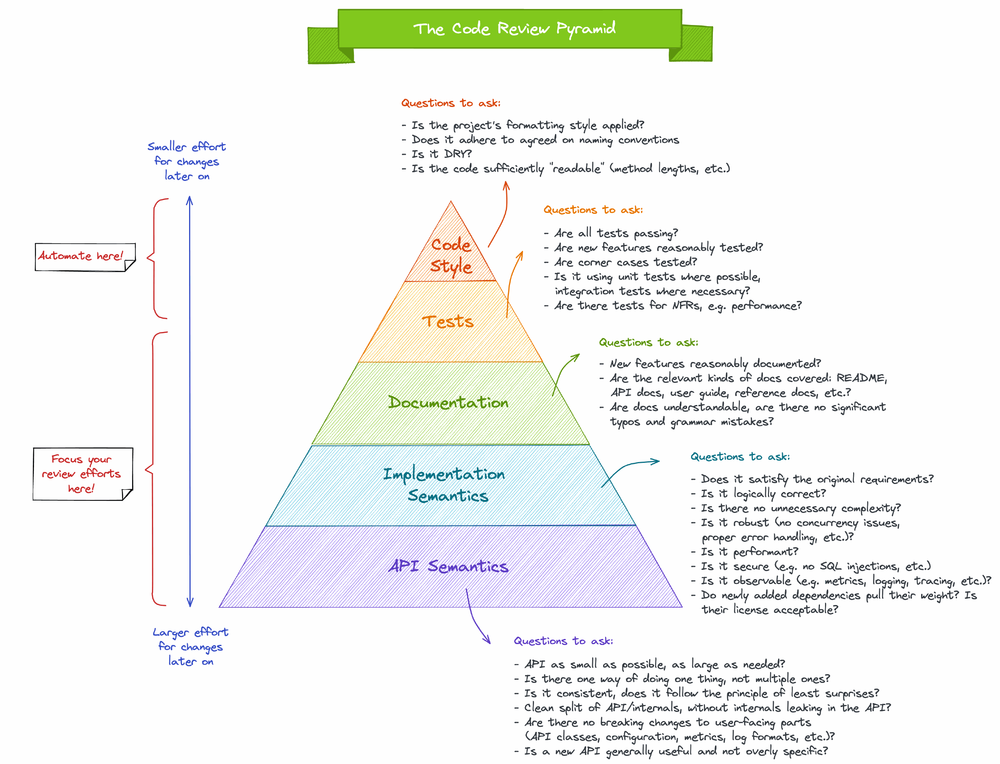 <!-- .element: class="plain pyramid" -->

<p class="aside" style="margin: 6px 0 0">The base is the <em>what</em>. The top is the <em>how</em>.</p>


---


## What no test catches

<span class="subtitle">Hardwood docs, the write model, Aug 22</span>

<div class="doc-excerpt">
<p><strong>Page size</strong> governs read granularity. A reader that skips pages by their statistics can only skip whole pages.</p>
<p><strong>Row-group size</strong> governs <mark class="doc-claim">read parallelism</mark> and split sizing, and on the write side it is the memory bound above.</p>
</div>

<blockquote class="transcript doc-me fragment" data-fragment-index="0">
"…governs read parallelism" in the docs is not correct: we parallelize reading at the chunk and even page level.
<cite>Me, Aug 26</cite>
</blockquote>

<div class="doc-checks fragment" data-fragment-index="1">
<span class="doc-label">Passed it</span> <span>Tests</span> <span>Docs build</span>
<span class="doc-label doc-caught">Caught it</span> <span class="doc-owner">Someone who knows the design</span>
</div>


---

<!-- .slide: class="hero chapter" data-background-image="images/sections/chapter-raise-floor.jpg" data-background-opacity="0.22" -->

<span class="overline">3 · A new way of working</span>

# Raise the floor

<span class="aside">Make every correction stick.</span>

<span class="credit">© &#126;MVI&#126; (warped) https://flic.kr/p/4kA93z (CC BY 2.0)</span>


---

## Automate the top: the ladder

<svg class="proto" viewBox="0 0 1000 460" width="1000" height="460"><g class="fragment" data-fragment-index="0"><rect x="25" y="350" width="310" height="90" fill="#354045" fill-opacity="0.25"/><text x="41" y="386" class="p-label" fill="#ffffff">1</text><text x="73" y="386" class="p-step" fill="#ffffff">Ask in prose</text><text x="31" y="304" class="p-sub" fill="#354045">Sep 4: a rule in CLAUDE.md</text><text x="31" y="330" class="p-sub" fill="#354045">Sep 8: “why again?”</text></g><g class="fragment" data-fragment-index="1"><rect x="345" y="260" width="310" height="180" fill="#354045" fill-opacity="0.55"/><text x="361" y="296" class="p-label" fill="#ffffff">2</text><text x="393" y="296" class="p-step" fill="#ffffff">Automated check</text><text x="351" y="214" class="p-sub" fill="#354045">Filler prose → PR build check</text><text x="351" y="240" class="p-sub" fill="#354045">var → compiler error</text></g><g class="fragment" data-fragment-index="2"><rect x="665" y="170" width="310" height="270" fill="#354045" fill-opacity="0.85"/><text x="681" y="206" class="p-label" fill="#ffffff">3</text><text x="713" y="206" class="p-step" fill="#ffffff">Unrepresentable</text><text x="671" y="124" class="p-sub" fill="#354045">Sep 14: co-author trailer</text><text x="671" y="150" class="p-sub" fill="#354045">off in the settings file</text></g></svg>


---


## Prose rots. Checks don't.

<span class="subtitle">One comment, in 29 filter matchers, May 11 to Sep 10</span>

<span class="rot-go fragment" data-fragment-index="0"></span>
<span class="rot-fix-go fragment" data-fragment-index="1"></span>

<pre class="rot-code"><code class="nohighlight" data-noescape><span class="rot-swap"><span class="rot-old c">// Build the predicate bitmap ignoring nulls. The inner loop is fixed at 64
// iterations and uses a branchless `(cond ? 1 : 0) &lt;&lt; b` pack so HotSpot
// <mark class="rot-claim">fully unrolls it and auto-vectorizes the comparison</mark>. The tail is split
// off to keep the hot loop's trip count constant at 64.</span><span class="rot-new c">// Build the predicate bitmap ignoring nulls; nulls are masked out in the
// word-wise pass below. The comparison is branchless, but <mark class="rot-fixed">C2 does not</mark>
// <mark class="rot-fixed">vectorize it</mark> — packing a vector compare into bitmap bits has no
// autovectorization idiom, so this compiles to a scalar cmp/setcc/shl/or
// chain unrolled 4x. The tail is split off to keep the hot loop's trip
// count constant at 64.</span></span>
<span class="k">for</span> (<span class="k">int</span> w = 0; w &lt; fullWords; w++) {
    <span class="k">int</span> base = w &lt;&lt; 6;
    <span class="k">long</span> word = 0L;
    <span class="k">for</span> (<span class="k">int</span> b = 0; b &lt; 64; b++) {
        word |= ((vals[base + b] &gt; lit) ? 1L : 0L) &lt;&lt; b;
    }
    outWords[w] = word;
}</code></pre>

<div class="rot-captions">
<p class="aside rot-verdict">perfasm: six scalar instructions per value, no vector instructions, unrolled 4×.</p>
<p class="aside rot-fix">Sep 10: rewritten from a measurement. <em>Still prose, so it can rot again.</em></p>
</div>


---

<!-- .slide: class="hero-image" -->


---

<!-- .slide: class="hero-image" -->

<svg class="helix" viewBox="0 0 400 400" data-helix data-turns="3">
  <text class="ring-label" x="200" y="56" text-anchor="middle">The magic</text>
  <text class="ring-label" x="200" y="358" text-anchor="middle">Midnight</text>
</svg>
<span class="fragment helix-step" data-helix-tilt data-fragment-index="0"></span>
<div class="helix-captions">
  <p class="fragment fade-out" data-fragment-index="0">Magic, midnight, magic, midnight…</p>
  <p class="fragment" data-fragment-index="0">…and every turn ends <em>higher</em>.</p>
</div>


---


<!-- .slide: class="section" data-state="section-slide" data-background-image="images/sections/price-joy.jpg" data-background-opacity="0.55" -->

# 4 · The price, and the joy

<span class="credit">© Michael Elleray https://flic.kr/p/aCqL2a (CC BY 2.0)</span>


---

<!-- .slide: class="hero" -->

## I no longer know every line.

And I'm fine with that.


---

<!-- .slide: class="hero-image" -->

## Expand, then consolidate

<div class="pair">
  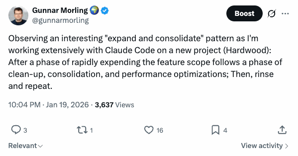
  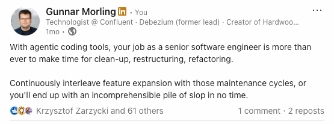
</div>


---

<!-- .slide: class="hero-image" -->


---

## Nine months

<div class="columns nine-months">
<div>

| | |
|---|---|
| Commits | 1,039 |
| Main code (Java) | 91k lines |
| Test code | 90k lines |
| Design docs | 90 |
| Review files | 222 |
| Issues · PRs | 728 · 503 |

</div>
<div>
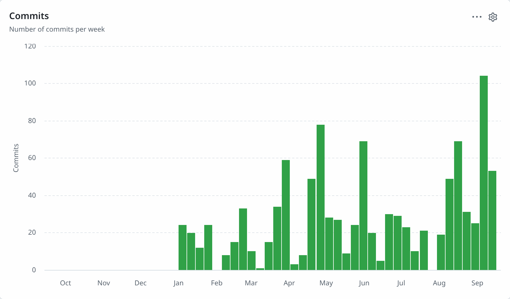
<p class="gh-caption">Commits per week, from GitHub, Sep 17</p>
</div>
</div>


---

<!-- .slide: class="hero" data-background-image="images/sections/piano.jpg" data-background-opacity="0.10" -->

## AI lets you build things you otherwise just <em>wouldn't</em>.

<span class="credit-side">© OnceCaptured https://flic.kr/p/iiCcNU (CC BY 2.0)</span>


---

<!-- .slide: class="hero" -->

## "Built with AI, not by AI" is a quality claim.

The agent owns more and more of the <em>how</em>.<br>It holds only if you're the arbiter of the <em>what</em>.


---

<!-- .slide: class="hero" -->

# Review the claim, not the diff.


---

## Stop being the loop

<svg class="cycle cycle-monday" viewBox="0 80 1088 475" width="1088" height="475"><defs><marker id="cycle-head-monday" viewBox="0 0 10 10" refX="6" refY="5" markerWidth="3.2" markerHeight="3.2" orient="auto-start-reverse"><path d="M0 0 L10 5 L0 10 z" class="cycle-head"/></marker></defs><path class="cycle-arc" d="M581.0 186.3 L585.5 187.6 L589.9 189.1 L594.3 190.8 L598.7 192.7 L602.9 194.8 L607.1 197.0 L611.2 199.4 L615.2 201.9 L619.2 204.7 L623.0 207.5 L626.7 210.6 L630.3 213.7 L633.7 217.1 L637.1 220.5 L640.3 224.1 L643.3 227.8 L646.3 231.7 L649.0 235.6 L651.7 239.7 L654.1 243.9 L656.4 248.2 L658.6 252.5 L660.5 257.0 L662.3 261.6" marker-end="url(#cycle-head-monday)"/><path class="cycle-arc" d="M665.4 339.4 L663.9 344.2 L662.3 349.0 L660.4 353.7 L658.4 358.3 L656.2 362.8 L653.8 367.3 L651.3 371.7 L648.5 375.9 L645.6 380.1 L642.5 384.2 L639.3 388.1 L635.9 391.9 L632.4 395.6 L628.7 399.2 L624.9 402.6 L620.9 405.8 L616.8 408.9 L612.6 411.9 L608.2 414.6 L603.7 417.3 L599.2 419.7 L594.5 422.0 L589.8 424.0 L584.9 425.9" marker-end="url(#cycle-head-monday)"/><path class="cycle-arc" d="M502.1 429.0 L497.0 427.4 L492.0 425.6 L487.0 423.7 L482.1 421.5 L477.3 419.2 L472.5 416.6 L467.9 413.9 L463.4 411.0 L458.9 407.9 L454.6 404.6 L450.5 401.2 L446.4 397.6 L442.5 393.8 L438.8 389.9 L435.2 385.8 L431.7 381.6 L428.4 377.2 L425.3 372.7 L422.4 368.1 L419.6 363.4 L417.0 358.5 L414.7 353.6 L412.5 348.5 L410.5 343.4" marker-end="url(#cycle-head-monday)"/><path class="cycle-arc" d="M407.4 255.6 L409.1 250.2 L411.0 244.9 L413.0 239.6 L415.3 234.4 L417.8 229.3 L420.5 224.3 L423.4 219.4 L426.5 214.7 L429.8 210.0 L433.3 205.4 L436.9 201.0 L440.8 196.8 L444.8 192.6 L448.9 188.7 L453.2 184.9 L457.7 181.2 L462.3 177.8 L467.1 174.5 L472.0 171.4 L477.0 168.5 L482.1 165.8 L487.4 163.3 L492.7 161.0 L498.1 158.9" marker-end="url(#cycle-head-monday)"/><text class="cycle-label" x="544" y="110" text-anchor="middle"><tspan class="cycle-num">1</tspan>  Build the <tspan class="cycle-em">feedback loop</tspan></text><text class="cycle-sub" x="544" y="140" text-anchor="middle">so the agent finds out it’s wrong</text><text class="cycle-label" x="734" y="304" text-anchor="start"><tspan class="cycle-num">2</tspan>  Make it <tspan class="cycle-em">fast</tspan></text><text class="cycle-sub" x="734" y="334" text-anchor="start">or it gets skipped</text><text class="cycle-label" x="544" y="512" text-anchor="middle"><tspan class="cycle-num">3</tspan>  Review what <tspan class="cycle-em">no feedback loop</tspan> can see</text><text class="cycle-sub" x="544" y="542" text-anchor="middle">that part stays with you</text><text class="cycle-label" x="354" y="304" text-anchor="end"><tspan class="cycle-num">4</tspan>  Raise the <tspan class="cycle-em">floor</tspan></text><text class="cycle-sub" x="354" y="334" text-anchor="end">make every correction stick</text></svg>

<div class="signoff fragment">
  <strong class="signoff-thanks">Thank you!</strong>
  
  <div>
    Gunnar Morling
    <span class="signoff-role">Technologist, Confluent</span>
    <span>morling.dev · hardwood.dev · @gunnarmorling</span>
  </div>
</div>
