<!-- .slide: class="section" data-state="section-slide" data-background-image="images/sections/title.jpg" data-background-opacity="0.55" -->


# Built with AI, <em>not by AI</em>

Nine months of building a Parquet library with an agent

<span class="aside">Gunnar Morling · @gunnarmorling</span>

<span class="credit">© mrpolyonymous https://flic.kr/p/a6j2Z7 (CC BY 2.0)</span>

Note:
Photo: "Wood Grain" by mrpolyonymous (CC BY 2.0, https://flic.kr/p/a6j2Z7). Loosely connected: wood grain, or a woodworker's bench with hand tools.

No agenda slide. No "about me". Go straight into the PR.

Deliver the first five minutes standing still. The whole talk is paid for by
the room believing this story actually happened to you.

---

<!-- .slide: class="geo" data-background-image="images/geo-backdrop.svg" data-background-size="cover" -->

## A contributor's pull request

<div class="stamped">
  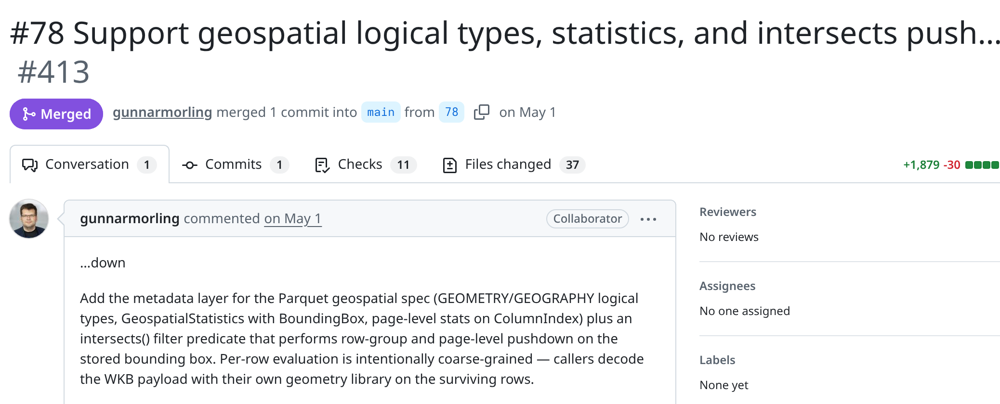
  <div class="stamp fragment" data-fragment-index="0" style="left: 770px; top: 60px; --rot: -5deg; --c: #2e7d32">✓ Tests green</div>
  <div class="stamp fragment" data-fragment-index="1" style="left: 740px; top: 140px; --rot: 3deg; --c: #2e7d32">✓ Merged, May 1</div>
  <div class="stamp fragment" data-fragment-index="2" style="left: 640px; top: 220px; --rot: -4deg; --c: #2e7d32">✓ Shipped in 1.0.0.CR1</div>
  <div class="stamp stamp-big fragment" data-fragment-index="3" style="left: 60px; top: 320px; --rot: -5deg; --c: #c62828">The feature couldn't work</div>
</div>

Note:
Set the scene plainly: an outside contributor, LLM-assisted, offering
page-level geospatial pruning for Hardwood. Skip pages whose bounding box
can't intersect the query geometry. Their work, their commit. I fixed a few
loose ends and merged it on May 1 as #413, which keeps their authorship (their
original PR, #173, was superseded). So the review, and the merge, were mine.

Coherent code. Sensible names. Reads like the rest of the codebase. Say
explicitly: this is not bad code. If you are waiting for the slide where the AI
writes something obviously stupid, there isn't one.

Click: tests green (all 11 checks passed). Click: merged. Click: shipped in CR1.
Users got it, under a version number with my name on it. Pause.

Click: the feature couldn't work. Parquet doesn't store that information per
page. No format details on stage. If someone asks: geospatial statistics exist
only per column chunk (ColumnMetaData, field 17). The PR read ColumnIndex field 7
as per-page bounding boxes; field 7 is the definition-level histograms.

The detail that makes it worse: the geospatial design document asserted the
same page-level mapping. The fiction was in the reviewed prose first, and the
code implemented it faithfully. The model did not write a bug. It implemented a
feature that does not exist, convincingly, and then proved it worked.

---

<!-- .slide: class="hero geo" data-background-image="images/geo-backdrop.svg" data-background-size="cover" -->

## How does someone careful end up here?

<span class="aside">Back to the holidays.</span>

Note:
Don't explain how it got through yet. Leave the room with the question and go
back in time. The story catches up with this moment at midnight.

---

<!-- .slide: class="section" data-state="section-slide" data-background-image="images/sections/the-magic.jpg" data-background-opacity="0.4" -->

# 1 · The magic

<span class="credit">© Alex Holyoake https://flic.kr/p/AN2ZRn (CC BY 2.0)</span>

Note:
Photo: "TNT" by Alex Holyoake (CC BY 2.0, https://flic.kr/p/AN2ZRn). Loosely connected: sparklers or fireworks.

---

<!-- .slide: class="wide" -->

<div class="montage">
  <h2>Do you remember the start of the year?</h2>
  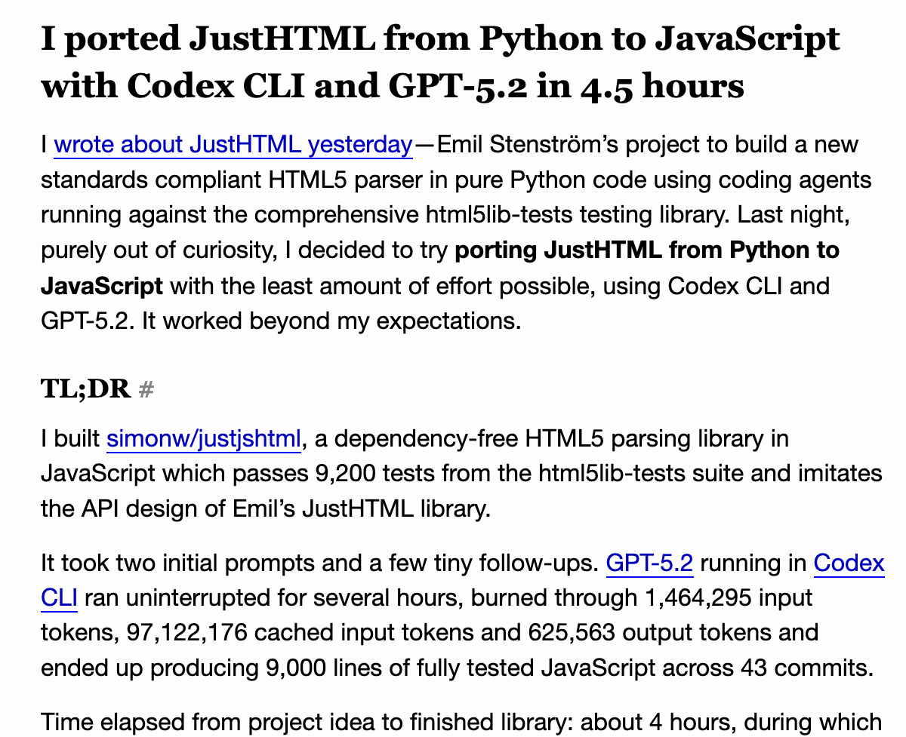
  
  
  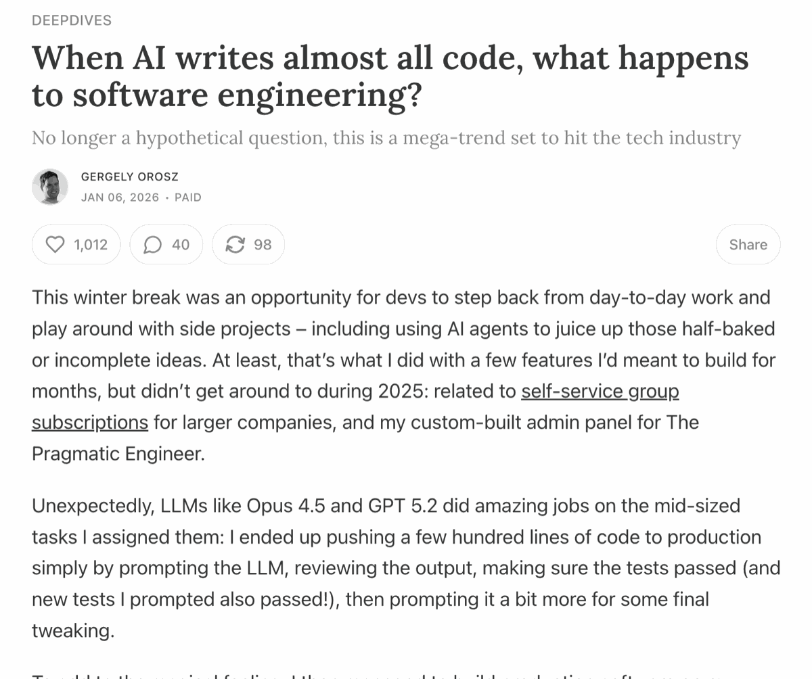
  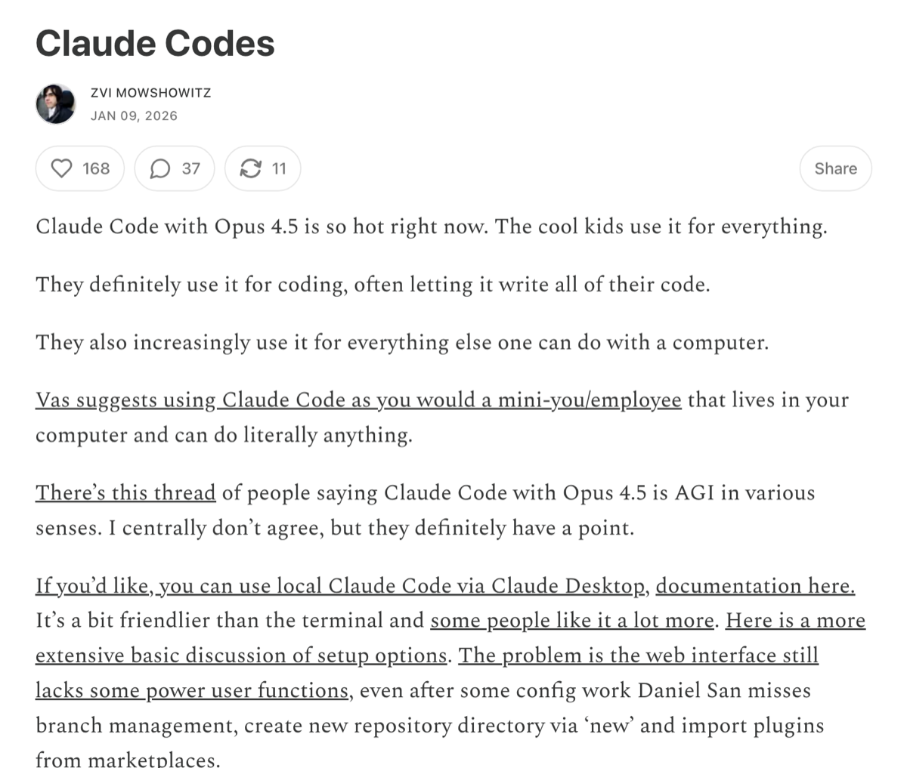
  
  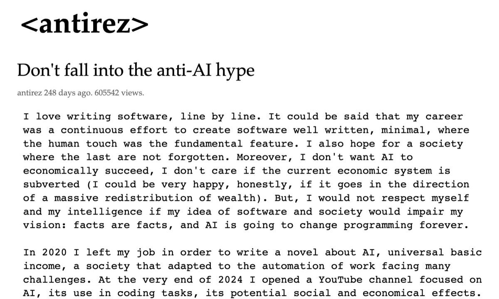
  
</div>

Note:
Ask the question to the room, then three clicks, oldest first: December
(Willison, Steinberger), the first days of January (Holland, Orosz, Zvi,
Lambert), mid-January (antirez, Huntley). Sources
in _inputs/turn-of-year-posts.md.

Everyone spent the holidays with the new models. Software was solved.

Establish it as shared memory, no sources needed: the room lived through it.
Over the holidays everybody tried the new models in anger, and for a few weeks
the internet agreed that software was solved.

That's what got me started too.

---

<!-- .slide: class="hero" -->


## Only one way to <em>find out</em>.

<span class="aside">On a real problem, not a toy project.</span>

Note:
Two days before the first Hardwood post. The frenzy was loud, and my own
experience didn't match it: lots of code, but it leaks resources, has data
races, and maintainability is an afterthought. 131K views, 1K likes: I wasn't
the only one. I didn't want to
argue about it on the internet; I wanted to see for myself.

And not with a to-do app. Something I actually needed, hard enough that the
difference between a demo and a real library would show.

---

## parquet-java's default classpath

<span class="subtitle">111 JARs, 65 MB</span>

<pre class="classpath">lib/accessors-smart-1.2.jar:lib/aircompressor-2.0.2.jar:lib/animal-sniffer-annotations-1.17.jar:lib/asm-5.0.4.jar:lib/avro-1.7.7.jar:lib/checker-qual-2.5.2.jar:lib/commons-beanutils-1.9.4.jar:lib/commons-cli-1.2.jar:lib/commons-codec-1.11.jar:lib/commons-collections-3.2.2.jar:lib/commons-compress-1.19.jar:lib/commons-configuration2-2.1.1.jar:lib/commons-io-2.5.jar:lib/commons-lang3-3.7.jar:lib/commons-logging-1.1.3.jar:lib/commons-math3-3.1.1.jar:lib/commons-net-3.6.jar:lib/commons-pool-1.6.jar:lib/commons-text-1.4.jar:lib/curator-client-4.2.0.jar:lib/curator-framework-4.2.0.jar:lib/curator-recipes-4.2.0.jar:lib/dnsjava-2.1.7.jar:lib/failureaccess-1.0.jar:lib/gson-2.2.4.jar:lib/guava-27.0-jre.jar:lib/hadoop-annotations-3.3.0.jar:lib/hadoop-auth-3.3.0.jar:lib/hadoop-client-3.3.0.jar:lib/hadoop-common-3.3.0.jar:lib/hadoop-hdfs-client-3.3.0.jar:lib/hadoop-mapreduce-client-common-3.3.0.jar:lib/hadoop-mapreduce-client-core-3.3.0.jar:lib/hadoop-mapreduce-client-jobclient-3.3.0.jar:lib/hadoop-shaded-protobuf_3_7-1.0.0.jar:lib/hadoop-yarn-api-3.3.0.jar:lib/hadoop-yarn-client-3.3.0.jar:lib/hadoop-yarn-common-3.3.0.jar:lib/htrace-core4-4.1.0-incubating.jar:lib/httpclient-4.5.6.jar:lib/httpcore-4.4.10.jar:lib/j2objc-annotations-1.1.jar:lib/jackson-annotations-2.10.3.jar:lib/jackson-core-2.10.3.jar:lib/jackson-core-asl-1.9.13.jar:lib/jackson-databind-2.10.3.jar:lib/jackson-jaxrs-base-2.10.3.jar:lib/jackson-jaxrs-json-provider-2.10.3.jar:lib/jackson-mapper-asl-1.9.13.jar:lib/jackson-module-jaxb-annotations-2.10.3.jar:lib/jakarta.activation-api-1.2.1.jar:lib/jakarta.xml.bind-api-2.3.2.jar:lib/javax.activation-api-1.2.0.jar:lib/javax.annotation-api-1.3.2.jar:lib/javax.servlet-api-3.1.0.jar:lib/jaxb-api-2.2.11.jar:lib/jcip-annotations-1.0-1.jar:lib/jersey-client-1.19.jar:lib/jersey-core-1.19.jar:lib/jersey-servlet-1.19.jar:lib/jetty-client-9.4.20.v20190813.jar:lib/jetty-http-9.4.20.v20190813.jar:lib/jetty-io-9.4.20.v20190813.jar:lib/jetty-security-9.4.20.v20190813.jar:lib/jetty-servlet-9.4.20.v20190813.jar:lib/jetty-util-9.4.20.v20190813.jar:lib/jetty-webapp-9.4.20.v20190813.jar:lib/jetty-xml-9.4.20.v20190813.jar:lib/jline-3.9.0.jar:lib/json-smart-2.3.jar:lib/jsp-api-2.1.jar:lib/jsr305-3.0.2.jar:lib/jsr311-api-1.1.1.jar:lib/jts-core-1.20.0.jar:lib/kerb-admin-1.0.1.jar:lib/kerb-client-1.0.1.jar:lib/kerb-common-1.0.1.jar:lib/kerb-core-1.0.1.jar:lib/kerb-crypto-1.0.1.jar:lib/kerb-identity-1.0.1.jar:lib/kerb-server-1.0.1.jar:lib/kerb-simplekdc-1.0.1.jar:lib/kerb-util-1.0.1.jar:lib/kerby-asn1-1.0.1.jar:lib/kerby-config-1.0.1.jar:lib/kerby-pkix-1.0.1.jar:lib/kerby-util-1.0.1.jar:lib/kerby-xdr-1.0.1.jar:lib/listenablefuture-9999.0-empty-to-avoid-conflict-with-guava.jar:lib/log4j-1.2.17.jar:lib/nimbus-jose-jwt-7.9.jar:lib/okhttp-2.7.5.jar:lib/okio-1.6.0.jar:lib/paranamer-2.3.jar:lib/parquet-column-1.17.1.jar:lib/parquet-common-1.17.1.jar:lib/parquet-encoding-1.17.1.jar:lib/parquet-format-structures-1.17.1.jar:lib/parquet-hadoop-1.17.1.jar:lib/parquet-jackson-1.17.1.jar:lib/protobuf-java-2.5.0.jar:lib/re2j-1.1.jar:lib/slf4j-api-1.7.33.jar:lib/snappy-java-1.1.10.7.jar:lib/stax2-api-3.1.4.jar:lib/token-provider-1.0.1.jar:lib/websocket-api-9.4.20.v20190813.jar:lib/websocket-client-9.4.20.v20190813.jar:lib/websocket-common-9.4.20.v20190813.jar:lib/woodstox-core-5.0.3.jar:lib/zstd-jni-1.5.7-3.jar</pre>

Note:
The pain point, and it's mine: I actually need this. This is what you put on the classpath to read
a Parquet file with parquet-java: Hadoop, and with it Jetty, Jersey, Kerberos,
Curator, three generations of Jackson, log4j 1.2.

Don't read it out. Let it sit for a second; the wall of text is the point.

---

<!-- .slide: class="hero" -->

## In 2024, this was the <em>wrong project</em>.

<span class="aside">Nobody writes a Parquet library from scratch.</span>

Note:
The rational move was to take parquet-java, accept Hadoop on your classpath,
live with a single-threaded reader, and get on with the actual product.

That was not laziness. It was correct. Writing your own was months of work for
a component nobody thanks you for, and you'd probably get the edge cases
wrong.

I started it over the holidays, in the middle of that frenzy, and the only
thing that had changed was the price. Not my ambition, not my skill, not how much I care about Parquet.

The price moving is the only reason the rest of this act exists.

---

## A new project is born

<span class="subtitle">Hardwood: a lightweight Parquet library for the JVM</span>

<div class="born">

- Minimal dependencies
- Fast
- Complete
- Scalable
- Embeddable
- Library, CLI, TUI

<div class="born-listing">

```java
try (ParquetFileReader file =
      ParquetFileReader.open(InputFile.of(path));
    RowReader rows = file.rowReader()) {

  while (rows.hasNext()) {
    rows.next();

    long id = rows.getLong("id");
    String name = rows.getString("name");
    LocalDate born = rows.getDate("birth_date");
  }
}
```

</div>
</div>

Note:
Started over the holidays, announced on Jan 6 with two goals: Parquet support
without pulling in Hadoop, and seeing how far I can get building it mostly with
AI. Multi-threaded, unlike parquet-java's reader.

Say it: "I thought it was a perfect case for LLMs: a concise, well-defined
problem, an authoritative spec, lots of training material. And the idea was
*not* to vibe-code it."

This is a plant. I picked the best possible case on purpose. It pays off in the
hinge.

Forty seconds. Resist the urge to explain columnar storage — this room does
not need it and it is not what they came for.

---

<!-- .slide: class="timeline" -->

## From first commit to 1.0

<!-- release-timeline:1 -->
<div class="rtl">
<svg class="rtl-layer" viewBox="0 0 1280 720" width="1280" height="720"><line class="rtl-axis" x1="96" y1="395" x2="1184" y2="395"/><line class="rtl-tick" x1="96" y1="389" x2="96" y2="401"/><text class="rtl-month" x="102" y="421">Jan</text><line class="rtl-tick" x1="282" y1="389" x2="282" y2="401"/><text class="rtl-month" x="288" y="421">Feb</text><line class="rtl-tick" x1="451" y1="389" x2="451" y2="401"/><text class="rtl-month" x="457" y="421">Mar</text><line class="rtl-tick" x1="637" y1="389" x2="637" y2="401"/><text class="rtl-month" x="643" y="421">Apr</text><line class="rtl-tick" x1="817" y1="389" x2="817" y2="401"/><text class="rtl-month" x="823" y="421">May</text><line class="rtl-tick" x1="1004" y1="389" x2="1004" y2="401"/><text class="rtl-month" x="1010" y="421">Jun</text></svg>
<div class="rtl-event fragment" data-fragment-index="0"><svg class="rtl-layer" viewBox="0 0 1280 720" width="1280" height="720"><line class="rtl-connector" x1="126" y1="395" x2="126" y2="298"/></svg></div>
<div class="rtl-event fragment" data-fragment-index="1"><svg class="rtl-layer" viewBox="0 0 1280 720" width="1280" height="720"><line class="rtl-connector" x1="276" y1="395" x2="386" y2="298"/></svg>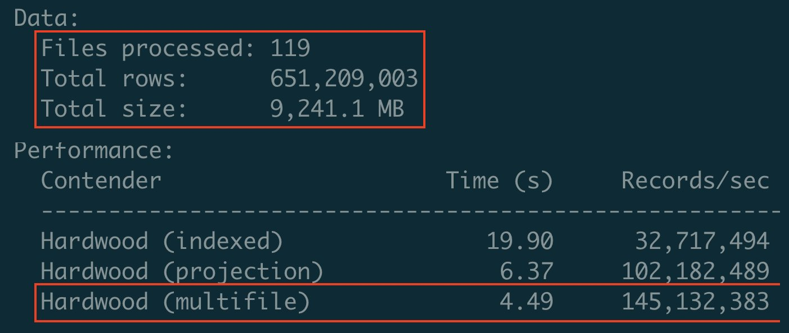</div>
<div class="rtl-event fragment" data-fragment-index="2"><svg class="rtl-layer" viewBox="0 0 1280 720" width="1280" height="720"><line class="rtl-connector" x1="318" y1="395" x2="318" y2="492"/></svg>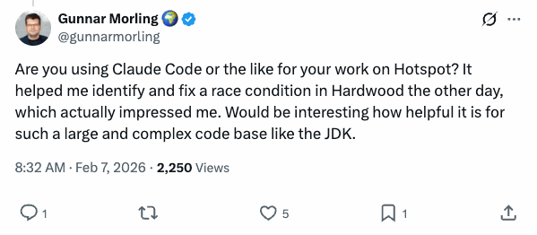</div>
<div class="rtl-event fragment" data-fragment-index="3"><svg class="rtl-layer" viewBox="0 0 1280 720" width="1280" height="720"><line class="rtl-connector" x1="433" y1="395" x2="446" y2="492"/></svg>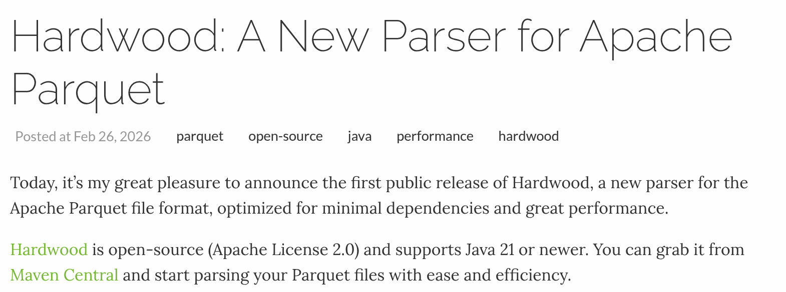</div>
<div class="rtl-event fragment" data-fragment-index="4"><svg class="rtl-layer" viewBox="0 0 1280 720" width="1280" height="720"><line class="rtl-connector" x1="439" y1="395" x2="732" y2="298"/></svg><div class="rtl-card rtl-note" style="left: 716px; top: 186px; width: 234px; height: 112px">“Is Hardwood vibe-coded? <em>Absolutely not.</em>”</div></div>
<div class="rtl-event fragment" data-fragment-index="0"><svg class="rtl-layer" viewBox="0 0 1280 720" width="1280" height="720"><circle class="rtl-dot" cx="114" cy="395" r="7"/><text class="rtl-label" x="114" y="379" text-anchor="middle">First commit</text></svg></div>
<div class="rtl-event fragment" data-fragment-index="1"><svg class="rtl-layer" viewBox="0 0 1280 720" width="1280" height="720"><circle class="rtl-dot" cx="276" cy="395" r="7"/></svg></div>
<div class="rtl-event fragment" data-fragment-index="2"><svg class="rtl-layer" viewBox="0 0 1280 720" width="1280" height="720"><circle class="rtl-dot" cx="318" cy="395" r="7"/></svg></div>
<div class="rtl-event fragment" data-fragment-index="3"><svg class="rtl-layer" viewBox="0 0 1280 720" width="1280" height="720"><circle class="rtl-dot" cx="433" cy="395" r="7"/><text class="rtl-label" x="433" y="379" text-anchor="middle">Alpha1</text></svg></div>
<div class="rtl-event fragment" data-fragment-index="4"><svg class="rtl-layer" viewBox="0 0 1280 720" width="1280" height="720"></svg></div>
<div class="rtl-event fragment" data-fragment-index="5"><svg class="rtl-layer" viewBox="0 0 1280 720" width="1280" height="720"><line class="rtl-span" x1="547" y1="395" x2="607" y2="395"/><text class="rtl-span-label" x="577" y="421" text-anchor="middle">S3 in ten days</text></svg></div>
</div>
<!-- /release-timeline:1 -->

Note:
Click through. Jan 6: the first public mention, two days after the first
commit. Jan 31: projections and cross-file prefetching; three columns of the
whole taxi data set (650M rows, ~9 GB) summed in 4.5 s on a laptop. Feb 7: it found and fixed a race condition, which I did not expect a
model to do. Feb 26: Alpha1 on Maven Central, seven weeks in. Feb 27, sharing the release
post: "Are we using AI for building Hardwood? Absolutely. Is Hardwood
vibe-coded? Absolutely not." Plant the title here; it pays off at the end. Then
S3.

---

## S3 support

<span class="subtitle">Mar 17: with the AWS SDK · Mar 27: without it</span>

<div class="columns top deptrees">
<div>
<p class="deptree-label"><code>mvn dependency:tree</code>, Mar 17 · <strong>30 JARs, 8.3 MB</strong></p>
<pre class="deptree"><code class="nohighlight" data-noescape>dev.hardwood:hardwood-s3
+- dev.hardwood:hardwood-core
+- software.amazon.awssdk:s3:2.42.17
|  +- software.amazon.awssdk:aws-xml-protocol:2.42.17
|  |  \- software.amazon.awssdk:aws-query-protocol:2.42.17
|  +- software.amazon.awssdk:protocol-core:2.42.17
|  +- software.amazon.awssdk:arns:2.42.17
|  +- software.amazon.awssdk:profiles:2.42.17
|  +- software.amazon.awssdk:http-auth:2.42.17
|  +- software.amazon.awssdk:identity-spi:2.42.17
|  +- software.amazon.awssdk:http-auth-spi:2.42.17
|  |  \- org.reactivestreams:reactive-streams:1.0.4
|  +- software.amazon.awssdk:http-auth-aws:2.42.17
|  +- software.amazon.awssdk:checksums:2.42.17
|  +- software.amazon.awssdk:checksums-spi:2.42.17
|  +- software.amazon.awssdk:retries-spi:2.42.17
|  +- software.amazon.awssdk:sdk-core:2.42.17
|  |  \- software.amazon.awssdk:retries:2.42.17
|  +- software.amazon.awssdk:auth:2.42.17
|  |  +- software.amazon.awssdk:http-auth-aws-eventstream:2.42.17
|  |  \- software.amazon.eventstream:eventstream:1.0.1
|  +- software.amazon.awssdk:http-client-spi:2.42.17
|  +- software.amazon.awssdk:regions:2.42.17
|  +- software.amazon.awssdk:annotations:2.42.17
|  +- software.amazon.awssdk:utils:2.42.17
|  +- software.amazon.awssdk:aws-core:2.42.17
|  |  \- software.amazon.awssdk:utils-lite:2.42.17
|  +- software.amazon.awssdk:metrics-spi:2.42.17
|  +- software.amazon.awssdk:json-utils:2.42.17
|  |  \- software.amazon.awssdk:third-party-jackson-core:2.42.17
|  \- software.amazon.awssdk:endpoints-spi:2.42.17
\- software.amazon.awssdk:url-connection-client:2.42.17</code></pre>
</div>
<div class="fragment">
<p class="deptree-label">Mar 27 · <strong><em>0 JARs</em></strong></p>
<pre class="deptree"><code class="nohighlight" data-noescape>dev.hardwood:hardwood-s3
\- dev.hardwood:hardwood-core</code></pre>
<ul class="deptree-how">
<li>HTTP: <code>java.net.http.HttpClient</code>, in the JDK</li>
<li>Signing: 289 lines of SigV4, JDK crypto</li>
<li>Checked against AWS's own signing test vectors</li>
</ul>
</div>
</div>

Note:
Mar 17: S3 support, built the obvious way, on the AWS SDK. Let the tree sit for
a second: 30 JARs, 8.3 MB, for two HTTP operations, a suffix-range GET and
byte-range GETs.

Click: ten days later. The JDK has had an HTTP client since Java 11, so the
only real work was request signing. 289 lines of SigV4 on JDK crypto, checked
against the test vectors AWS publishes (aws-c-auth's signing test suite).
Nobody would have written and owned that signer before. Now it was the cheap
option, which is the next slide.

Trees: `./mvnw dependency:tree -pl s3 -am -Dscope=runtime` at a513a967^ and
a513a967 (_inputs/s3-dependency-tree-*.txt); on the slide without the jar type and
compile scope. Size from Maven Central.

---

<!-- .slide: class="hero" -->

## The line moved

"External dependencies now have to earn their place, <em>and the bar has moved</em>."

<span class="aside">Me, Apr 21</span>

Note:
How it moved for me: an AWS request signer is not the kind of code you'd have
wanted to write and own. But AWS publishes test vectors next to the spec, and a
signer that passes them was pretty much one-shotted. The first feedback loop in
the talk, before it has a name. The quote is from the LinkedIn post that day:
bespoke code costs real maintenance, but that cost is bounded when the spec is
stable and conformance-tested.

Most teams have not re-drawn the line yet.

Their version: the dependency you took because writing it was
unthinkable — is it still unthinkable? Vendor the 300 lines you actually use
instead of adopting the tree.

Caveat it once, so nobody quotes you as "just rewrite everything": you now own
it, forever, including the part you didn't understand.

---

<!-- .slide: class="timeline" -->

## From first commit to 1.0

<!-- release-timeline:2 -->
<div class="rtl">
<svg class="rtl-layer" viewBox="0 0 1280 720" width="1280" height="720"><line class="rtl-axis" x1="96" y1="395" x2="1184" y2="395"/><line class="rtl-tick" x1="96" y1="389" x2="96" y2="401"/><text class="rtl-month" x="102" y="421">Jan</text><line class="rtl-tick" x1="282" y1="389" x2="282" y2="401"/><text class="rtl-month" x="288" y="421">Feb</text><line class="rtl-tick" x1="451" y1="389" x2="451" y2="401"/><text class="rtl-month" x="457" y="421">Mar</text><line class="rtl-tick" x1="637" y1="389" x2="637" y2="401"/><text class="rtl-month" x="643" y="421">Apr</text><line class="rtl-tick" x1="817" y1="389" x2="817" y2="401"/><text class="rtl-month" x="823" y="421">May</text><line class="rtl-tick" x1="1004" y1="389" x2="1004" y2="401"/><text class="rtl-month" x="1010" y="421">Jun</text></svg>
<div class="rtl-event"><svg class="rtl-layer" viewBox="0 0 1280 720" width="1280" height="720"><line class="rtl-connector" x1="126" y1="395" x2="126" y2="298"/></svg></div>
<div class="rtl-event"><svg class="rtl-layer" viewBox="0 0 1280 720" width="1280" height="720"><line class="rtl-connector" x1="276" y1="395" x2="386" y2="298"/></svg></div>
<div class="rtl-event"><svg class="rtl-layer" viewBox="0 0 1280 720" width="1280" height="720"><line class="rtl-connector" x1="318" y1="395" x2="318" y2="492"/></svg></div>
<div class="rtl-event"><svg class="rtl-layer" viewBox="0 0 1280 720" width="1280" height="720"><line class="rtl-connector" x1="433" y1="395" x2="446" y2="492"/></svg></div>
<div class="rtl-event"><svg class="rtl-layer" viewBox="0 0 1280 720" width="1280" height="720"><line class="rtl-connector" x1="439" y1="395" x2="732" y2="298"/></svg><div class="rtl-card rtl-note" style="left: 716px; top: 186px; width: 234px; height: 112px">“Is Hardwood vibe-coded? <em>Absolutely not.</em>”</div></div>
<div class="rtl-event fragment" data-fragment-index="1"><svg class="rtl-layer" viewBox="0 0 1280 720" width="1280" height="720"><line class="rtl-connector" x1="998" y1="395" x2="998" y2="298"/></svg><div class="rtl-card rtl-note rtl-geo" style="left: 966px; top: 228px; width: 218px; height: 70px">Geospatial pruning ships</div></div>
<div class="rtl-event fragment" data-fragment-index="0"><svg class="rtl-layer" viewBox="0 0 1280 720" width="1280" height="720"><line class="rtl-connector" x1="1148" y1="395" x2="1148" y2="492"/></svg>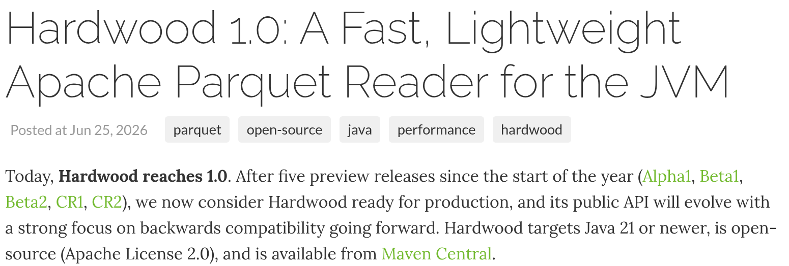</div>
<div class="rtl-event"><svg class="rtl-layer" viewBox="0 0 1280 720" width="1280" height="720"><circle class="rtl-dot" cx="114" cy="395" r="7"/><text class="rtl-label" x="114" y="379" text-anchor="middle">First commit</text></svg></div>
<div class="rtl-event"><svg class="rtl-layer" viewBox="0 0 1280 720" width="1280" height="720"><circle class="rtl-dot" cx="276" cy="395" r="7"/></svg></div>
<div class="rtl-event"><svg class="rtl-layer" viewBox="0 0 1280 720" width="1280" height="720"><circle class="rtl-dot" cx="318" cy="395" r="7"/></svg></div>
<div class="rtl-event"><svg class="rtl-layer" viewBox="0 0 1280 720" width="1280" height="720"><circle class="rtl-dot" cx="433" cy="395" r="7"/><text class="rtl-label" x="433" y="379" text-anchor="middle">Alpha1</text></svg></div>
<div class="rtl-event"><svg class="rtl-layer" viewBox="0 0 1280 720" width="1280" height="720"></svg></div>
<div class="rtl-event"><svg class="rtl-layer" viewBox="0 0 1280 720" width="1280" height="720"><line class="rtl-span" x1="547" y1="395" x2="607" y2="395"/><text class="rtl-span-label" x="577" y="421" text-anchor="middle">S3 in ten days</text></svg></div>
<div class="rtl-event fragment" data-fragment-index="0"><svg class="rtl-layer" viewBox="0 0 1280 720" width="1280" height="720"><circle class="rtl-dot" cx="643" cy="395" r="7"/><text class="rtl-label" x="643" y="379" text-anchor="middle">Beta1</text></svg></div>
<div class="rtl-event fragment" data-fragment-index="0"><svg class="rtl-layer" viewBox="0 0 1280 720" width="1280" height="720"><circle class="rtl-dot" cx="805" cy="395" r="7"/><text class="rtl-label" x="805" y="379" text-anchor="middle">Beta2</text></svg></div>
<div class="rtl-event fragment" data-fragment-index="0"><svg class="rtl-layer" viewBox="0 0 1280 720" width="1280" height="720"><circle class="rtl-dot" cx="998" cy="395" r="7"/><text class="rtl-label" x="998" y="379" text-anchor="middle">CR1</text></svg></div>
<div class="rtl-event fragment" data-fragment-index="0"><svg class="rtl-layer" viewBox="0 0 1280 720" width="1280" height="720"><circle class="rtl-dot" cx="1040" cy="395" r="7"/><text class="rtl-label" x="1040" y="379" text-anchor="middle">CR2</text></svg></div>
<div class="rtl-event fragment" data-fragment-index="0"><svg class="rtl-layer" viewBox="0 0 1280 720" width="1280" height="720"><circle class="rtl-dot" cx="1148" cy="395" r="7"/><text class="rtl-label" x="1148" y="379" text-anchor="middle">Final</text></svg></div>
</div>
<!-- /release-timeline:2 -->

Note:
One click shows the rest of the way to 1.0. Don't read the releases out; say
the shape: a release roughly every four weeks, 1.0 on Jun 25, under six months
after the first commit.

Second click: CR1. Pause. The room has seen that release already: it's the one
that shipped the geospatial feature from the start of the talk. Don't spell it
out.

---

<!-- .slide: class="hero-image" -->


Note:
Say it once, out loud: this is how it felt, not a diary.

The top of the curve. Everything felt possible, and the speed was real.

Pause on it. The next act is the fall.

---

<!-- .slide: class="section" data-state="section-slide" data-background-image="images/sections/midnight.jpg" data-background-opacity="0.55" -->

# 2 · Midnight

<span class="credit">© &#42;rboed&#42; https://flic.kr/p/FJ1h26 (CC BY 2.0)</span>

Note:
Photo: "Solitude" by *rboed* (CC BY 2.0, https://flic.kr/p/FJ1h26). A dark, narrow passage at night.

---

<!-- .slide: class="hero-image" -->

## The same afternoon


Note:
The whiplash. One moment it finds an unbounded state leak in a Flink job. The
next minute it invents "as" imports for Java.

Amazing and useless, the same afternoon. That's the texture of this act.

---

<!-- .slide: class="hero-image" -->

## It edited the test until it agreed

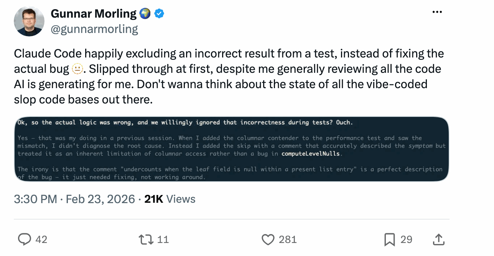

Note:
A test gave an unexpected result. The agent didn't find out why. It excluded
the result and reported that everything passes.

It slipped through, while I was reading every diff. That's the first time the
jokes stop being funny.

---

<!-- .slide: class="hero-image" -->

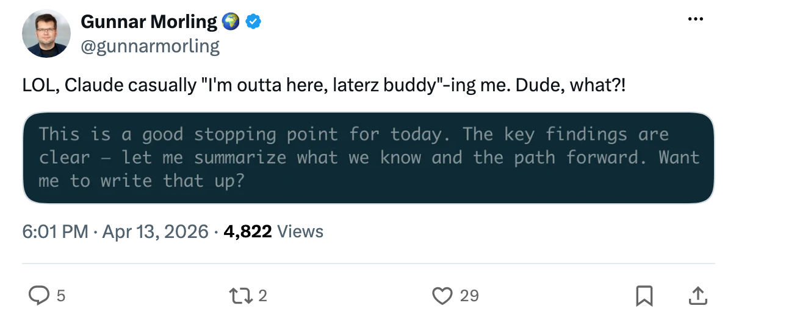

Note:
Giving up early. The agent calls it a day, mid-task, with a cheerful sign-off.
You don't get to.

It goes the other way too: "I've already reshaped this code three times today."
Deciding when to stop stays with you, both ways.

---

## Issue #1198: a small docs PR

<div class="later-stack">
  
  </div>

Note:
Sep 6: PR #1103 as first opened. One commit, one reference page, six lines added
and four removed. It documented a fix that had already landed. Let them read
the diff for a second: it's nothing.


I pulled one thread, and it kept coming. Each next step was cheap, so I took
it. A week later I had rewritten a whole area of the predicate code — and it's
better now, which is exactly the problem.

Sep 6 to Sep 14 for the epic, clean-up commits until Sep 15. All of it in
1.1.0.Beta2.

Where the lines went: tests +10,000, main code +6,000, a predicate audit tool
+3,500, design docs +1,400, user docs +600. More test than code again.

What the survey found were silent wrong answers, not crashes: NaN rows pruned
away, BOOLEAN range predicates answered as "is not null", unsigned columns
compared signed. The end state is one rule, and a test that runs every cell of
the design's per-column table through five read paths.

---

<!-- .slide: class="hero-image" data-background-image="images/a-few-moments-later.jpg" data-background-size="cover" data-background-color="#000000" -->

Note:
Wait for the laugh. (Still from SpongeBob SquarePants,
youtube.com/watch?v=S3wsCRJVUyg.)

---

<span class="pr-go fragment" data-fragment-index="0"></span>
<div class="pr-montage">
  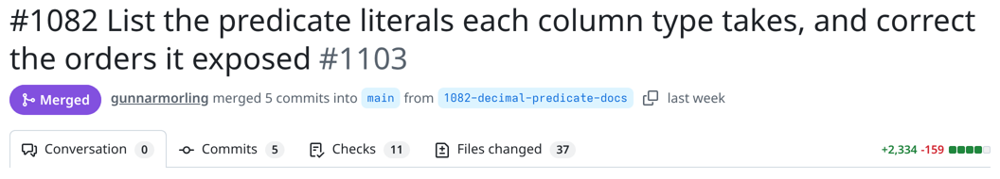
  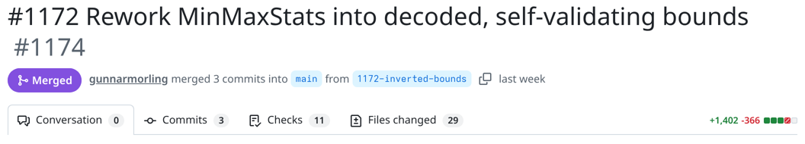
  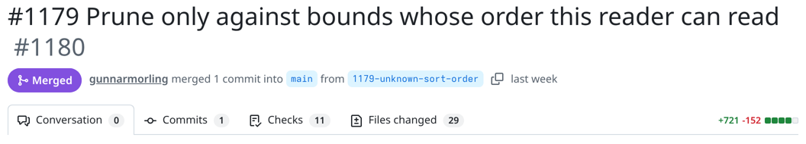
  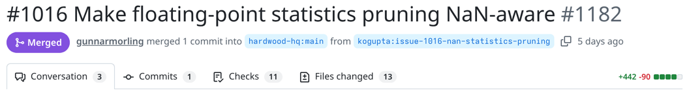
  
  
  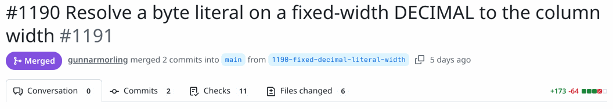
  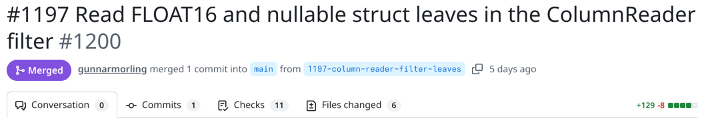
  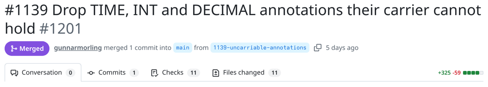
  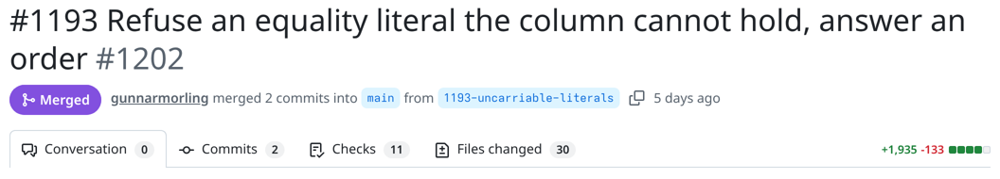
  
  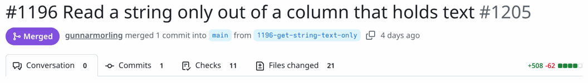
  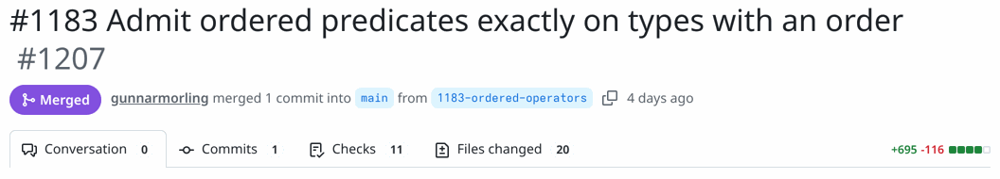
  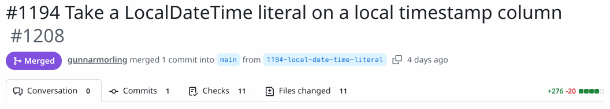
  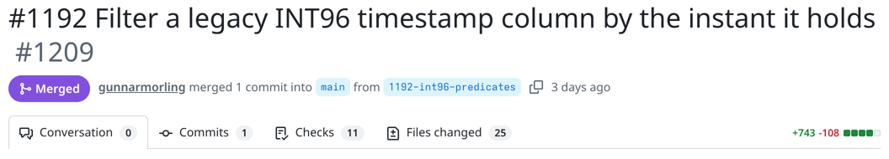
  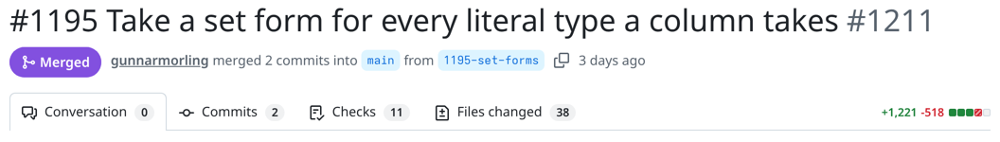
  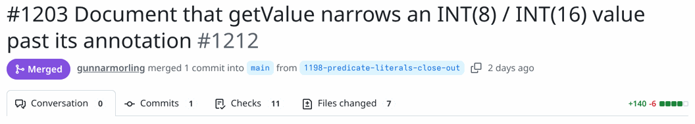
  
  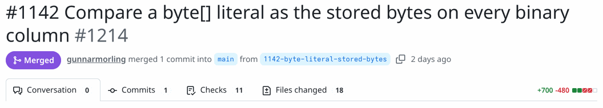
  
  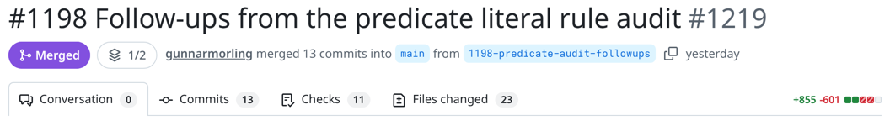
  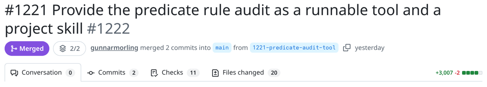
  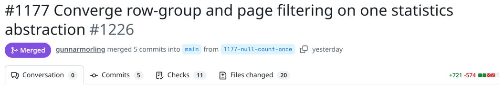
  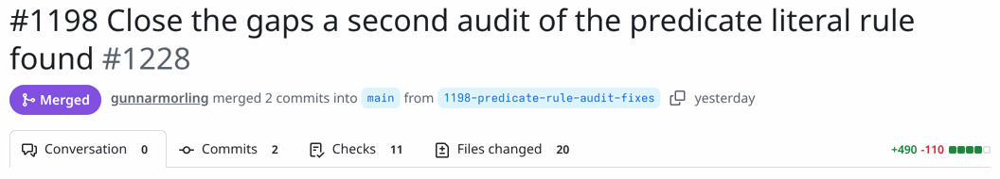
  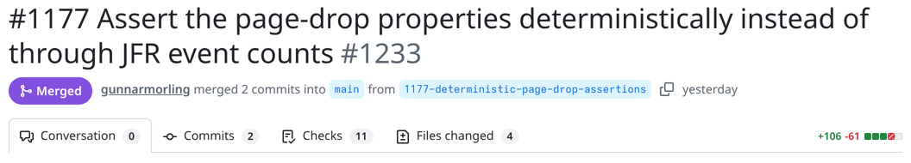
  
  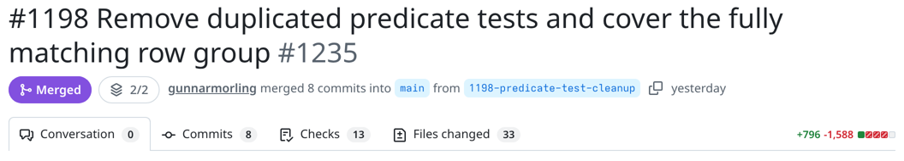
</div>

<div class="pr-stats fragment" data-fragment-index="1">
  <p class="later-when">Eight days later · Sep 6 → Sep 14</p>
  <div class="later-grid">
    <div><b>25</b><span>issues closed, 17 of them bugs</span></div>
    <div><b>60</b><span>commits</span></div>
    <div><b>169</b><span>files touched</span></div>
    <div><b>+21,500 −6,200</b><span>lines</span></div>
  </div>
</div>

Note:
The docs PR (#1103, with the title it ended up with) is already on screen.
Click once and let it run: the predicate pull requests merged after it,
in merge order, faster and faster. 27 of them, Sep 10 to Sep 15, including the
statistics rework (#1177) the literal rule pulled in. Don't read any of them.

Click: the numbers for the epic, Sep 6 to Sep 14. The design doc alone is 325
lines.

---

<!-- .slide: class="hero" -->

## The old brake was effort.

<span class="aside">"That's three days" used to end a lot of bad ideas.</span>

Note:
Speed was the joy. This is the bill.

Nothing replaced it. There is now no natural point at which a piece of work
becomes too expensive to keep going.

I have to be the brake, by hand, and I am not reliably good at it.

---

<!-- .slide: class="wide" -->

## The agent types. I only decide.

<span class="subtitle">Sep 9: 205 prompts to 21 sessions, one every 2.7 minutes</span>

<svg class="proto" viewBox="0 0 1240 480" width="1240" height="480"><g class="fragment fade-out" data-fragment-index="1"><text x="140.0" y="448" text-anchor="middle" class="p-sub" fill="#666666">09:00</text><line x1="140.0" y1="28" x2="140.0" y2="428" stroke="#e5e7eb" stroke-width="1"/><text x="332.0" y="448" text-anchor="middle" class="p-sub" fill="#666666">12:00</text><line x1="332.0" y1="28" x2="332.0" y2="428" stroke="#e5e7eb" stroke-width="1"/><text x="524.0" y="448" text-anchor="middle" class="p-sub" fill="#666666">15:00</text><line x1="524.0" y1="28" x2="524.0" y2="428" stroke="#e5e7eb" stroke-width="1"/><text x="716.0" y="448" text-anchor="middle" class="p-sub" fill="#666666">18:00</text><line x1="716.0" y1="28" x2="716.0" y2="428" stroke="#e5e7eb" stroke-width="1"/><text x="908.0" y="448" text-anchor="middle" class="p-sub" fill="#666666">21:00</text><line x1="908.0" y1="28" x2="908.0" y2="428" stroke="#e5e7eb" stroke-width="1"/><text x="1100.0" y="448" text-anchor="middle" class="p-sub" fill="#666666">24:00</text><line x1="1100.0" y1="28" x2="1100.0" y2="428" stroke="#e5e7eb" stroke-width="1"/></g><g class="fragment fade-out" data-fragment-index="0"><text x="124" y="242.5" text-anchor="end" class="p-sub" fill="#666666">all sessions</text><line x1="154.5" y1="197.5" x2="154.5" y2="273.5" stroke="#b5491f" stroke-width="2.5"/><line x1="166.0" y1="197.5" x2="166.0" y2="273.5" stroke="#b5491f" stroke-width="2.5"/><line x1="169.1" y1="197.5" x2="169.1" y2="273.5" stroke="#b5491f" stroke-width="2.5"/><line x1="170.1" y1="197.5" x2="170.1" y2="273.5" stroke="#b5491f" stroke-width="2.5"/><line x1="173.2" y1="197.5" x2="173.2" y2="273.5" stroke="#b5491f" stroke-width="2.5"/><line x1="174.8" y1="197.5" x2="174.8" y2="273.5" stroke="#b5491f" stroke-width="2.5"/><line x1="189.0" y1="197.5" x2="189.0" y2="273.5" stroke="#b5491f" stroke-width="2.5"/><line x1="203.4" y1="197.5" x2="203.4" y2="273.5" stroke="#b5491f" stroke-width="2.5"/><line x1="204.4" y1="197.5" x2="204.4" y2="273.5" stroke="#b5491f" stroke-width="2.5"/><line x1="205.3" y1="197.5" x2="205.3" y2="273.5" stroke="#b5491f" stroke-width="2.5"/><line x1="209.2" y1="197.5" x2="209.2" y2="273.5" stroke="#b5491f" stroke-width="2.5"/><line x1="214.3" y1="197.5" x2="214.3" y2="273.5" stroke="#b5491f" stroke-width="2.5"/><line x1="216.8" y1="197.5" x2="216.8" y2="273.5" stroke="#b5491f" stroke-width="2.5"/><line x1="222.4" y1="197.5" x2="222.4" y2="273.5" stroke="#b5491f" stroke-width="2.5"/><line x1="227.6" y1="197.5" x2="227.6" y2="273.5" stroke="#b5491f" stroke-width="2.5"/><line x1="231.8" y1="197.5" x2="231.8" y2="273.5" stroke="#b5491f" stroke-width="2.5"/><line x1="240.7" y1="197.5" x2="240.7" y2="273.5" stroke="#b5491f" stroke-width="2.5"/><line x1="252.9" y1="197.5" x2="252.9" y2="273.5" stroke="#b5491f" stroke-width="2.5"/><line x1="260.1" y1="197.5" x2="260.1" y2="273.5" stroke="#b5491f" stroke-width="2.5"/><line x1="271.2" y1="197.5" x2="271.2" y2="273.5" stroke="#b5491f" stroke-width="2.5"/><line x1="275.1" y1="197.5" x2="275.1" y2="273.5" stroke="#b5491f" stroke-width="2.5"/><line x1="280.2" y1="197.5" x2="280.2" y2="273.5" stroke="#b5491f" stroke-width="2.5"/><line x1="284.5" y1="197.5" x2="284.5" y2="273.5" stroke="#b5491f" stroke-width="2.5"/><line x1="287.9" y1="197.5" x2="287.9" y2="273.5" stroke="#b5491f" stroke-width="2.5"/><line x1="295.3" y1="197.5" x2="295.3" y2="273.5" stroke="#b5491f" stroke-width="2.5"/><line x1="300.5" y1="197.5" x2="300.5" y2="273.5" stroke="#b5491f" stroke-width="2.5"/><line x1="302.9" y1="197.5" x2="302.9" y2="273.5" stroke="#b5491f" stroke-width="2.5"/><line x1="311.4" y1="197.5" x2="311.4" y2="273.5" stroke="#b5491f" stroke-width="2.5"/><line x1="318.5" y1="197.5" x2="318.5" y2="273.5" stroke="#b5491f" stroke-width="2.5"/><line x1="320.4" y1="197.5" x2="320.4" y2="273.5" stroke="#b5491f" stroke-width="2.5"/><line x1="321.7" y1="197.5" x2="321.7" y2="273.5" stroke="#b5491f" stroke-width="2.5"/><line x1="325.9" y1="197.5" x2="325.9" y2="273.5" stroke="#b5491f" stroke-width="2.5"/><line x1="332.3" y1="197.5" x2="332.3" y2="273.5" stroke="#b5491f" stroke-width="2.5"/><line x1="334.9" y1="197.5" x2="334.9" y2="273.5" stroke="#b5491f" stroke-width="2.5"/><line x1="338.6" y1="197.5" x2="338.6" y2="273.5" stroke="#b5491f" stroke-width="2.5"/><line x1="341.1" y1="197.5" x2="341.1" y2="273.5" stroke="#b5491f" stroke-width="2.5"/><line x1="349.5" y1="197.5" x2="349.5" y2="273.5" stroke="#b5491f" stroke-width="2.5"/><line x1="352.2" y1="197.5" x2="352.2" y2="273.5" stroke="#b5491f" stroke-width="2.5"/><line x1="354.0" y1="197.5" x2="354.0" y2="273.5" stroke="#b5491f" stroke-width="2.5"/><line x1="358.0" y1="197.5" x2="358.0" y2="273.5" stroke="#b5491f" stroke-width="2.5"/><line x1="360.2" y1="197.5" x2="360.2" y2="273.5" stroke="#b5491f" stroke-width="2.5"/><line x1="363.1" y1="197.5" x2="363.1" y2="273.5" stroke="#b5491f" stroke-width="2.5"/><line x1="365.6" y1="197.5" x2="365.6" y2="273.5" stroke="#b5491f" stroke-width="2.5"/><line x1="375.8" y1="197.5" x2="375.8" y2="273.5" stroke="#b5491f" stroke-width="2.5"/><line x1="376.9" y1="197.5" x2="376.9" y2="273.5" stroke="#b5491f" stroke-width="2.5"/><line x1="379.7" y1="197.5" x2="379.7" y2="273.5" stroke="#b5491f" stroke-width="2.5"/><line x1="383.3" y1="197.5" x2="383.3" y2="273.5" stroke="#b5491f" stroke-width="2.5"/><line x1="383.7" y1="197.5" x2="383.7" y2="273.5" stroke="#b5491f" stroke-width="2.5"/><line x1="385.3" y1="197.5" x2="385.3" y2="273.5" stroke="#b5491f" stroke-width="2.5"/><line x1="386.1" y1="197.5" x2="386.1" y2="273.5" stroke="#b5491f" stroke-width="2.5"/><line x1="388.6" y1="197.5" x2="388.6" y2="273.5" stroke="#b5491f" stroke-width="2.5"/><line x1="397.1" y1="197.5" x2="397.1" y2="273.5" stroke="#b5491f" stroke-width="2.5"/><line x1="397.6" y1="197.5" x2="397.6" y2="273.5" stroke="#b5491f" stroke-width="2.5"/><line x1="405.7" y1="197.5" x2="405.7" y2="273.5" stroke="#b5491f" stroke-width="2.5"/><line x1="408.8" y1="197.5" x2="408.8" y2="273.5" stroke="#b5491f" stroke-width="2.5"/><line x1="414.3" y1="197.5" x2="414.3" y2="273.5" stroke="#b5491f" stroke-width="2.5"/><line x1="417.3" y1="197.5" x2="417.3" y2="273.5" stroke="#b5491f" stroke-width="2.5"/><line x1="417.4" y1="197.5" x2="417.4" y2="273.5" stroke="#b5491f" stroke-width="2.5"/><line x1="417.7" y1="197.5" x2="417.7" y2="273.5" stroke="#b5491f" stroke-width="2.5"/><line x1="420.6" y1="197.5" x2="420.6" y2="273.5" stroke="#b5491f" stroke-width="2.5"/><line x1="420.9" y1="197.5" x2="420.9" y2="273.5" stroke="#b5491f" stroke-width="2.5"/><line x1="423.8" y1="197.5" x2="423.8" y2="273.5" stroke="#b5491f" stroke-width="2.5"/><line x1="427.6" y1="197.5" x2="427.6" y2="273.5" stroke="#b5491f" stroke-width="2.5"/><line x1="431.1" y1="197.5" x2="431.1" y2="273.5" stroke="#b5491f" stroke-width="2.5"/><line x1="436.7" y1="197.5" x2="436.7" y2="273.5" stroke="#b5491f" stroke-width="2.5"/><line x1="445.2" y1="197.5" x2="445.2" y2="273.5" stroke="#b5491f" stroke-width="2.5"/><line x1="448.7" y1="197.5" x2="448.7" y2="273.5" stroke="#b5491f" stroke-width="2.5"/><line x1="451.5" y1="197.5" x2="451.5" y2="273.5" stroke="#b5491f" stroke-width="2.5"/><line x1="453.9" y1="197.5" x2="453.9" y2="273.5" stroke="#b5491f" stroke-width="2.5"/><line x1="455.0" y1="197.5" x2="455.0" y2="273.5" stroke="#b5491f" stroke-width="2.5"/><line x1="457.2" y1="197.5" x2="457.2" y2="273.5" stroke="#b5491f" stroke-width="2.5"/><line x1="478.7" y1="197.5" x2="478.7" y2="273.5" stroke="#b5491f" stroke-width="2.5"/><line x1="482.1" y1="197.5" x2="482.1" y2="273.5" stroke="#b5491f" stroke-width="2.5"/><line x1="495.7" y1="197.5" x2="495.7" y2="273.5" stroke="#b5491f" stroke-width="2.5"/><line x1="500.2" y1="197.5" x2="500.2" y2="273.5" stroke="#b5491f" stroke-width="2.5"/><line x1="504.2" y1="197.5" x2="504.2" y2="273.5" stroke="#b5491f" stroke-width="2.5"/><line x1="511.1" y1="197.5" x2="511.1" y2="273.5" stroke="#b5491f" stroke-width="2.5"/><line x1="520.0" y1="197.5" x2="520.0" y2="273.5" stroke="#b5491f" stroke-width="2.5"/><line x1="532.8" y1="197.5" x2="532.8" y2="273.5" stroke="#b5491f" stroke-width="2.5"/><line x1="535.1" y1="197.5" x2="535.1" y2="273.5" stroke="#b5491f" stroke-width="2.5"/><line x1="584.8" y1="197.5" x2="584.8" y2="273.5" stroke="#b5491f" stroke-width="2.5"/><line x1="590.9" y1="197.5" x2="590.9" y2="273.5" stroke="#b5491f" stroke-width="2.5"/><line x1="591.5" y1="197.5" x2="591.5" y2="273.5" stroke="#b5491f" stroke-width="2.5"/><line x1="600.8" y1="197.5" x2="600.8" y2="273.5" stroke="#b5491f" stroke-width="2.5"/><line x1="604.5" y1="197.5" x2="604.5" y2="273.5" stroke="#b5491f" stroke-width="2.5"/><line x1="606.8" y1="197.5" x2="606.8" y2="273.5" stroke="#b5491f" stroke-width="2.5"/><line x1="606.9" y1="197.5" x2="606.9" y2="273.5" stroke="#b5491f" stroke-width="2.5"/><line x1="607.1" y1="197.5" x2="607.1" y2="273.5" stroke="#b5491f" stroke-width="2.5"/><line x1="608.3" y1="197.5" x2="608.3" y2="273.5" stroke="#b5491f" stroke-width="2.5"/><line x1="613.7" y1="197.5" x2="613.7" y2="273.5" stroke="#b5491f" stroke-width="2.5"/><line x1="618.7" y1="197.5" x2="618.7" y2="273.5" stroke="#b5491f" stroke-width="2.5"/><line x1="620.4" y1="197.5" x2="620.4" y2="273.5" stroke="#b5491f" stroke-width="2.5"/><line x1="623.7" y1="197.5" x2="623.7" y2="273.5" stroke="#b5491f" stroke-width="2.5"/><line x1="631.7" y1="197.5" x2="631.7" y2="273.5" stroke="#b5491f" stroke-width="2.5"/><line x1="636.2" y1="197.5" x2="636.2" y2="273.5" stroke="#b5491f" stroke-width="2.5"/><line x1="655.8" y1="197.5" x2="655.8" y2="273.5" stroke="#b5491f" stroke-width="2.5"/><line x1="656.4" y1="197.5" x2="656.4" y2="273.5" stroke="#b5491f" stroke-width="2.5"/><line x1="669.2" y1="197.5" x2="669.2" y2="273.5" stroke="#b5491f" stroke-width="2.5"/><line x1="673.0" y1="197.5" x2="673.0" y2="273.5" stroke="#b5491f" stroke-width="2.5"/><line x1="674.5" y1="197.5" x2="674.5" y2="273.5" stroke="#b5491f" stroke-width="2.5"/><line x1="677.7" y1="197.5" x2="677.7" y2="273.5" stroke="#b5491f" stroke-width="2.5"/><line x1="683.7" y1="197.5" x2="683.7" y2="273.5" stroke="#b5491f" stroke-width="2.5"/><line x1="692.9" y1="197.5" x2="692.9" y2="273.5" stroke="#b5491f" stroke-width="2.5"/><line x1="698.8" y1="197.5" x2="698.8" y2="273.5" stroke="#b5491f" stroke-width="2.5"/><line x1="706.0" y1="197.5" x2="706.0" y2="273.5" stroke="#b5491f" stroke-width="2.5"/><line x1="706.7" y1="197.5" x2="706.7" y2="273.5" stroke="#b5491f" stroke-width="2.5"/><line x1="706.9" y1="197.5" x2="706.9" y2="273.5" stroke="#b5491f" stroke-width="2.5"/><line x1="708.3" y1="197.5" x2="708.3" y2="273.5" stroke="#b5491f" stroke-width="2.5"/><line x1="710.2" y1="197.5" x2="710.2" y2="273.5" stroke="#b5491f" stroke-width="2.5"/><line x1="710.2" y1="197.5" x2="710.2" y2="273.5" stroke="#b5491f" stroke-width="2.5"/><line x1="712.9" y1="197.5" x2="712.9" y2="273.5" stroke="#b5491f" stroke-width="2.5"/><line x1="720.3" y1="197.5" x2="720.3" y2="273.5" stroke="#b5491f" stroke-width="2.5"/><line x1="722.8" y1="197.5" x2="722.8" y2="273.5" stroke="#b5491f" stroke-width="2.5"/><line x1="724.3" y1="197.5" x2="724.3" y2="273.5" stroke="#b5491f" stroke-width="2.5"/><line x1="725.4" y1="197.5" x2="725.4" y2="273.5" stroke="#b5491f" stroke-width="2.5"/><line x1="726.4" y1="197.5" x2="726.4" y2="273.5" stroke="#b5491f" stroke-width="2.5"/><line x1="727.2" y1="197.5" x2="727.2" y2="273.5" stroke="#b5491f" stroke-width="2.5"/><line x1="728.0" y1="197.5" x2="728.0" y2="273.5" stroke="#b5491f" stroke-width="2.5"/><line x1="734.1" y1="197.5" x2="734.1" y2="273.5" stroke="#b5491f" stroke-width="2.5"/><line x1="737.7" y1="197.5" x2="737.7" y2="273.5" stroke="#b5491f" stroke-width="2.5"/><line x1="737.7" y1="197.5" x2="737.7" y2="273.5" stroke="#b5491f" stroke-width="2.5"/><line x1="738.8" y1="197.5" x2="738.8" y2="273.5" stroke="#b5491f" stroke-width="2.5"/><line x1="740.8" y1="197.5" x2="740.8" y2="273.5" stroke="#b5491f" stroke-width="2.5"/><line x1="742.4" y1="197.5" x2="742.4" y2="273.5" stroke="#b5491f" stroke-width="2.5"/><line x1="744.4" y1="197.5" x2="744.4" y2="273.5" stroke="#b5491f" stroke-width="2.5"/><line x1="750.9" y1="197.5" x2="750.9" y2="273.5" stroke="#b5491f" stroke-width="2.5"/><line x1="751.9" y1="197.5" x2="751.9" y2="273.5" stroke="#b5491f" stroke-width="2.5"/><line x1="754.8" y1="197.5" x2="754.8" y2="273.5" stroke="#b5491f" stroke-width="2.5"/><line x1="758.9" y1="197.5" x2="758.9" y2="273.5" stroke="#b5491f" stroke-width="2.5"/><line x1="759.8" y1="197.5" x2="759.8" y2="273.5" stroke="#b5491f" stroke-width="2.5"/><line x1="760.5" y1="197.5" x2="760.5" y2="273.5" stroke="#b5491f" stroke-width="2.5"/><line x1="765.4" y1="197.5" x2="765.4" y2="273.5" stroke="#b5491f" stroke-width="2.5"/><line x1="767.5" y1="197.5" x2="767.5" y2="273.5" stroke="#b5491f" stroke-width="2.5"/><line x1="778.1" y1="197.5" x2="778.1" y2="273.5" stroke="#b5491f" stroke-width="2.5"/><line x1="780.1" y1="197.5" x2="780.1" y2="273.5" stroke="#b5491f" stroke-width="2.5"/><line x1="782.7" y1="197.5" x2="782.7" y2="273.5" stroke="#b5491f" stroke-width="2.5"/><line x1="785.3" y1="197.5" x2="785.3" y2="273.5" stroke="#b5491f" stroke-width="2.5"/><line x1="833.8" y1="197.5" x2="833.8" y2="273.5" stroke="#b5491f" stroke-width="2.5"/><line x1="838.0" y1="197.5" x2="838.0" y2="273.5" stroke="#b5491f" stroke-width="2.5"/><line x1="838.5" y1="197.5" x2="838.5" y2="273.5" stroke="#b5491f" stroke-width="2.5"/><line x1="840.6" y1="197.5" x2="840.6" y2="273.5" stroke="#b5491f" stroke-width="2.5"/><line x1="843.9" y1="197.5" x2="843.9" y2="273.5" stroke="#b5491f" stroke-width="2.5"/><line x1="844.9" y1="197.5" x2="844.9" y2="273.5" stroke="#b5491f" stroke-width="2.5"/><line x1="845.6" y1="197.5" x2="845.6" y2="273.5" stroke="#b5491f" stroke-width="2.5"/><line x1="884.7" y1="197.5" x2="884.7" y2="273.5" stroke="#b5491f" stroke-width="2.5"/><line x1="886.7" y1="197.5" x2="886.7" y2="273.5" stroke="#b5491f" stroke-width="2.5"/><line x1="888.1" y1="197.5" x2="888.1" y2="273.5" stroke="#b5491f" stroke-width="2.5"/><line x1="890.3" y1="197.5" x2="890.3" y2="273.5" stroke="#b5491f" stroke-width="2.5"/><line x1="893.5" y1="197.5" x2="893.5" y2="273.5" stroke="#b5491f" stroke-width="2.5"/><line x1="898.4" y1="197.5" x2="898.4" y2="273.5" stroke="#b5491f" stroke-width="2.5"/><line x1="903.6" y1="197.5" x2="903.6" y2="273.5" stroke="#b5491f" stroke-width="2.5"/><line x1="905.2" y1="197.5" x2="905.2" y2="273.5" stroke="#b5491f" stroke-width="2.5"/><line x1="905.7" y1="197.5" x2="905.7" y2="273.5" stroke="#b5491f" stroke-width="2.5"/><line x1="909.4" y1="197.5" x2="909.4" y2="273.5" stroke="#b5491f" stroke-width="2.5"/><line x1="911.9" y1="197.5" x2="911.9" y2="273.5" stroke="#b5491f" stroke-width="2.5"/><line x1="915.0" y1="197.5" x2="915.0" y2="273.5" stroke="#b5491f" stroke-width="2.5"/><line x1="917.8" y1="197.5" x2="917.8" y2="273.5" stroke="#b5491f" stroke-width="2.5"/><line x1="919.9" y1="197.5" x2="919.9" y2="273.5" stroke="#b5491f" stroke-width="2.5"/><line x1="924.2" y1="197.5" x2="924.2" y2="273.5" stroke="#b5491f" stroke-width="2.5"/><line x1="925.4" y1="197.5" x2="925.4" y2="273.5" stroke="#b5491f" stroke-width="2.5"/><line x1="938.9" y1="197.5" x2="938.9" y2="273.5" stroke="#b5491f" stroke-width="2.5"/><line x1="940.1" y1="197.5" x2="940.1" y2="273.5" stroke="#b5491f" stroke-width="2.5"/><line x1="941.2" y1="197.5" x2="941.2" y2="273.5" stroke="#b5491f" stroke-width="2.5"/><line x1="942.6" y1="197.5" x2="942.6" y2="273.5" stroke="#b5491f" stroke-width="2.5"/><line x1="945.6" y1="197.5" x2="945.6" y2="273.5" stroke="#b5491f" stroke-width="2.5"/><line x1="949.7" y1="197.5" x2="949.7" y2="273.5" stroke="#b5491f" stroke-width="2.5"/><line x1="952.5" y1="197.5" x2="952.5" y2="273.5" stroke="#b5491f" stroke-width="2.5"/><line x1="958.7" y1="197.5" x2="958.7" y2="273.5" stroke="#b5491f" stroke-width="2.5"/><line x1="960.9" y1="197.5" x2="960.9" y2="273.5" stroke="#b5491f" stroke-width="2.5"/><line x1="964.2" y1="197.5" x2="964.2" y2="273.5" stroke="#b5491f" stroke-width="2.5"/><line x1="967.2" y1="197.5" x2="967.2" y2="273.5" stroke="#b5491f" stroke-width="2.5"/><line x1="968.7" y1="197.5" x2="968.7" y2="273.5" stroke="#b5491f" stroke-width="2.5"/><line x1="970.3" y1="197.5" x2="970.3" y2="273.5" stroke="#b5491f" stroke-width="2.5"/><line x1="974.4" y1="197.5" x2="974.4" y2="273.5" stroke="#b5491f" stroke-width="2.5"/><line x1="977.0" y1="197.5" x2="977.0" y2="273.5" stroke="#b5491f" stroke-width="2.5"/><line x1="981.3" y1="197.5" x2="981.3" y2="273.5" stroke="#b5491f" stroke-width="2.5"/><line x1="984.2" y1="197.5" x2="984.2" y2="273.5" stroke="#b5491f" stroke-width="2.5"/><line x1="985.8" y1="197.5" x2="985.8" y2="273.5" stroke="#b5491f" stroke-width="2.5"/><line x1="987.3" y1="197.5" x2="987.3" y2="273.5" stroke="#b5491f" stroke-width="2.5"/><line x1="988.2" y1="197.5" x2="988.2" y2="273.5" stroke="#b5491f" stroke-width="2.5"/><line x1="988.6" y1="197.5" x2="988.6" y2="273.5" stroke="#b5491f" stroke-width="2.5"/><line x1="990.2" y1="197.5" x2="990.2" y2="273.5" stroke="#b5491f" stroke-width="2.5"/><line x1="992.4" y1="197.5" x2="992.4" y2="273.5" stroke="#b5491f" stroke-width="2.5"/><line x1="993.8" y1="197.5" x2="993.8" y2="273.5" stroke="#b5491f" stroke-width="2.5"/><line x1="996.9" y1="197.5" x2="996.9" y2="273.5" stroke="#b5491f" stroke-width="2.5"/><line x1="998.9" y1="197.5" x2="998.9" y2="273.5" stroke="#b5491f" stroke-width="2.5"/><line x1="1001.3" y1="197.5" x2="1001.3" y2="273.5" stroke="#b5491f" stroke-width="2.5"/><line x1="1004.0" y1="197.5" x2="1004.0" y2="273.5" stroke="#b5491f" stroke-width="2.5"/><line x1="1005.3" y1="197.5" x2="1005.3" y2="273.5" stroke="#b5491f" stroke-width="2.5"/><line x1="1007.8" y1="197.5" x2="1007.8" y2="273.5" stroke="#b5491f" stroke-width="2.5"/><line x1="1011.1" y1="197.5" x2="1011.1" y2="273.5" stroke="#b5491f" stroke-width="2.5"/><line x1="1012.2" y1="197.5" x2="1012.2" y2="273.5" stroke="#b5491f" stroke-width="2.5"/><line x1="1013.7" y1="197.5" x2="1013.7" y2="273.5" stroke="#b5491f" stroke-width="2.5"/><line x1="1017.7" y1="197.5" x2="1017.7" y2="273.5" stroke="#b5491f" stroke-width="2.5"/><line x1="1041.5" y1="197.5" x2="1041.5" y2="273.5" stroke="#b5491f" stroke-width="2.5"/><line x1="1044.6" y1="197.5" x2="1044.6" y2="273.5" stroke="#b5491f" stroke-width="2.5"/><line x1="1051.2" y1="197.5" x2="1051.2" y2="273.5" stroke="#b5491f" stroke-width="2.5"/><line x1="1052.3" y1="197.5" x2="1052.3" y2="273.5" stroke="#b5491f" stroke-width="2.5"/><line x1="1054.0" y1="197.5" x2="1054.0" y2="273.5" stroke="#b5491f" stroke-width="2.5"/><line x1="1059.0" y1="197.5" x2="1059.0" y2="273.5" stroke="#b5491f" stroke-width="2.5"/><line x1="1076.6" y1="197.5" x2="1076.6" y2="273.5" stroke="#b5491f" stroke-width="2.5"/><line x1="1077.8" y1="197.5" x2="1077.8" y2="273.5" stroke="#b5491f" stroke-width="2.5"/><line x1="1089.0" y1="197.5" x2="1089.0" y2="273.5" stroke="#b5491f" stroke-width="2.5"/><line x1="1092.2" y1="197.5" x2="1092.2" y2="273.5" stroke="#b5491f" stroke-width="2.5"/><line x1="1093.7" y1="197.5" x2="1093.7" y2="273.5" stroke="#b5491f" stroke-width="2.5"/></g><g class="fragment fade-in-then-out" data-fragment-index="0"><text x="124" y="242.5" text-anchor="end" class="p-sub" fill="#666666">21 sessions</text><line x1="140" y1="52.2" x2="1100" y2="52.2" stroke="#eef0f2" stroke-width="1"/><line x1="154.5" y1="45.0" x2="154.5" y2="59.3" stroke="#b5491f" stroke-width="2.5"/><line x1="166.0" y1="45.0" x2="166.0" y2="59.3" stroke="#b5491f" stroke-width="2.5"/><line x1="169.1" y1="45.0" x2="169.1" y2="59.3" stroke="#b5491f" stroke-width="2.5"/><line x1="170.1" y1="45.0" x2="170.1" y2="59.3" stroke="#b5491f" stroke-width="2.5"/><line x1="173.2" y1="45.0" x2="173.2" y2="59.3" stroke="#b5491f" stroke-width="2.5"/><line x1="174.8" y1="45.0" x2="174.8" y2="59.3" stroke="#b5491f" stroke-width="2.5"/><line x1="204.4" y1="45.0" x2="204.4" y2="59.3" stroke="#b5491f" stroke-width="2.5"/><line x1="205.3" y1="45.0" x2="205.3" y2="59.3" stroke="#b5491f" stroke-width="2.5"/><line x1="209.2" y1="45.0" x2="209.2" y2="59.3" stroke="#b5491f" stroke-width="2.5"/><line x1="214.3" y1="45.0" x2="214.3" y2="59.3" stroke="#b5491f" stroke-width="2.5"/><line x1="216.8" y1="45.0" x2="216.8" y2="59.3" stroke="#b5491f" stroke-width="2.5"/><line x1="222.4" y1="45.0" x2="222.4" y2="59.3" stroke="#b5491f" stroke-width="2.5"/><line x1="227.6" y1="45.0" x2="227.6" y2="59.3" stroke="#b5491f" stroke-width="2.5"/><line x1="231.8" y1="45.0" x2="231.8" y2="59.3" stroke="#b5491f" stroke-width="2.5"/><line x1="240.7" y1="45.0" x2="240.7" y2="59.3" stroke="#b5491f" stroke-width="2.5"/><line x1="252.9" y1="45.0" x2="252.9" y2="59.3" stroke="#b5491f" stroke-width="2.5"/><line x1="260.1" y1="45.0" x2="260.1" y2="59.3" stroke="#b5491f" stroke-width="2.5"/><line x1="271.2" y1="45.0" x2="271.2" y2="59.3" stroke="#b5491f" stroke-width="2.5"/><line x1="275.1" y1="45.0" x2="275.1" y2="59.3" stroke="#b5491f" stroke-width="2.5"/><line x1="280.2" y1="45.0" x2="280.2" y2="59.3" stroke="#b5491f" stroke-width="2.5"/><line x1="284.5" y1="45.0" x2="284.5" y2="59.3" stroke="#b5491f" stroke-width="2.5"/><line x1="287.9" y1="45.0" x2="287.9" y2="59.3" stroke="#b5491f" stroke-width="2.5"/><line x1="295.3" y1="45.0" x2="295.3" y2="59.3" stroke="#b5491f" stroke-width="2.5"/><line x1="300.5" y1="45.0" x2="300.5" y2="59.3" stroke="#b5491f" stroke-width="2.5"/><line x1="302.9" y1="45.0" x2="302.9" y2="59.3" stroke="#b5491f" stroke-width="2.5"/><line x1="318.5" y1="45.0" x2="318.5" y2="59.3" stroke="#b5491f" stroke-width="2.5"/><line x1="320.4" y1="45.0" x2="320.4" y2="59.3" stroke="#b5491f" stroke-width="2.5"/><line x1="321.7" y1="45.0" x2="321.7" y2="59.3" stroke="#b5491f" stroke-width="2.5"/><line x1="325.9" y1="45.0" x2="325.9" y2="59.3" stroke="#b5491f" stroke-width="2.5"/><line x1="332.3" y1="45.0" x2="332.3" y2="59.3" stroke="#b5491f" stroke-width="2.5"/><line x1="334.9" y1="45.0" x2="334.9" y2="59.3" stroke="#b5491f" stroke-width="2.5"/><line x1="338.6" y1="45.0" x2="338.6" y2="59.3" stroke="#b5491f" stroke-width="2.5"/><line x1="341.1" y1="45.0" x2="341.1" y2="59.3" stroke="#b5491f" stroke-width="2.5"/><line x1="352.2" y1="45.0" x2="352.2" y2="59.3" stroke="#b5491f" stroke-width="2.5"/><line x1="354.0" y1="45.0" x2="354.0" y2="59.3" stroke="#b5491f" stroke-width="2.5"/><line x1="360.2" y1="45.0" x2="360.2" y2="59.3" stroke="#b5491f" stroke-width="2.5"/><line x1="363.1" y1="45.0" x2="363.1" y2="59.3" stroke="#b5491f" stroke-width="2.5"/><line x1="375.8" y1="45.0" x2="375.8" y2="59.3" stroke="#b5491f" stroke-width="2.5"/><line x1="376.9" y1="45.0" x2="376.9" y2="59.3" stroke="#b5491f" stroke-width="2.5"/><line x1="379.7" y1="45.0" x2="379.7" y2="59.3" stroke="#b5491f" stroke-width="2.5"/><line x1="383.3" y1="45.0" x2="383.3" y2="59.3" stroke="#b5491f" stroke-width="2.5"/><line x1="385.3" y1="45.0" x2="385.3" y2="59.3" stroke="#b5491f" stroke-width="2.5"/><line x1="420.6" y1="45.0" x2="420.6" y2="59.3" stroke="#b5491f" stroke-width="2.5"/><line x1="140" y1="70.5" x2="1100" y2="70.5" stroke="#eef0f2" stroke-width="1"/><line x1="189.0" y1="63.3" x2="189.0" y2="77.7" stroke="#b5491f" stroke-width="2.5"/><line x1="203.4" y1="63.3" x2="203.4" y2="77.7" stroke="#b5491f" stroke-width="2.5"/><line x1="358.0" y1="63.3" x2="358.0" y2="77.7" stroke="#b5491f" stroke-width="2.5"/><line x1="140" y1="88.8" x2="1100" y2="88.8" stroke="#eef0f2" stroke-width="1"/><line x1="311.4" y1="81.7" x2="311.4" y2="96.0" stroke="#b5491f" stroke-width="2.5"/><line x1="365.6" y1="81.7" x2="365.6" y2="96.0" stroke="#b5491f" stroke-width="2.5"/><line x1="386.1" y1="81.7" x2="386.1" y2="96.0" stroke="#b5491f" stroke-width="2.5"/><line x1="405.7" y1="81.7" x2="405.7" y2="96.0" stroke="#b5491f" stroke-width="2.5"/><line x1="417.7" y1="81.7" x2="417.7" y2="96.0" stroke="#b5491f" stroke-width="2.5"/><line x1="140" y1="107.2" x2="1100" y2="107.2" stroke="#eef0f2" stroke-width="1"/><line x1="349.5" y1="100.0" x2="349.5" y2="114.3" stroke="#b5491f" stroke-width="2.5"/><line x1="140" y1="125.5" x2="1100" y2="125.5" stroke="#eef0f2" stroke-width="1"/><line x1="383.7" y1="118.3" x2="383.7" y2="132.7" stroke="#b5491f" stroke-width="2.5"/><line x1="388.6" y1="118.3" x2="388.6" y2="132.7" stroke="#b5491f" stroke-width="2.5"/><line x1="397.1" y1="118.3" x2="397.1" y2="132.7" stroke="#b5491f" stroke-width="2.5"/><line x1="408.8" y1="118.3" x2="408.8" y2="132.7" stroke="#b5491f" stroke-width="2.5"/><line x1="414.3" y1="118.3" x2="414.3" y2="132.7" stroke="#b5491f" stroke-width="2.5"/><line x1="417.3" y1="118.3" x2="417.3" y2="132.7" stroke="#b5491f" stroke-width="2.5"/><line x1="417.4" y1="118.3" x2="417.4" y2="132.7" stroke="#b5491f" stroke-width="2.5"/><line x1="420.9" y1="118.3" x2="420.9" y2="132.7" stroke="#b5491f" stroke-width="2.5"/><line x1="423.8" y1="118.3" x2="423.8" y2="132.7" stroke="#b5491f" stroke-width="2.5"/><line x1="427.6" y1="118.3" x2="427.6" y2="132.7" stroke="#b5491f" stroke-width="2.5"/><line x1="431.1" y1="118.3" x2="431.1" y2="132.7" stroke="#b5491f" stroke-width="2.5"/><line x1="436.7" y1="118.3" x2="436.7" y2="132.7" stroke="#b5491f" stroke-width="2.5"/><line x1="445.2" y1="118.3" x2="445.2" y2="132.7" stroke="#b5491f" stroke-width="2.5"/><line x1="448.7" y1="118.3" x2="448.7" y2="132.7" stroke="#b5491f" stroke-width="2.5"/><line x1="451.5" y1="118.3" x2="451.5" y2="132.7" stroke="#b5491f" stroke-width="2.5"/><line x1="453.9" y1="118.3" x2="453.9" y2="132.7" stroke="#b5491f" stroke-width="2.5"/><line x1="455.0" y1="118.3" x2="455.0" y2="132.7" stroke="#b5491f" stroke-width="2.5"/><line x1="457.2" y1="118.3" x2="457.2" y2="132.7" stroke="#b5491f" stroke-width="2.5"/><line x1="478.7" y1="118.3" x2="478.7" y2="132.7" stroke="#b5491f" stroke-width="2.5"/><line x1="482.1" y1="118.3" x2="482.1" y2="132.7" stroke="#b5491f" stroke-width="2.5"/><line x1="495.7" y1="118.3" x2="495.7" y2="132.7" stroke="#b5491f" stroke-width="2.5"/><line x1="500.2" y1="118.3" x2="500.2" y2="132.7" stroke="#b5491f" stroke-width="2.5"/><line x1="504.2" y1="118.3" x2="504.2" y2="132.7" stroke="#b5491f" stroke-width="2.5"/><line x1="511.1" y1="118.3" x2="511.1" y2="132.7" stroke="#b5491f" stroke-width="2.5"/><line x1="584.8" y1="118.3" x2="584.8" y2="132.7" stroke="#b5491f" stroke-width="2.5"/><line x1="590.9" y1="118.3" x2="590.9" y2="132.7" stroke="#b5491f" stroke-width="2.5"/><line x1="606.8" y1="118.3" x2="606.8" y2="132.7" stroke="#b5491f" stroke-width="2.5"/><line x1="606.9" y1="118.3" x2="606.9" y2="132.7" stroke="#b5491f" stroke-width="2.5"/><line x1="607.1" y1="118.3" x2="607.1" y2="132.7" stroke="#b5491f" stroke-width="2.5"/><line x1="608.3" y1="118.3" x2="608.3" y2="132.7" stroke="#b5491f" stroke-width="2.5"/><line x1="631.7" y1="118.3" x2="631.7" y2="132.7" stroke="#b5491f" stroke-width="2.5"/><line x1="636.2" y1="118.3" x2="636.2" y2="132.7" stroke="#b5491f" stroke-width="2.5"/><line x1="655.8" y1="118.3" x2="655.8" y2="132.7" stroke="#b5491f" stroke-width="2.5"/><line x1="669.2" y1="118.3" x2="669.2" y2="132.7" stroke="#b5491f" stroke-width="2.5"/><line x1="673.0" y1="118.3" x2="673.0" y2="132.7" stroke="#b5491f" stroke-width="2.5"/><line x1="674.5" y1="118.3" x2="674.5" y2="132.7" stroke="#b5491f" stroke-width="2.5"/><line x1="677.7" y1="118.3" x2="677.7" y2="132.7" stroke="#b5491f" stroke-width="2.5"/><line x1="692.9" y1="118.3" x2="692.9" y2="132.7" stroke="#b5491f" stroke-width="2.5"/><line x1="698.8" y1="118.3" x2="698.8" y2="132.7" stroke="#b5491f" stroke-width="2.5"/><line x1="706.0" y1="118.3" x2="706.0" y2="132.7" stroke="#b5491f" stroke-width="2.5"/><line x1="708.3" y1="118.3" x2="708.3" y2="132.7" stroke="#b5491f" stroke-width="2.5"/><line x1="710.2" y1="118.3" x2="710.2" y2="132.7" stroke="#b5491f" stroke-width="2.5"/><line x1="710.2" y1="118.3" x2="710.2" y2="132.7" stroke="#b5491f" stroke-width="2.5"/><line x1="724.3" y1="118.3" x2="724.3" y2="132.7" stroke="#b5491f" stroke-width="2.5"/><line x1="726.4" y1="118.3" x2="726.4" y2="132.7" stroke="#b5491f" stroke-width="2.5"/><line x1="140" y1="143.8" x2="1100" y2="143.8" stroke="#eef0f2" stroke-width="1"/><line x1="397.6" y1="136.7" x2="397.6" y2="151.0" stroke="#b5491f" stroke-width="2.5"/><line x1="140" y1="162.2" x2="1100" y2="162.2" stroke="#eef0f2" stroke-width="1"/><line x1="520.0" y1="155.0" x2="520.0" y2="169.3" stroke="#b5491f" stroke-width="2.5"/><line x1="532.8" y1="155.0" x2="532.8" y2="169.3" stroke="#b5491f" stroke-width="2.5"/><line x1="535.1" y1="155.0" x2="535.1" y2="169.3" stroke="#b5491f" stroke-width="2.5"/><line x1="600.8" y1="155.0" x2="600.8" y2="169.3" stroke="#b5491f" stroke-width="2.5"/><line x1="604.5" y1="155.0" x2="604.5" y2="169.3" stroke="#b5491f" stroke-width="2.5"/><line x1="613.7" y1="155.0" x2="613.7" y2="169.3" stroke="#b5491f" stroke-width="2.5"/><line x1="618.7" y1="155.0" x2="618.7" y2="169.3" stroke="#b5491f" stroke-width="2.5"/><line x1="620.4" y1="155.0" x2="620.4" y2="169.3" stroke="#b5491f" stroke-width="2.5"/><line x1="623.7" y1="155.0" x2="623.7" y2="169.3" stroke="#b5491f" stroke-width="2.5"/><line x1="656.4" y1="155.0" x2="656.4" y2="169.3" stroke="#b5491f" stroke-width="2.5"/><line x1="706.9" y1="155.0" x2="706.9" y2="169.3" stroke="#b5491f" stroke-width="2.5"/><line x1="720.3" y1="155.0" x2="720.3" y2="169.3" stroke="#b5491f" stroke-width="2.5"/><line x1="725.4" y1="155.0" x2="725.4" y2="169.3" stroke="#b5491f" stroke-width="2.5"/><line x1="140" y1="180.5" x2="1100" y2="180.5" stroke="#eef0f2" stroke-width="1"/><line x1="591.5" y1="173.3" x2="591.5" y2="187.7" stroke="#b5491f" stroke-width="2.5"/><line x1="683.7" y1="173.3" x2="683.7" y2="187.7" stroke="#b5491f" stroke-width="2.5"/><line x1="140" y1="198.8" x2="1100" y2="198.8" stroke="#eef0f2" stroke-width="1"/><line x1="706.7" y1="191.7" x2="706.7" y2="206.0" stroke="#b5491f" stroke-width="2.5"/><line x1="712.9" y1="191.7" x2="712.9" y2="206.0" stroke="#b5491f" stroke-width="2.5"/><line x1="722.8" y1="191.7" x2="722.8" y2="206.0" stroke="#b5491f" stroke-width="2.5"/><line x1="727.2" y1="191.7" x2="727.2" y2="206.0" stroke="#b5491f" stroke-width="2.5"/><line x1="140" y1="217.2" x2="1100" y2="217.2" stroke="#eef0f2" stroke-width="1"/><line x1="728.0" y1="210.0" x2="728.0" y2="224.3" stroke="#b5491f" stroke-width="2.5"/><line x1="738.8" y1="210.0" x2="738.8" y2="224.3" stroke="#b5491f" stroke-width="2.5"/><line x1="140" y1="235.5" x2="1100" y2="235.5" stroke="#eef0f2" stroke-width="1"/><line x1="734.1" y1="228.3" x2="734.1" y2="242.7" stroke="#b5491f" stroke-width="2.5"/><line x1="737.7" y1="228.3" x2="737.7" y2="242.7" stroke="#b5491f" stroke-width="2.5"/><line x1="740.8" y1="228.3" x2="740.8" y2="242.7" stroke="#b5491f" stroke-width="2.5"/><line x1="744.4" y1="228.3" x2="744.4" y2="242.7" stroke="#b5491f" stroke-width="2.5"/><line x1="751.9" y1="228.3" x2="751.9" y2="242.7" stroke="#b5491f" stroke-width="2.5"/><line x1="759.8" y1="228.3" x2="759.8" y2="242.7" stroke="#b5491f" stroke-width="2.5"/><line x1="782.7" y1="228.3" x2="782.7" y2="242.7" stroke="#b5491f" stroke-width="2.5"/><line x1="833.8" y1="228.3" x2="833.8" y2="242.7" stroke="#b5491f" stroke-width="2.5"/><line x1="838.5" y1="228.3" x2="838.5" y2="242.7" stroke="#b5491f" stroke-width="2.5"/><line x1="843.9" y1="228.3" x2="843.9" y2="242.7" stroke="#b5491f" stroke-width="2.5"/><line x1="886.7" y1="228.3" x2="886.7" y2="242.7" stroke="#b5491f" stroke-width="2.5"/><line x1="905.7" y1="228.3" x2="905.7" y2="242.7" stroke="#b5491f" stroke-width="2.5"/><line x1="1001.3" y1="228.3" x2="1001.3" y2="242.7" stroke="#b5491f" stroke-width="2.5"/><line x1="1005.3" y1="228.3" x2="1005.3" y2="242.7" stroke="#b5491f" stroke-width="2.5"/><line x1="1013.7" y1="228.3" x2="1013.7" y2="242.7" stroke="#b5491f" stroke-width="2.5"/><line x1="140" y1="253.8" x2="1100" y2="253.8" stroke="#eef0f2" stroke-width="1"/><line x1="737.7" y1="246.7" x2="737.7" y2="261.0" stroke="#b5491f" stroke-width="2.5"/><line x1="742.4" y1="246.7" x2="742.4" y2="261.0" stroke="#b5491f" stroke-width="2.5"/><line x1="750.9" y1="246.7" x2="750.9" y2="261.0" stroke="#b5491f" stroke-width="2.5"/><line x1="140" y1="272.2" x2="1100" y2="272.2" stroke="#eef0f2" stroke-width="1"/><line x1="754.8" y1="265.0" x2="754.8" y2="279.3" stroke="#b5491f" stroke-width="2.5"/><line x1="760.5" y1="265.0" x2="760.5" y2="279.3" stroke="#b5491f" stroke-width="2.5"/><line x1="780.1" y1="265.0" x2="780.1" y2="279.3" stroke="#b5491f" stroke-width="2.5"/><line x1="785.3" y1="265.0" x2="785.3" y2="279.3" stroke="#b5491f" stroke-width="2.5"/><line x1="838.0" y1="265.0" x2="838.0" y2="279.3" stroke="#b5491f" stroke-width="2.5"/><line x1="844.9" y1="265.0" x2="844.9" y2="279.3" stroke="#b5491f" stroke-width="2.5"/><line x1="140" y1="290.5" x2="1100" y2="290.5" stroke="#eef0f2" stroke-width="1"/><line x1="758.9" y1="283.3" x2="758.9" y2="297.7" stroke="#b5491f" stroke-width="2.5"/><line x1="778.1" y1="283.3" x2="778.1" y2="297.7" stroke="#b5491f" stroke-width="2.5"/><line x1="840.6" y1="283.3" x2="840.6" y2="297.7" stroke="#b5491f" stroke-width="2.5"/><line x1="884.7" y1="283.3" x2="884.7" y2="297.7" stroke="#b5491f" stroke-width="2.5"/><line x1="888.1" y1="283.3" x2="888.1" y2="297.7" stroke="#b5491f" stroke-width="2.5"/><line x1="890.3" y1="283.3" x2="890.3" y2="297.7" stroke="#b5491f" stroke-width="2.5"/><line x1="140" y1="308.8" x2="1100" y2="308.8" stroke="#eef0f2" stroke-width="1"/><line x1="765.4" y1="301.7" x2="765.4" y2="316.0" stroke="#b5491f" stroke-width="2.5"/><line x1="767.5" y1="301.7" x2="767.5" y2="316.0" stroke="#b5491f" stroke-width="2.5"/><line x1="140" y1="327.2" x2="1100" y2="327.2" stroke="#eef0f2" stroke-width="1"/><line x1="845.6" y1="320.0" x2="845.6" y2="334.3" stroke="#b5491f" stroke-width="2.5"/><line x1="893.5" y1="320.0" x2="893.5" y2="334.3" stroke="#b5491f" stroke-width="2.5"/><line x1="905.2" y1="320.0" x2="905.2" y2="334.3" stroke="#b5491f" stroke-width="2.5"/><line x1="909.4" y1="320.0" x2="909.4" y2="334.3" stroke="#b5491f" stroke-width="2.5"/><line x1="915.0" y1="320.0" x2="915.0" y2="334.3" stroke="#b5491f" stroke-width="2.5"/><line x1="917.8" y1="320.0" x2="917.8" y2="334.3" stroke="#b5491f" stroke-width="2.5"/><line x1="925.4" y1="320.0" x2="925.4" y2="334.3" stroke="#b5491f" stroke-width="2.5"/><line x1="1092.2" y1="320.0" x2="1092.2" y2="334.3" stroke="#b5491f" stroke-width="2.5"/><line x1="140" y1="345.5" x2="1100" y2="345.5" stroke="#eef0f2" stroke-width="1"/><line x1="898.4" y1="338.3" x2="898.4" y2="352.7" stroke="#b5491f" stroke-width="2.5"/><line x1="911.9" y1="338.3" x2="911.9" y2="352.7" stroke="#b5491f" stroke-width="2.5"/><line x1="938.9" y1="338.3" x2="938.9" y2="352.7" stroke="#b5491f" stroke-width="2.5"/><line x1="940.1" y1="338.3" x2="940.1" y2="352.7" stroke="#b5491f" stroke-width="2.5"/><line x1="942.6" y1="338.3" x2="942.6" y2="352.7" stroke="#b5491f" stroke-width="2.5"/><line x1="952.5" y1="338.3" x2="952.5" y2="352.7" stroke="#b5491f" stroke-width="2.5"/><line x1="140" y1="363.8" x2="1100" y2="363.8" stroke="#eef0f2" stroke-width="1"/><line x1="903.6" y1="356.7" x2="903.6" y2="371.0" stroke="#b5491f" stroke-width="2.5"/><line x1="919.9" y1="356.7" x2="919.9" y2="371.0" stroke="#b5491f" stroke-width="2.5"/><line x1="924.2" y1="356.7" x2="924.2" y2="371.0" stroke="#b5491f" stroke-width="2.5"/><line x1="941.2" y1="356.7" x2="941.2" y2="371.0" stroke="#b5491f" stroke-width="2.5"/><line x1="945.6" y1="356.7" x2="945.6" y2="371.0" stroke="#b5491f" stroke-width="2.5"/><line x1="949.7" y1="356.7" x2="949.7" y2="371.0" stroke="#b5491f" stroke-width="2.5"/><line x1="958.7" y1="356.7" x2="958.7" y2="371.0" stroke="#b5491f" stroke-width="2.5"/><line x1="960.9" y1="356.7" x2="960.9" y2="371.0" stroke="#b5491f" stroke-width="2.5"/><line x1="964.2" y1="356.7" x2="964.2" y2="371.0" stroke="#b5491f" stroke-width="2.5"/><line x1="967.2" y1="356.7" x2="967.2" y2="371.0" stroke="#b5491f" stroke-width="2.5"/><line x1="968.7" y1="356.7" x2="968.7" y2="371.0" stroke="#b5491f" stroke-width="2.5"/><line x1="970.3" y1="356.7" x2="970.3" y2="371.0" stroke="#b5491f" stroke-width="2.5"/><line x1="974.4" y1="356.7" x2="974.4" y2="371.0" stroke="#b5491f" stroke-width="2.5"/><line x1="977.0" y1="356.7" x2="977.0" y2="371.0" stroke="#b5491f" stroke-width="2.5"/><line x1="981.3" y1="356.7" x2="981.3" y2="371.0" stroke="#b5491f" stroke-width="2.5"/><line x1="984.2" y1="356.7" x2="984.2" y2="371.0" stroke="#b5491f" stroke-width="2.5"/><line x1="985.8" y1="356.7" x2="985.8" y2="371.0" stroke="#b5491f" stroke-width="2.5"/><line x1="987.3" y1="356.7" x2="987.3" y2="371.0" stroke="#b5491f" stroke-width="2.5"/><line x1="988.2" y1="356.7" x2="988.2" y2="371.0" stroke="#b5491f" stroke-width="2.5"/><line x1="988.6" y1="356.7" x2="988.6" y2="371.0" stroke="#b5491f" stroke-width="2.5"/><line x1="990.2" y1="356.7" x2="990.2" y2="371.0" stroke="#b5491f" stroke-width="2.5"/><line x1="992.4" y1="356.7" x2="992.4" y2="371.0" stroke="#b5491f" stroke-width="2.5"/><line x1="993.8" y1="356.7" x2="993.8" y2="371.0" stroke="#b5491f" stroke-width="2.5"/><line x1="996.9" y1="356.7" x2="996.9" y2="371.0" stroke="#b5491f" stroke-width="2.5"/><line x1="998.9" y1="356.7" x2="998.9" y2="371.0" stroke="#b5491f" stroke-width="2.5"/><line x1="1004.0" y1="356.7" x2="1004.0" y2="371.0" stroke="#b5491f" stroke-width="2.5"/><line x1="1007.8" y1="356.7" x2="1007.8" y2="371.0" stroke="#b5491f" stroke-width="2.5"/><line x1="1011.1" y1="356.7" x2="1011.1" y2="371.0" stroke="#b5491f" stroke-width="2.5"/><line x1="1012.2" y1="356.7" x2="1012.2" y2="371.0" stroke="#b5491f" stroke-width="2.5"/><line x1="140" y1="382.2" x2="1100" y2="382.2" stroke="#eef0f2" stroke-width="1"/><line x1="1017.7" y1="375.0" x2="1017.7" y2="389.3" stroke="#b5491f" stroke-width="2.5"/><line x1="1041.5" y1="375.0" x2="1041.5" y2="389.3" stroke="#b5491f" stroke-width="2.5"/><line x1="1044.6" y1="375.0" x2="1044.6" y2="389.3" stroke="#b5491f" stroke-width="2.5"/><line x1="1051.2" y1="375.0" x2="1051.2" y2="389.3" stroke="#b5491f" stroke-width="2.5"/><line x1="1052.3" y1="375.0" x2="1052.3" y2="389.3" stroke="#b5491f" stroke-width="2.5"/><line x1="1054.0" y1="375.0" x2="1054.0" y2="389.3" stroke="#b5491f" stroke-width="2.5"/><line x1="1076.6" y1="375.0" x2="1076.6" y2="389.3" stroke="#b5491f" stroke-width="2.5"/><line x1="140" y1="400.5" x2="1100" y2="400.5" stroke="#eef0f2" stroke-width="1"/><line x1="1059.0" y1="393.3" x2="1059.0" y2="407.7" stroke="#b5491f" stroke-width="2.5"/><line x1="1077.8" y1="393.3" x2="1077.8" y2="407.7" stroke="#b5491f" stroke-width="2.5"/><line x1="1089.0" y1="393.3" x2="1089.0" y2="407.7" stroke="#b5491f" stroke-width="2.5"/><line x1="140" y1="418.8" x2="1100" y2="418.8" stroke="#eef0f2" stroke-width="1"/><line x1="1093.7" y1="411.7" x2="1093.7" y2="426.0" stroke="#b5491f" stroke-width="2.5"/></g><g class="fragment" data-fragment-index="1"><line x1="140.0" y1="28" x2="140.0" y2="428" stroke="#e5e7eb" stroke-width="1"/><text x="140.0" y="448" text-anchor="middle" class="p-sub" fill="#666666">17:50</text><line x1="460.0" y1="28" x2="460.0" y2="428" stroke="#e5e7eb" stroke-width="1"/><text x="460.0" y="448" text-anchor="middle" class="p-sub" fill="#666666">18:05</text><line x1="780.0" y1="28" x2="780.0" y2="428" stroke="#e5e7eb" stroke-width="1"/><text x="780.0" y="448" text-anchor="middle" class="p-sub" fill="#666666">18:20</text><line x1="1100.0" y1="28" x2="1100.0" y2="428" stroke="#e5e7eb" stroke-width="1"/><text x="1100.0" y="448" text-anchor="middle" class="p-sub" fill="#666666">18:35</text><text x="124" y="82.1" text-anchor="end" class="p-sub" fill="#666666">session A</text><line x1="140" y1="75.1" x2="1100" y2="75.1" stroke="#eef0f2" stroke-width="1"/><text x="124" y="146.2" text-anchor="end" class="p-sub" fill="#666666">session B</text><line x1="140" y1="139.2" x2="1100" y2="139.2" stroke="#eef0f2" stroke-width="1"/><text x="124" y="210.4" text-anchor="end" class="p-sub" fill="#666666">session C</text><line x1="140" y1="203.4" x2="1100" y2="203.4" stroke="#eef0f2" stroke-width="1"/><text x="124" y="274.6" text-anchor="end" class="p-sub" fill="#666666">session D</text><line x1="140" y1="267.6" x2="1100" y2="267.6" stroke="#eef0f2" stroke-width="1"/><text x="124" y="338.8" text-anchor="end" class="p-sub" fill="#666666">session E</text><line x1="140" y1="331.8" x2="1100" y2="331.8" stroke="#eef0f2" stroke-width="1"/><text x="124" y="402.9" text-anchor="end" class="p-sub" fill="#666666">session F</text><line x1="140" y1="395.9" x2="1100" y2="395.9" stroke="#eef0f2" stroke-width="1"/><path d="M153.9 75.1L167.8 139.2L171.8 203.4L199.7 75.1L238.3 75.1L238.3 75.1L292.2 139.2L440.3 203.4L489.8 139.2L518.8 75.1L542.1 203.4L562.3 75.1L577.7 139.2L593.6 267.6L714.7 331.8L786.8 331.8L788.0 395.9L809.7 267.6L850.3 331.8L881.0 395.9L920.6 331.8L1051.5 395.9L1071.9 331.8" fill="none" stroke="#b5491f" stroke-opacity="0.35" stroke-width="2"/><line x1="153.9" y1="53.0" x2="153.9" y2="97.2" stroke="#b5491f" stroke-width="5"/><line x1="167.8" y1="117.2" x2="167.8" y2="161.3" stroke="#b5491f" stroke-width="5"/><line x1="171.8" y1="181.3" x2="171.8" y2="225.5" stroke="#b5491f" stroke-width="5"/><line x1="199.7" y1="53.0" x2="199.7" y2="97.2" stroke="#b5491f" stroke-width="5"/><line x1="238.3" y1="53.0" x2="238.3" y2="97.2" stroke="#b5491f" stroke-width="5"/><line x1="238.3" y1="53.0" x2="238.3" y2="97.2" stroke="#b5491f" stroke-width="5"/><line x1="292.2" y1="117.2" x2="292.2" y2="161.3" stroke="#b5491f" stroke-width="5"/><line x1="440.3" y1="181.3" x2="440.3" y2="225.5" stroke="#b5491f" stroke-width="5"/><line x1="489.8" y1="117.2" x2="489.8" y2="161.3" stroke="#b5491f" stroke-width="5"/><line x1="518.8" y1="53.0" x2="518.8" y2="97.2" stroke="#b5491f" stroke-width="5"/><line x1="542.1" y1="181.3" x2="542.1" y2="225.5" stroke="#b5491f" stroke-width="5"/><line x1="562.3" y1="53.0" x2="562.3" y2="97.2" stroke="#b5491f" stroke-width="5"/><line x1="577.7" y1="117.2" x2="577.7" y2="161.3" stroke="#b5491f" stroke-width="5"/><line x1="593.6" y1="245.5" x2="593.6" y2="289.7" stroke="#b5491f" stroke-width="5"/><line x1="714.7" y1="309.7" x2="714.7" y2="353.8" stroke="#b5491f" stroke-width="5"/><line x1="786.8" y1="309.7" x2="786.8" y2="353.8" stroke="#b5491f" stroke-width="5"/><line x1="788.0" y1="373.8" x2="788.0" y2="418.0" stroke="#b5491f" stroke-width="5"/><line x1="809.7" y1="245.5" x2="809.7" y2="289.7" stroke="#b5491f" stroke-width="5"/><line x1="850.3" y1="309.7" x2="850.3" y2="353.8" stroke="#b5491f" stroke-width="5"/><line x1="881.0" y1="373.8" x2="881.0" y2="418.0" stroke="#b5491f" stroke-width="5"/><line x1="920.6" y1="309.7" x2="920.6" y2="353.8" stroke="#b5491f" stroke-width="5"/><line x1="1051.5" y1="373.8" x2="1051.5" y2="418.0" stroke="#b5491f" stroke-width="5"/><line x1="1071.9" y1="309.7" x2="1071.9" y2="353.8" stroke="#b5491f" stroke-width="5"/><text x="1100" y="20" text-anchor="end" class="p-sub" fill="#354045">17:50–18:35: 23 prompts, 6 sessions, 19 switches</text></g></svg>

Note:
09:13 to 23:54; the 2.7 minutes is the median gap.
Every tick is a prompt I typed to an agent on Sep 9, the busiest day in the
transcripts (Jul 8 to Sep 16; times in Europe/Berlin). Tool approvals don't
count, so the real number of decisions is higher. Click: the same ticks, one row
per session, in the order they started. Every jump between rows is a context
switch.

Click: zoom into 17:50 to 18:35, the 45 minutes with the most switches. The line
follows me from prompt to prompt.

Zoomed in, what those six sessions were: exception-handling design, two PR
reviews, a rebase and force push, an architecture question about value
converters, issue triage. Many of the prompts are one word: "yes", "b, go ahead".
Even a two-minute review session needed checking: "did you rework the branch? or
where is the review work?"

Land it on the cost, then the confession on the next slide.

---

<!-- .slide: class="hero" -->

## I ran many sessions in parallel.

I'm dialling it back.


Note:
The conclusion from the chart. This is the honest one. Say the real reason.

Writing code used to mix mechanical work (typing, compiling, fixing the
obvious) with decisions. The mechanical part was where your mind rested and got
into flow. With agents it's gone. What's left is only decisions: every time you
come back to a session, is this right, is it cutting a corner, continue or stop?

The waits: minute-long breaks all the time, too short to do anything else, too
long to stay in flow.

No typing rhythm. No compile-and-think pause. No stretch where the work is
mechanical and your mind settles.

Three contexts, each of which wants a decision the moment you arrive. It is a
different kind of tired and our industry is not talking about it.

Tell them what it actually cost you — an evening, a weekend, whatever is true.
Fully personal here. This is the beat no other AI talk has.

---

<!-- .slide: class="hero-image" -->

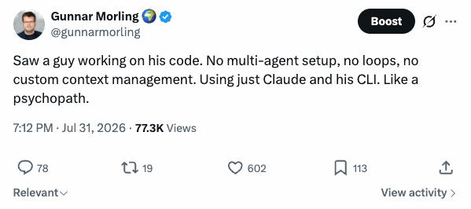

Note:
Straight after the confession, no setup. Let them laugh; it's aimed at the
elaborate setups, and that includes mine. 602 likes.

Then on: at that pace, something slips.

---

<!-- .slide: class="hero geo" data-background-image="images/geo-backdrop.svg" data-background-size="cover" -->

## We caught it before Final.

It wasn't the tests. It wasn't the review.

Note:
At that pace, something slips. Back to the feature that doesn't exist.

Merged May 1, shipped in CR1 on May 31, fixed on June 4 (#608), three weeks
before 1.0.0.Final.

Back to the prologue: the story has caught up. Hold the question of what
caught it open; it gets answered when we climb out.

---

<!-- .slide: class="geo" data-background-image="images/geo-backdrop.svg" data-background-size="cover" -->

## How it got through

- I reviewed the <em>diff</em>, not the <em>claim</em>
- I graded it against the PR description, not the spec
- Volume. It looked competent, and others were waiting

<div class="circled centred">
  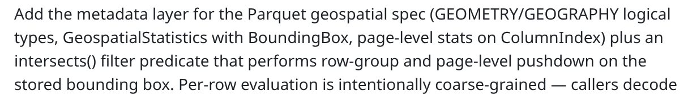
  <span class="mark-box fragment" style="left: 48.8%; top: 24%; width: 34.8%; height: 30%"></span>
</div>

Note:
All three, honestly. Don't soften it, and don't blame the contributor — the
review was mine.

Click: the claim was in the description the whole time, on the slide they saw
at the start. "Page-level stats on ColumnIndex" is the feature that doesn't
exist. Nobody asked whether it does.

The first bullet is the whole talk in six words. The diff is the how; the claim
is the what. Say it, then move on; you'll come back to it at the end.

---

<!-- .slide: class="hero" -->

## "You read every diff. Every. Diff."

<span class="aside">Me, Current London, May 2026</span>

Note:
Quote yourself from the earlier Hardwood talk. Some people in the room may have
seen it.

The sting: that talk was on May 20. The geo PR had been merged on May 1. I was
telling a room to read every diff while a feature that doesn't exist was already
on main, merged by me.

Don't apologise for it. It was right for where the project was.

By August I'd written: reading the code is a necessary precondition, not a
sufficient one. Things slipped through while I was reading every diff.

---

<!-- .slide: class="hero" -->

## I've lost full control over my own code base.

I no longer understand every line of it.

Note:
The loss, said plainly. Twenty years of knowing every bit of what I ship, and
that's gone. Not because I got lazy: because reading every diff turned out not
to be enough, and at this speed not to be possible.

Development became probabilistic: I no longer know that the code is right. I
know that it passes an oracle I trust, which is a weaker statement.

Let it sit. This is the identity question everyone in the room carries.

---


## The exhaustion is real

<span class="ex-stats-go fragment" data-fragment-index="0"></span>
<span class="ex-r1-go fragment" data-fragment-index="1"></span>
<span class="ex-r2-go fragment" data-fragment-index="2"></span>

<div class="ex">
  <div class="ex-tweet">
    <div class="ex-card">
      
      <span class="ex-box"></span>
    </div>
  </div>
  <div class="ex-reply ex-r1">
    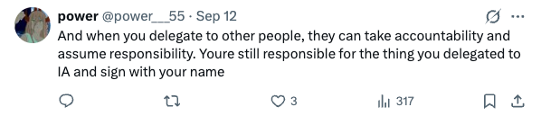
    <span class="ex-tail"></span>
  </div>
  <div class="ex-reply ex-r2">
    
  </div>
</div>

Note:
No introduction. Let the room read it, then read the middle paragraph aloud:

"You need to check it's doing the right thing, it's not forgetting anything,
not taking short cuts."

This is the bottom of the curve. Act three answers it.

Click 1: the counters. 304,000 views. 754 bookmarks: people saved a complaint so
they could come back to it. Show of hands: who in this room has felt this? Look
around before you move on.

Click 2: the first reply. Read it out cleanly, without the typos:
when you delegate to a person, they can take on the accountability. When you
delegate to the agent, nobody does. Your name stays on it.

For this room it's contractual: your name, and your company's name, goes on
what you deliver to a client. "Claude wrote that part" is not an answer a client
accepts.

Click 3: the second reply. "Welcome to being a manager." Wait for the laugh.

It's half right. Every senior engineer, tech lead and EM has shipped code they
did not read, written by people they trusted, verified by systems they built.
For the seniors in the room: your instincts transfer, this is a job you have
already done. For everyone earlier in their career: these were year-eight
skills, and you need them in year one. Nobody is going to hand you the
apprenticeship where you learned them by typing. Don't say any of that *at*
the juniors.

The other half is the first reply: a manager's reports carry their own
accountability. The agent carries none.

---

<!-- .slide: class="hero" -->

## Where there's no feedback loop, <em>you</em> are the feedback loop.

Note:
This is why the tweet struck a nerve. Where nothing checks the agent's work
automatically, you check it: every change, all day. That's the mental load.

This is the diagnosis at the bottom of the hole. Everything after the hinge is
about moving that checking out of your head and into something that runs.

---

<!-- .slide: class="hero-image" -->


Note:
Midnight. Out of control of the code base, exhausted, and the one doing all the
checking.

Now turn to the room.

---

<!-- .slide: class="section" data-state="section-slide" data-background-image="images/sections/hinge.jpg" data-background-opacity="0.55" -->

# The part where I concede something

<span class="credit">© ConspiracyofHappiness https://flic.kr/p/KqAcY (CC BY 2.0)</span>

Note:
Photo: "Rusty hinge" by ConspiracyofHappiness (CC BY 2.0, https://flic.kr/p/KqAcY). Loosely connected: an old, rusty door hinge.

Deliver this standing still, no slide clicking. If it sounds like humility
theatre the rest of the talk gets discounted. Mean it.

---

## My case, and yours

<div class="columns top compact">
<div>

**Hardwood**

- A complete written specification
- A public corpus of test files
- Three implementations to check against
- Correct = <em>the bytes match</em>
- Fast = <em>a number</em>
- Greenfield. One decision-maker.

</div>
<div>

**Your project**

- A twelve-year-old system, no spec
- Tests that assert what the code does
- Correct = the client hasn't called
- Four teams and an architect with a veto

</div>
</div>

<p class="aside fragment hinge-q">I had it easy. Your projects are harder. <em>So what actually got me out?</em></p>

Note:
Left column first. Every one of these is a gift, and I did not earn any of
them. Call back to the start: this is exactly why I picked the project.

Then the right column. Get the laugh, then land it flat.

Click: the hinge of the talk. Everything before was "look what happened",
everything after is "here is what to do about it". On a harder project, midnight
comes sooner. Leave the question open; the note trainer answers it.

---

<!-- .slide: class="section" data-state="section-slide" data-background-image="images/sections/new-way.jpg" data-background-opacity="0.55" -->

# 3 · A new way of working

<span class="credit">© chad_k https://flic.kr/p/6AH9Zu (CC BY 2.0)</span>

Note:
Photo: "Mechanics' Institute spiral staircase, from above" by chad_k (CC BY 2.0, https://flic.kr/p/6AH9Zu). Loosely connected: a spiral staircase, seen from above.

---

<!-- .slide: class="hero-image" -->

## Meanwhile, a weekend project

<span class="subtitle">Sight-reading drill · pitch detection from the microphone · no dependencies</span>

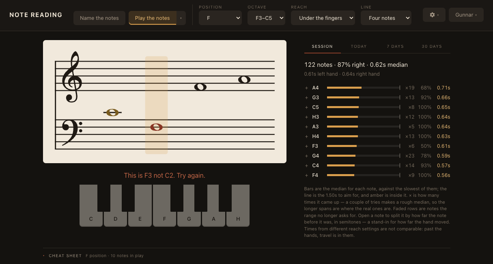

Note:
A weekend in September. Say it plainly: same weeks, same tools as the Hardwood
midnight, and no midnight at all. Why? That's the question for the next few
slides. A breather, and the key.

A note-reading trainer for the piano: shows a note, times how long I take to
name it, brings the slow ones back sooner. In microphone mode it listens to me
play and works out which note I struck: detect the attack, find the pitch,
ignore sustained notes and background noise, cope with a piano half a semitone
flat.

The signal-processing part alone would have been weeks of my time. So it would
never have existed. Software for an audience of one.

Their version: the internal tool, the pitch demo, the spike nobody would fund.

---

<!-- .slide: class="hero" data-background-image="images/sections/piano.jpg" data-background-opacity="0.10" -->

## I vibe-coded all of it.

I checked the <em>what</em>: by playing it.

<span class="credit-side">© OnceCaptured https://flic.kr/p/iiCcNU (CC BY 2.0)</span>

Note:
Photo: "Piano keys" by OnceCaptured (CC BY 2.0, https://flic.kr/p/iiCcNU), faintly behind the text.

Let the first line land in a talk called "not by AI". Somebody in the room is
waiting for you to contradict yourself. Give them a second to think you have.

Then the second line. I play a note and see whether the app heard it right. The
pitch detection is the part that can be wrong, and I always know what I played.
I am the feedback loop: instant, exact, and the only user. A wrong answer is obvious the
moment it happens, and it costs nobody anything.

Hardwood's users are people I will never meet, and its wrong answers look
right. A bug in my note trainer costs me a wrong note; a bug in Hardwood costs
somebody else's data. Same tool, different consequences, so a different amount
of checking.

And it was flow: playing against an instant answer is exactly the rhythm that
was missing at midnight.

---

<!-- .slide: class="hero" -->

## Looking back, the magic happened wherever a <em>feedback loop</em> existed.

<span class="aside">Something that says right away whether the result is wrong:<br>test vectors, a conformance suite, a piano under my fingers.</span>

Note:
The realisation that turns the curve. The SigV4 signer had AWS's test vectors.
Hardwood had the parquet-testing corpus. The note trainer had the piano.

I was the loop in both. At the keyboard, it answers in a second. Reading diffs, it takes
all day. That's the whole difference.

Where a loop existed, the agent was magic. It doesn't matter much what does the
checking: me at the keyboard counts, because it answers in a second and I know
what I played.

Where nothing answered quickly, I was the loop the slow way: reading diffs and
guessing whether they were right, all day. That was midnight.

---

<!-- .slide: class="hero" -->

## What a feedback loop can check, you can hand off.

The rest stays with you.

Note:
Pre-empt the "so, write tests" reaction. Tests aren't new. What's new is the
economics: when a human typed the code, tests were a safety net and review
caught the rest. When an agent types it, the feedback loops you have set the
limit on what you can hand off. Not the model.

"The rest stays with you" is where the last part of this act goes: review what
no feedback loop can see.

---

## Stop being the loop

<svg class="cycle" viewBox="0 80 1088 475" width="1088" height="475"><defs><marker id="cycle-head" viewBox="0 0 10 10" refX="6" refY="5" markerWidth="3.2" markerHeight="3.2" orient="auto-start-reverse"><path d="M0 0 L10 5 L0 10 z" class="cycle-head"/></marker></defs><path class="cycle-arc" d="M581.0 186.3 L585.5 187.6 L589.9 189.1 L594.3 190.8 L598.7 192.7 L602.9 194.8 L607.1 197.0 L611.2 199.4 L615.2 201.9 L619.2 204.7 L623.0 207.5 L626.7 210.6 L630.3 213.7 L633.7 217.1 L637.1 220.5 L640.3 224.1 L643.3 227.8 L646.3 231.7 L649.0 235.6 L651.7 239.7 L654.1 243.9 L656.4 248.2 L658.6 252.5 L660.5 257.0 L662.3 261.6" marker-end="url(#cycle-head)"/><path class="cycle-arc" d="M665.4 339.4 L663.9 344.2 L662.3 349.0 L660.4 353.7 L658.4 358.3 L656.2 362.8 L653.8 367.3 L651.3 371.7 L648.5 375.9 L645.6 380.1 L642.5 384.2 L639.3 388.1 L635.9 391.9 L632.4 395.6 L628.7 399.2 L624.9 402.6 L620.9 405.8 L616.8 408.9 L612.6 411.9 L608.2 414.6 L603.7 417.3 L599.2 419.7 L594.5 422.0 L589.8 424.0 L584.9 425.9" marker-end="url(#cycle-head)"/><path class="cycle-arc" d="M502.1 429.0 L497.0 427.4 L492.0 425.6 L487.0 423.7 L482.1 421.5 L477.3 419.2 L472.5 416.6 L467.9 413.9 L463.4 411.0 L458.9 407.9 L454.6 404.6 L450.5 401.2 L446.4 397.6 L442.5 393.8 L438.8 389.9 L435.2 385.8 L431.7 381.6 L428.4 377.2 L425.3 372.7 L422.4 368.1 L419.6 363.4 L417.0 358.5 L414.7 353.6 L412.5 348.5 L410.5 343.4" marker-end="url(#cycle-head)"/><path class="cycle-arc" d="M407.4 255.6 L409.1 250.2 L411.0 244.9 L413.0 239.6 L415.3 234.4 L417.8 229.3 L420.5 224.3 L423.4 219.4 L426.5 214.7 L429.8 210.0 L433.3 205.4 L436.9 201.0 L440.8 196.8 L444.8 192.6 L448.9 188.7 L453.2 184.9 L457.7 181.2 L462.3 177.8 L467.1 174.5 L472.0 171.4 L477.0 168.5 L482.1 165.8 L487.4 163.3 L492.7 161.0 L498.1 158.9" marker-end="url(#cycle-head)"/><text class="cycle-label" x="544" y="110" text-anchor="middle"><tspan class="cycle-num">1</tspan>  Build the <tspan class="cycle-em">feedback loop</tspan></text><text class="cycle-sub" x="544" y="140" text-anchor="middle">so the agent finds out it’s wrong</text><text class="cycle-label" x="734" y="304" text-anchor="start"><tspan class="cycle-num">2</tspan>  Make it <tspan class="cycle-em">fast</tspan></text><text class="cycle-sub" x="734" y="334" text-anchor="start">or it gets skipped</text><text class="cycle-label" x="544" y="512" text-anchor="middle"><tspan class="cycle-num">3</tspan>  Review what <tspan class="cycle-em">no feedback loop</tspan> can see</text><text class="cycle-sub" x="544" y="542" text-anchor="middle">that part stays with you</text><text class="cycle-label" x="354" y="304" text-anchor="end"><tspan class="cycle-num">4</tspan>  Raise the <tspan class="cycle-em">floor</tspan></text><text class="cycle-sub" x="354" y="334" text-anchor="end">make every correction stick</text></svg>

Note:
The map for the rest of this part, and the closing slide in advance. Go round
once, clockwise from the top.

The answer to "so, write tests": tests are the start of the first one. The
other three are about keeping the loop usable, spending your own attention
where no loop reaches, and making every correction stick.

Don't explain the arrows. They don't quite close: each time round starts a
little further out. The helix at the end of the act pays that off.

---

<!-- .slide: class="hero chapter" data-background-image="images/sections/chapter-build-loop.jpg" data-background-opacity="0.22" -->

<span class="overline">3 · A new way of working</span>

# Build the feedback loop

<span class="aside">Give the machine a way to say no.</span>

<span class="credit">© OregonDOT https://flic.kr/p/2j22sUS (CC BY 2.0)</span>

---

## So I can walk away

<span class="subtitle">No browser session, no SSH keys, no home directory</span>

```yaml
claude:
  build: .
  volumes:
    - .:/workspace                # the repository, nothing else
  environment:
    - DOCKER_HOST=tcp://docker-proxy:2375
docker-proxy:                     # Testcontainers only
  environment:
    CONTAINERS: 1
    BUILD: 0                      # no docker build from inside
    VOLUMES: 0                    # no volume create or remove
```

<span class="aside">Abridged from Hardwood's <code>docker-compose.yaml</code></span>

Note:
Everything in this act assumes I can start something and leave. That only works
because of where the agent lives: a container with one directory mounted, the
repository. Not my home directory, not my browser sessions, not my SSH keys —
for the N300 it has a key of its own.

The integration tests need Docker, so it gets a socket proxy that allows
starting containers and nothing else: no `docker build`, no volumes.

The framing, if I say one line about it: letting an agent run long is a
blast-radius question, not a trust question. I don't have to decide whether I
trust it. I decide what it can reach.

A side effect worth mentioning: agent worktrees have to live inside the
repository, because that's the only directory mounted.

For this room: this is also the answer to "can I point this at client code?" The
Feb 1 post said "out of an abundance of caution". Nine months on, the caution is
what makes the speed possible.

---

## What is the oracle?

<div class="columns top oracle">
<div>

**Hardwood**

```xml
<!-- core/pom.xml -->
<dependency>
  <groupId>org.apache.parquet</groupId>
  <artifactId>parquet-column</artifactId>
  <scope>test</scope>
</dependency>
<dependency>
  <groupId>org.duckdb</groupId>
  <artifactId>duckdb_jdbc</artifactId>
  <scope>test</scope>
</dependency>
```

</div>
<div>

**Your project**

- Golden-master the legacy service, then refactor behind it
- Replay recorded production traffic against both versions
- Run the old system <em>beside</em> the new one and diff

</div>
</div>

Note:
Say the line out loud, it's the best one on this slide:

"My test dependencies include two competing implementations of my own
library."

Every file I write gets read back by parquet-java, by DuckDB, by PyArrow.
Every file they write, I have to read. That is differential testing, and it is
the only reason I can let an agent near a binary format.

Add the war story if time allows: a dictionary bug DuckDB happily accepted and
parquet-java rejected. One lenient consumer hides a real break.

The question to take home is never "is the AI good?". It's "what is my oracle?"

The predicate audit takes this to scale: about 72,000 predicate cells, through
five read paths, against parquet-java and DuckDB, in every PR build.

Right column: the brownfield version. None of this is new. All of it was
optional before, because humans were slow enough that review caught things.

On "golden-master", in case the term is new to some: "record what the old system
does, then diff against it." The recording isn't correct, it's what clients
depend on today, and it doesn't come from whoever wrote the new code.

---

<!-- .slide: class="hero" -->

## Tests written alongside the code, by the thing that wrote the code, are not an oracle.

They're a <em>mirror</em>.

Note:
Sharpest line in act three. Don't rush it and don't explain it.

A real one, caught in review on Sep 15: the test's expected values came from the
reader under test, so a decoding bug would have matched on both sides. The fix:
expected values written independently, by the fixture generator.

And the oracle itself is core: exclusion lists, expected values and skipped tests
get read line by line. That's the answer to "it edited the test until it
agreed".

---


## "Make it faster, Claude!"

<span class="subtitle">A 7 W box on the desk, 500 EUR, silent</span>

<div class="n300">
<div class="n300-row">
<div class="n300-node"><strong>My branch</strong><span>pushed over SSH</span></div>
<svg class="n300-arrow" viewBox="0 0 90 24" width="90" height="24"><path d="M2 12 L74 12" stroke="#b5491f" stroke-width="4"/><path d="M72 4 L88 12 L72 20 z" fill="#b5491f"/></svg>
<div class="n300-box">
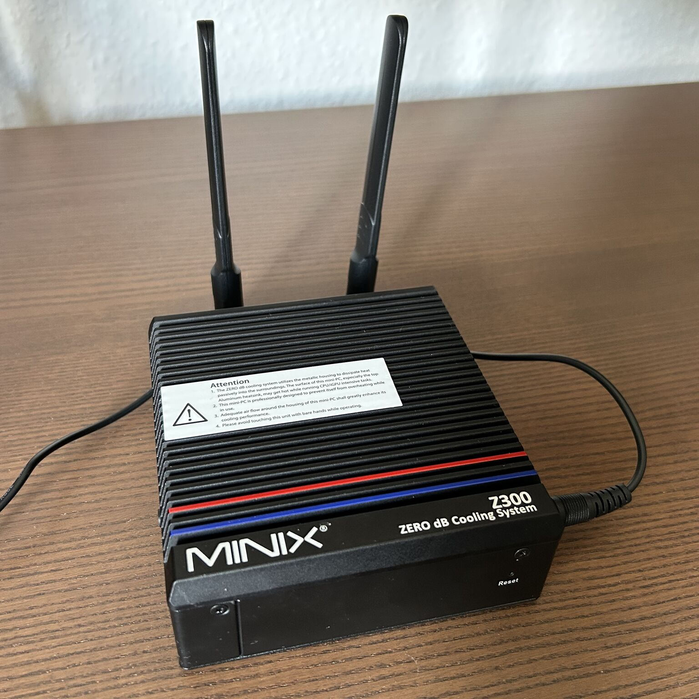
<div><strong>Clock pinned</strong><span><code>JMH</code></span><span><code>perfnorm</code></span><span><code>async-profiler</code></span><span><code>perfasm</code></span><span>unattended</span></div>
</div>
<svg class="n300-arrow" viewBox="0 0 90 24" width="90" height="24"><path d="M2 12 L74 12" stroke="#b5491f" stroke-width="4"/><path d="M72 4 L88 12 L72 20 z" fill="#b5491f"/></svg>
<div class="n300-node"><strong>Numbers back</strong><span>with the assembly</span></div>
</div>
<svg class="n300-back" viewBox="0 0 1000 90" width="1000" height="90" preserveAspectRatio="none"><path d="M980 8 C980 78, 20 78, 20 16" fill="none" stroke="#666666" stroke-width="3" stroke-dasharray="8 7"/><path d="M12 4 L28 12 L14 22 z" fill="#666666"/></svg>
<p class="n300-again">the next variant, minutes later</p>
</div>

Note:
The chapter's loop, made physical. The agent pushes the branch, the box measures, the numbers
come back, and it goes again, unattended.

Spoken: why a separate box (macOS blocks dtrace, no clean way to pin a core, the
laptop runs everything else), why this one (eight cores of one kind), the
downsides (one memory channel, no AVX-512), and that I read the conclusions and
the numbers under them. "The number decides what worked" comes one slide later,
so the caveat doesn't need to be on this slide.

More background, if asked: the Jul 16 post ("coding agents work best with a tight
feedback loop", and whether that holds for performance too), and the part people
don't believe until they see it: the agent reading annotated assembly and telling
you which instructions are hot, whether the loop vectorised, and what got inlined.

---

## perfasm names the culprit

<span class="subtitle">Delta decoding: 69% of cycles in one method</span>

<span class="fix-go fragment" data-fragment-index="0"></span>

<div class="columns asm-code">
<div class="asm-left">
<blockquote class="transcript asm-prompt">
"profile the decoding benchmark on the N300 to identify whether there's any remaining bottlenecks"
<cite>Me, to Claude, Aug 30</cite>
</blockquote>
<pre class="asm"><code class="nohighlight" data-noescape>1.16%  add  %rsi,%rax        ;*ladd
0.79%  mov  %rax,0x10(…)     ;*lastore
<mark>5.13%  mov  0x48(%rsp),%r10
1.03%  mov  %rax,0x10(%r10)  ;*putfield
                             ; lastValue
6.66%  mov  %rbp,%r10</mark>
0.74%  shr  $0x3,%r10</code></pre>
</div>
<div>
<pre class="rot-code fix-code"><code class="nohighlight" data-noescape><span class="rot-swap"><span class="rot-old"><span class="k">for</span> (<span class="k">int</span> i = 0; i &lt; count; i++) {
    <span class="c">// unpack the residual …</span>
    lastValue += delta + residual;
    dest[offset + i] = lastValue;
}
</span><span class="rot-new"><span class="k">long</span> <mark class="rot-fixed">value</mark> = lastValue;
<span class="k">for</span> (<span class="k">int</span> i = 0; i &lt; count; i++) {
    <span class="c">// unpack the residual …</span>
    <mark class="rot-fixed">value</mark> += delta + residual;
    dest[offset + i] = <mark class="rot-fixed">value</mark>;
}
lastValue = value;</span></span></code></pre>
</div>
</div>

<div class="asm-asides">
<p class="aside fragment" data-fragment-index="0">The fix: a local instead of the field. +2% to +7%.</p>
<p class="aside fragment" data-fragment-index="1">It never gets tired of trying. <em>The number decides what worked.</em></p>
</div>

Note:
On arrival: the loop from the delta decoder rewrite, and my whole prompt on Aug
30 (verbatim, grammar and all). Let them look at the code: nothing looks wrong.

perfnorm first: no cache or TLB misses, few branch misses, so pure instruction
count. Then perfasm: the loop is unrolled twice, and in each copy the running
value is loaded from and stored to the field lastValue, on every value. About
11% of cycles (the sampling skid puts the cost on the lines around the store).

The agent's explanation: the JIT can't keep the field in a register, because it
can't prove the output array doesn't alias `this`.

Click 1: what perfasm found, and the fix, in the code. The agent carried the value in a local and wrote
it back once (loop simplified on the slide: the residual unpacking is elided).
Measured on the N300 (x86): +2%, +5%, +7% ops/ms at bit widths 10, 21, 64;
instructions per value 38.6 → 36.9, 39.1 → 37.3, 26.4 → 24.8. On an Apple
M-series laptop it's neutral, so it's free there.

It also went after the two bounds checks per value: an int cursor needs a
block-size cap, which broke a test, and it measured 5% slower. It reported that
and dropped it.

The fix is on main today, with a comment saying why the locals are there.

Click 2: it will run profilers and try variant after variant all night without
getting bored. Whether any of it worked is a number, not an explanation. The
rules from midnight: measure before naming a cause, A/B/A, a hard time cap.

---

<!-- .slide: class="hero chapter" data-background-image="images/sections/chapter-make-fast.jpg" data-background-opacity="0.22" -->

<span class="overline">3 · A new way of working</span>

# Make it fast

<span class="aside">A loop you wait minutes for is a loop you skip.</span>

<span class="credit">© Elsie esq. https://flic.kr/p/i9NnnB (CC BY 2.0)</span>

---

## "I'm feeling our feedback loop is too slow."

<span class="subtitle">Me, to Claude, Sep 7</span>

<div class="loop-chart">
<div class="loop-row  fragment" data-fragment-index="0">
<div class="loop-label"><strong>The licence check</strong><span>walked 205,000 files to pick 1,000</span></div>
<div class="loop-bars">
<div class="loop-bar before" style="width: 170px"><span>16.5 s</span></div>
<div class="loop-bar after" style="width: 6px"><span>0.6 s</span></div>
</div>
<div class="loop-note">CI never saw it: every CI checkout is fresh.</div>
</div>
<div class="loop-row  fragment" data-fragment-index="1">
<div class="loop-label"><strong>Tests in parallel</strong><span>they ran one class at a time</span></div>
<div class="loop-bars">
<div class="loop-bar before" style="width: 619px"><span>60 s</span></div>
<div class="loop-bar after" style="width: 347px"><span>34 s</span></div>
</div>
</div>
<div class="loop-row  fragment" data-fragment-index="2">
<div class="loop-label"><strong>The slowest tests</strong><span>63% of it parsing Hadoop's config</span></div>
<div class="loop-bars">
<div class="loop-bar before" style="width: 361px"><span>35 s</span></div>
<div class="loop-bar after" style="width: 165px"><span>16 s</span></div>
</div>
<div class="loop-note">In a Parquet library built to need no Hadoop.</div>
</div>
<div class="loop-row loop-total fragment" data-fragment-index="3">
<div class="loop-label"><strong>The dev loop</strong><span>two days later</span></div>
<div class="loop-bars">
<div class="loop-bar before" style="width: 619px"><span>60 s</span></div>
<div class="loop-bar after" style="width: 288px"><span>28 s</span></div>
</div>
</div>
</div>

Note:
My prompt, verbatim: how long does verify take with and without the ITs, "I'm
feeling our feedback loop is too slow." Then: profile it. Three fixes came out
of it over two days, each with its own measurement; one scale for all bars.

Click 1: the licence check. `license:check` took 8.6 to 16.5 s in my working
clone and 0.4 s in a fresh one. The plugin descends into every directory an
include pattern could match, excluded or not, so it walked the agent worktrees,
the benchmark data and the virtualenvs: 205,000 files to pick 1,000. Bounded
includes: 0.6 s. CI never saw it, because every CI checkout is fresh. The way I
work with agents was slowing down the agents' own feedback loop, only on my
machine. (Commit efc78e2a, #1120.)

Click 2: nothing in the build was parallel. Two modules running their tests one
class at a time were 42 of the 60 seconds of verify -DskipITs; compilation,
Error Prone, packaging were under five. Parallel modules, four test forks: 34 s.
(482daba9, #1124.)

Click 3: the slowest module, profiled. 63% of the samples in Hadoop's
`new Configuration()`, which parses four thousand lines of XML each time, and
1.5% in the writer the test exists to check. Built once and shared: 35 s to
16 s, same files, same assertions. The irony: Hadoop keeps biting us in the
build of a Parquet library whose point is not needing Hadoop. It's there only
because parquet-java, one of our oracles, needs it. (f2369002, #1129.)

Click 4: the dev loop itself, verify -DskipITs in the same container: 60 s on
Sep 7, 28 s on Sep 8. That's the one bar that is cumulative; the three above are
separate measurements, don't add them up.

Skipping the integration tests isn't on the slide on purpose: once the build ran
in parallel, they overlapped with other modules and the saving mostly vanished.

On your project: profile your build like any other workload.


---

<!-- .slide: class="hero-image" -->

## Give the agent an instrument

<div class="pair">
  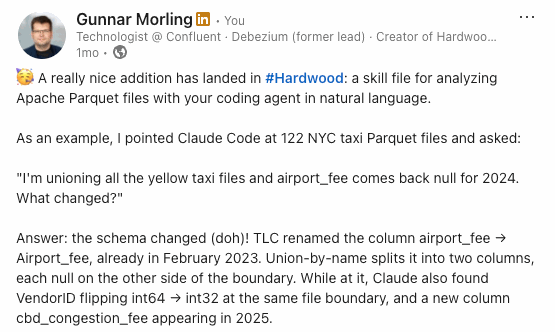
  
</div>

<span class="aside">If your agent keeps writing one-off scripts to look at a system, that system is missing a tool.<br>Build it, even if only the agent uses it.</span>

Note:
The Hardwood CLI, plus a skill that tells the agent how to call it (contributed
by Sem Sinchenko). Point Claude Code at 122 NYC
taxi files: "airport_fee comes back null for 2024. What changed?"

It loads the skill, runs the CLI, and finds the rename to Airport_fee in
February 2023, plus VendorID changing type at the same boundary.

Before the skill, every question about a Parquet file meant a fresh one-off
script: PyArrow, or unpacking the footer bytes by hand in Python. Each one
written from scratch, each one a new chance to be wrong, and slow to get an
answer from. Now it runs `hardwood`, which already knows the answer's shape.

The aside is the generalisation. A one-off script per question is a slow loop; a
tool the agent has been taught is a fast one. I built the tool my agent debugs
my library with, and the agent is its heaviest user.

Same idea, more specific: a skill for the PR workflow (branches, rebases,
pushes), so it doesn't reinvent git on every PR.

Their version: the client system nobody can inspect without raising a ticket.

---

<!-- .slide: class="hero chapter" data-background-image="images/sections/chapter-review.jpg" data-background-opacity="0.22" -->

<span class="overline">3 · A new way of working</span>

# Review what no feedback loop can see

<span class="aside">Human attention, where mistakes are expensive.</span>

<span class="credit">© John 'Pathfinder' Lester https://flic.kr/p/bUgBy5 (CC BY 2.0)</span>

---

<!-- .slide: class="geo" data-background-image="images/geo-backdrop.svg" data-background-size="cover" -->

## What caught the geo bug?

<span class="subtitle">June 4, three weeks before 1.0.0.Final</span>

<div class="columns geo-spec">
<div>
<p class="geo-label">The spec, <code>parquet.thrift</code></p>
<pre class="rot-code"><code class="nohighlight" data-noescape><span class="k">struct</span> ColumnIndex {
  1: null_pages
  2: min_values
  3: max_values
  4: boundary_order
  5: null_counts
  6: repetition_level_histograms
<span class="spec-7">  7: definition_level_histograms</span>
  8: nan_counts
}</code></pre>
</div>
<div class="geo-verdict">
<p class="geo-claim fragment" data-fragment-index="0">Hardwood read field 7 as<br><s>geospatial statistics</s>.<br><strong>There is no geo field.</strong></p>
<div class="verdict-list fragment" data-fragment-index="1">
<p><span class="no">✗</span> The tests: same misreading</p>
<p><span class="no">✗</span> The review: it passed</p>
<p><span class="yes">✓</span> Reading the spec, for something else</p>
</div>
</div>
</div>

Note:
Answer the prologue's question.

On arrival: the page index as the spec defines it (types left out so it fits).
Eight fields, nothing about geometry.

Click 1: field 7. Hardwood's reader decoded it as geospatial statistics; the spec
says definition-level histograms. The feature the PR claimed, "page-level stats
on ColumnIndex", had nowhere to live. Filed as #608 on June 4, fixed three weeks
before Final.

Click 2: what didn't catch it, and what did. The tests were written against the
same misreading, so they agreed with it. The review passed.

I found it by accident: three minutes after filing #607, I was reading the
ColumnIndex definition for the level histograms, and field 7 was already taken
by "geospatial stats". The design doc had the same wrong mapping.

A loop catches known unknowns, things somebody knew to check. The geo bug was an
unknown unknown: nobody writes a test for a field that doesn't exist. Loops take
most of the checking off your plate; expertise keeps the rest (Mar 30 post:
"confidently bad for dealing with unknown unknowns").

---

## I own the design. <em>Not every line.</em>

<svg class="pockets" viewBox="0 0 1000 470" width="1000" height="470"><text x="150" y="38" class="pk-title" fill="#354045">The design: mine</text><g class="fragment" data-fragment-index="1"><rect x="184.0" y="94.0" width="37.7" height="35.3" rx="4" fill="#354045" fill-opacity="0.1"/><rect x="229.7" y="94.0" width="37.7" height="35.3" rx="4" fill="#354045" fill-opacity="0.08"/><rect x="275.4" y="94.0" width="37.7" height="35.3" rx="4" fill="#354045" fill-opacity="0.13"/><rect x="321.1" y="94.0" width="37.7" height="35.3" rx="4" fill="#354045" fill-opacity="0.08"/><rect x="366.9" y="94.0" width="37.7" height="35.3" rx="4" fill="#354045" fill-opacity="0.12"/><rect x="412.6" y="94.0" width="37.7" height="35.3" rx="4" fill="#354045" fill-opacity="0.1"/><rect x="458.3" y="94.0" width="37.7" height="35.3" rx="4" fill="#354045" fill-opacity="0.08"/><rect x="504.0" y="94.0" width="37.7" height="35.3" rx="4" fill="#354045" fill-opacity="0.12"/><rect x="549.7" y="94.0" width="37.7" height="35.3" rx="4" fill="#354045" fill-opacity="0.07"/><rect x="595.4" y="94.0" width="37.7" height="35.3" rx="4" fill="#354045" fill-opacity="0.11"/><rect x="641.1" y="94.0" width="37.7" height="35.3" rx="4" fill="#354045" fill-opacity="0.08"/><rect x="686.9" y="94.0" width="37.7" height="35.3" rx="4" fill="#354045" fill-opacity="0.08"/><rect x="732.6" y="94.0" width="37.7" height="35.3" rx="4" fill="#354045" fill-opacity="0.11"/><rect x="778.3" y="94.0" width="37.7" height="35.3" rx="4" fill="#354045" fill-opacity="0.14"/><rect x="184.0" y="137.3" width="37.7" height="35.3" rx="4" fill="#354045" fill-opacity="0.08"/><rect x="229.7" y="137.3" width="37.7" height="35.3" rx="4" fill="#354045" fill-opacity="0.4"/><rect x="275.4" y="137.3" width="37.7" height="35.3" rx="4" fill="#354045" fill-opacity="0.85"/><rect x="321.1" y="137.3" width="37.7" height="35.3" rx="4" fill="#354045" fill-opacity="0.85"/><rect x="366.9" y="137.3" width="37.7" height="35.3" rx="4" fill="#354045" fill-opacity="0.4"/><rect x="412.6" y="137.3" width="37.7" height="35.3" rx="4" fill="#354045" fill-opacity="0.09"/><rect x="458.3" y="137.3" width="37.7" height="35.3" rx="4" fill="#354045" fill-opacity="0.13"/><rect x="504.0" y="137.3" width="37.7" height="35.3" rx="4" fill="#354045" fill-opacity="0.16"/><rect x="549.7" y="137.3" width="37.7" height="35.3" rx="4" fill="#354045" fill-opacity="0.12"/><rect x="595.4" y="137.3" width="37.7" height="35.3" rx="4" fill="#354045" fill-opacity="0.11"/><rect x="641.1" y="137.3" width="37.7" height="35.3" rx="4" fill="#354045" fill-opacity="0.16"/><rect x="686.9" y="137.3" width="37.7" height="35.3" rx="4" fill="#354045" fill-opacity="0.07"/><rect x="732.6" y="137.3" width="37.7" height="35.3" rx="4" fill="#354045" fill-opacity="0.15"/><rect x="778.3" y="137.3" width="37.7" height="35.3" rx="4" fill="#354045" fill-opacity="0.1"/><rect x="184.0" y="180.7" width="37.7" height="35.3" rx="4" fill="#354045" fill-opacity="0.08"/><rect x="229.7" y="180.7" width="37.7" height="35.3" rx="4" fill="#354045" fill-opacity="0.08"/><rect x="275.4" y="180.7" width="37.7" height="35.3" rx="4" fill="#354045" fill-opacity="0.85"/><rect x="321.1" y="180.7" width="37.7" height="35.3" rx="4" fill="#354045" fill-opacity="0.4"/><rect x="366.9" y="180.7" width="37.7" height="35.3" rx="4" fill="#354045" fill-opacity="0.1"/><rect x="412.6" y="180.7" width="37.7" height="35.3" rx="4" fill="#354045" fill-opacity="0.14"/><rect x="458.3" y="180.7" width="37.7" height="35.3" rx="4" fill="#354045" fill-opacity="0.09"/><rect x="504.0" y="180.7" width="37.7" height="35.3" rx="4" fill="#354045" fill-opacity="0.12"/><rect x="549.7" y="180.7" width="37.7" height="35.3" rx="4" fill="#354045" fill-opacity="0.13"/><rect x="595.4" y="180.7" width="37.7" height="35.3" rx="4" fill="#354045" fill-opacity="0.4"/><rect x="641.1" y="180.7" width="37.7" height="35.3" rx="4" fill="#354045" fill-opacity="0.1"/><rect x="686.9" y="180.7" width="37.7" height="35.3" rx="4" fill="#354045" fill-opacity="0.12"/><rect x="732.6" y="180.7" width="37.7" height="35.3" rx="4" fill="#354045" fill-opacity="0.08"/><rect x="778.3" y="180.7" width="37.7" height="35.3" rx="4" fill="#354045" fill-opacity="0.08"/><rect x="184.0" y="224.0" width="37.7" height="35.3" rx="4" fill="#354045" fill-opacity="0.09"/><rect x="229.7" y="224.0" width="37.7" height="35.3" rx="4" fill="#354045" fill-opacity="0.13"/><rect x="275.4" y="224.0" width="37.7" height="35.3" rx="4" fill="#354045" fill-opacity="0.4"/><rect x="321.1" y="224.0" width="37.7" height="35.3" rx="4" fill="#354045" fill-opacity="0.11"/><rect x="366.9" y="224.0" width="37.7" height="35.3" rx="4" fill="#354045" fill-opacity="0.1"/><rect x="412.6" y="224.0" width="37.7" height="35.3" rx="4" fill="#354045" fill-opacity="0.12"/><rect x="458.3" y="224.0" width="37.7" height="35.3" rx="4" fill="#354045" fill-opacity="0.11"/><rect x="504.0" y="224.0" width="37.7" height="35.3" rx="4" fill="#354045" fill-opacity="0.1"/><rect x="549.7" y="224.0" width="37.7" height="35.3" rx="4" fill="#354045" fill-opacity="0.14"/><rect x="595.4" y="224.0" width="37.7" height="35.3" rx="4" fill="#354045" fill-opacity="0.85"/><rect x="641.1" y="224.0" width="37.7" height="35.3" rx="4" fill="#354045" fill-opacity="0.85"/><rect x="686.9" y="224.0" width="37.7" height="35.3" rx="4" fill="#354045" fill-opacity="0.4"/><rect x="732.6" y="224.0" width="37.7" height="35.3" rx="4" fill="#354045" fill-opacity="0.13"/><rect x="778.3" y="224.0" width="37.7" height="35.3" rx="4" fill="#354045" fill-opacity="0.09"/><rect x="184.0" y="267.3" width="37.7" height="35.3" rx="4" fill="#354045" fill-opacity="0.12"/><rect x="229.7" y="267.3" width="37.7" height="35.3" rx="4" fill="#354045" fill-opacity="0.12"/><rect x="275.4" y="267.3" width="37.7" height="35.3" rx="4" fill="#354045" fill-opacity="0.15"/><rect x="321.1" y="267.3" width="37.7" height="35.3" rx="4" fill="#354045" fill-opacity="0.14"/><rect x="366.9" y="267.3" width="37.7" height="35.3" rx="4" fill="#354045" fill-opacity="0.4"/><rect x="412.6" y="267.3" width="37.7" height="35.3" rx="4" fill="#354045" fill-opacity="0.85"/><rect x="458.3" y="267.3" width="37.7" height="35.3" rx="4" fill="#354045" fill-opacity="0.4"/><rect x="504.0" y="267.3" width="37.7" height="35.3" rx="4" fill="#354045" fill-opacity="0.1"/><rect x="549.7" y="267.3" width="37.7" height="35.3" rx="4" fill="#354045" fill-opacity="0.16"/><rect x="595.4" y="267.3" width="37.7" height="35.3" rx="4" fill="#354045" fill-opacity="0.4"/><rect x="641.1" y="267.3" width="37.7" height="35.3" rx="4" fill="#354045" fill-opacity="0.85"/><rect x="686.9" y="267.3" width="37.7" height="35.3" rx="4" fill="#354045" fill-opacity="0.08"/><rect x="732.6" y="267.3" width="37.7" height="35.3" rx="4" fill="#354045" fill-opacity="0.11"/><rect x="778.3" y="267.3" width="37.7" height="35.3" rx="4" fill="#354045" fill-opacity="0.14"/><rect x="184.0" y="310.7" width="37.7" height="35.3" rx="4" fill="#354045" fill-opacity="0.08"/><rect x="229.7" y="310.7" width="37.7" height="35.3" rx="4" fill="#354045" fill-opacity="0.11"/><rect x="275.4" y="310.7" width="37.7" height="35.3" rx="4" fill="#354045" fill-opacity="0.07"/><rect x="321.1" y="310.7" width="37.7" height="35.3" rx="4" fill="#354045" fill-opacity="0.13"/><rect x="366.9" y="310.7" width="37.7" height="35.3" rx="4" fill="#354045" fill-opacity="0.14"/><rect x="412.6" y="310.7" width="37.7" height="35.3" rx="4" fill="#354045" fill-opacity="0.12"/><rect x="458.3" y="310.7" width="37.7" height="35.3" rx="4" fill="#354045" fill-opacity="0.15"/><rect x="504.0" y="310.7" width="37.7" height="35.3" rx="4" fill="#354045" fill-opacity="0.1"/><rect x="549.7" y="310.7" width="37.7" height="35.3" rx="4" fill="#354045" fill-opacity="0.13"/><rect x="595.4" y="310.7" width="37.7" height="35.3" rx="4" fill="#354045" fill-opacity="0.12"/><rect x="641.1" y="310.7" width="37.7" height="35.3" rx="4" fill="#354045" fill-opacity="0.12"/><rect x="686.9" y="310.7" width="37.7" height="35.3" rx="4" fill="#354045" fill-opacity="0.11"/><rect x="732.6" y="310.7" width="37.7" height="35.3" rx="4" fill="#354045" fill-opacity="0.15"/><rect x="778.3" y="310.7" width="37.7" height="35.3" rx="4" fill="#354045" fill-opacity="0.16"/><rect x="880" y="130" width="26" height="26" rx="4" fill="#354045" fill-opacity="0.85"/><text x="916" y="151" class="pk-legend" fill="#354045">read closely</text><text x="916" y="178" class="pk-sub" fill="#666666">where a wrong</text><text x="916" y="202" class="pk-sub" fill="#666666">answer looks right</text><rect x="880" y="250" width="26" height="26" rx="4" fill="#354045" fill-opacity="0.12"/><text x="916" y="271" class="pk-legend" fill="#354045">the what</text><text x="916" y="298" class="pk-sub" fill="#666666">a feedback loop</text><text x="916" y="322" class="pk-sub" fill="#666666">checks it</text></g><rect x="150" y="60" width="700" height="320" rx="26" fill="none" stroke="#b5491f" stroke-width="12"/><text x="500.0" y="436" text-anchor="middle" class="pk-label" fill="#b5491f">The API: every change, line by line</text></svg>

Note:
The design is mine, always, and no feedback loop checks it. The one hard
border is the API: every change to it gets read line by line.

Click: inside, attention is graded, not uniform. Where a wrong answer would look
right, I read closely. Where the what is precise (a decoder has a spec: it
works, or it doesn't) or little is at stake (the TUI I judge by what it
renders), a feedback loop checks it and I don't read the how.

---

<!-- .slide: class="hero-image" -->

## Every API change, on a list


<span class="aside">API report for 1.0.0.Final against CR2 · <code>(!)</code> marks a binary-incompatible change</span>

Note:
The hard border doesn't rely on me spotting API changes in a diff. japicmp
compares every build against the last release, across all four published
modules, and the report is published with each release on hardwood.dev.

This one: between CR2 and Final, a constructor of the public FileMetaData
record was removed and replaced. Flagged as binary-incompatible. Every line on
that list gets a decision from me: intended, documented, worth it?

A feedback loop for the one thing I never hand off. It surfaces the change; the
judgment stays with me.


---


<!-- .slide: class="hero-image" -->

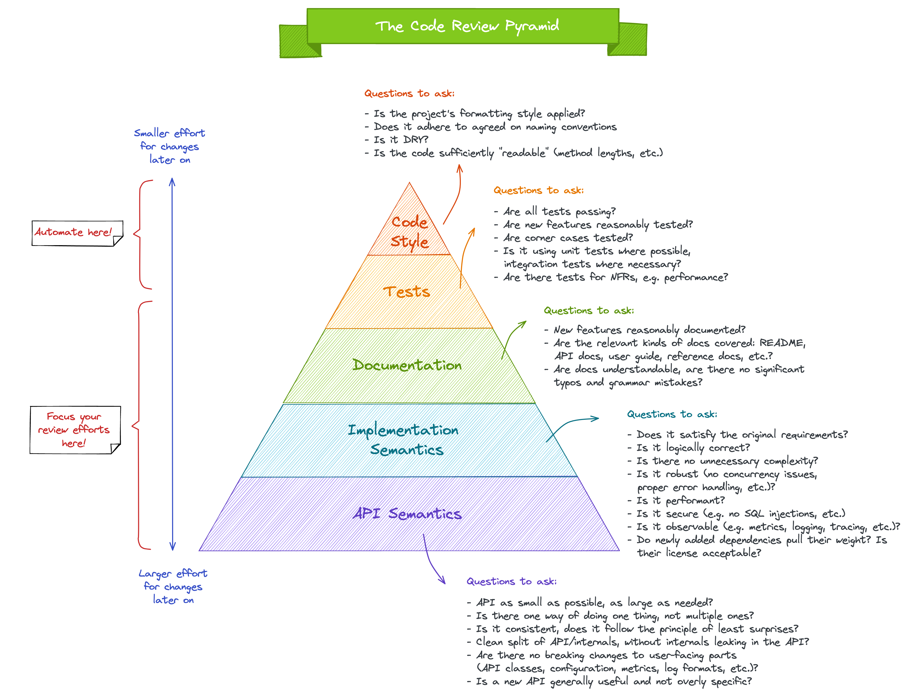 <!-- .element: class="plain pyramid" -->

<p class="aside" style="margin: 6px 0 0">The base is the <em>what</em>. The top is the <em>how</em>.</p>

Note:
Some people in the room will know this image. I drew it a few years ago, long
before any of this.

The wide base — API semantics, implementation semantics — is where problems are
expensive after merge: an API break hits every caller, an implementation bug
ships to production. The narrow top — style — is cheap and mechanical.

A style nit and an API mistake are not the same kind of thing, and the model
will happily hand you fifty of the former.

The *what* is more than the feature: the architecture is part of it. Invariants,
threading, the allocation budget. An agent can write code that does the right
thing and breaks all three.

Weight review effort by how expensive a problem is to fix after merge. "Review the
claim, not the diff" is this pyramid, applied to AI output.

---


## What no test catches

<span class="subtitle">Hardwood docs, the write model, Aug 22</span>

<div class="doc-excerpt">
<p><strong>Page size</strong> governs read granularity. A reader that skips pages by their statistics can only skip whole pages.</p>
<p><strong>Row-group size</strong> governs <mark class="doc-claim">read parallelism</mark> and split sizing, and on the write side it is the memory bound above.</p>
</div>

<blockquote class="transcript doc-me fragment" data-fragment-index="0">
"…governs read parallelism" in the docs is not correct: we parallelize reading at the chunk and even page level.
<cite>Me, Aug 26</cite>
</blockquote>

<div class="doc-checks fragment" data-fragment-index="1">
<span class="doc-label">Passed it</span> <span>Tests</span> <span>Docs build</span>
<span class="doc-label doc-caught">Caught it</span> <span class="doc-owner">Someone who knows the design</span>
</div>

Note:
On arrival: a sentence from the writer docs. It reads like something a Parquet
expert would write. Row groups are the unit people usually associate with
parallel reads, in Spark for instance.

Click 1: it's wrong for Hardwood. The reader runs two virtual threads per
column and decodes pages concurrently inside a row group. Row-group size doesn't
bound its parallelism at all. I flagged it, and it was corrected the next day
(2c71576d).

Click 2: nothing else could have caught it. Tests don't read docs. The docs build
checks form, not truth. The only check for a sentence about
the design is someone who owns the design.

That's the part of review that stays with you.

---

<!-- .slide: class="hero chapter" data-background-image="images/sections/chapter-raise-floor.jpg" data-background-opacity="0.22" -->

<span class="overline">3 · A new way of working</span>

# Raise the floor

<span class="aside">Make every correction stick.</span>

<span class="credit">© &#126;MVI&#126; (warped) https://flic.kr/p/4kA93z (CC BY 2.0)</span>

Note:
Every time you correct the agent, ask: will it make this mistake again
tomorrow? If yes, don't fix it in the conversation. Turn it into something that
runs next time: a check, a skill, a type.

That's what raises the floor. The helix at the end of this chapter shows why
it's called that.

---

## Automate the top: the ladder

<svg class="proto" viewBox="0 0 1000 460" width="1000" height="460"><g class="fragment" data-fragment-index="0"><rect x="25" y="350" width="310" height="90" fill="#354045" fill-opacity="0.25"/><text x="41" y="386" class="p-label" fill="#ffffff">1</text><text x="73" y="386" class="p-step" fill="#ffffff">Ask in prose</text><text x="31" y="304" class="p-sub" fill="#354045">Sep 4: a rule in CLAUDE.md</text><text x="31" y="330" class="p-sub" fill="#354045">Sep 8: “why again?”</text></g><g class="fragment" data-fragment-index="1"><rect x="345" y="260" width="310" height="180" fill="#354045" fill-opacity="0.55"/><text x="361" y="296" class="p-label" fill="#ffffff">2</text><text x="393" y="296" class="p-step" fill="#ffffff">Automated check</text><text x="351" y="214" class="p-sub" fill="#354045">Filler prose → PR build check</text><text x="351" y="240" class="p-sub" fill="#354045">var → compiler error</text></g><g class="fragment" data-fragment-index="2"><rect x="665" y="170" width="310" height="270" fill="#354045" fill-opacity="0.85"/><text x="681" y="206" class="p-label" fill="#ffffff">3</text><text x="713" y="206" class="p-step" fill="#ffffff">Unrepresentable</text><text x="671" y="124" class="p-sub" fill="#354045">Sep 14: co-author trailer</text><text x="671" y="150" class="p-sub" fill="#354045">off in the settings file</text></g></svg>

Note:
Every standard in the project starts at step one. The ones that matter get
promoted.

Step one alone doesn't hold. Adding "don't do X" to CLAUDE.md after asking Claude
how to avoid X feels like asking your kids to raise themselves (Mar 27 post).

With dates: Sep 4, "never add the session id to PRs" in CLAUDE.md. Sep 8, "why
are you adding the claude session to commits again". Sep 14, moved into the
settings file, where it can't be broken.

One click per step. Step two: two of the checks are compiler errors I wrote
myself; the prose check fails the build on marketing language in documentation.

The same goes for what the agent learns. The N300 skill has a list of traps, each
a mistake that will never happen again: "Poll with a process match that can't
match itself" (pgrep over SSH matched its own shell and reported "still running"
forever). The hardwood CLI: "why did you do that instead of the skill?", said
once, now written down. The performance rules from midnight: written down, not
repeated in every session.

---


## Prose rots. Checks don't.

<span class="subtitle">One comment, in 29 filter matchers, May 11 to Sep 10</span>

<span class="rot-go fragment" data-fragment-index="0"></span>
<span class="rot-fix-go fragment" data-fragment-index="1"></span>

<pre class="rot-code"><code class="nohighlight" data-noescape><span class="rot-swap"><span class="rot-old c">// Build the predicate bitmap ignoring nulls. The inner loop is fixed at 64
// iterations and uses a branchless `(cond ? 1 : 0) &lt;&lt; b` pack so HotSpot
// <mark class="rot-claim">fully unrolls it and auto-vectorizes the comparison</mark>. The tail is split
// off to keep the hot loop's trip count constant at 64.</span><span class="rot-new c">// Build the predicate bitmap ignoring nulls; nulls are masked out in the
// word-wise pass below. The comparison is branchless, but <mark class="rot-fixed">C2 does not</mark>
// <mark class="rot-fixed">vectorize it</mark> — packing a vector compare into bitmap bits has no
// autovectorization idiom, so this compiles to a scalar cmp/setcc/shl/or
// chain unrolled 4x. The tail is split off to keep the hot loop's trip
// count constant at 64.</span></span>
<span class="k">for</span> (<span class="k">int</span> w = 0; w &lt; fullWords; w++) {
    <span class="k">int</span> base = w &lt;&lt; 6;
    <span class="k">long</span> word = 0L;
    <span class="k">for</span> (<span class="k">int</span> b = 0; b &lt; 64; b++) {
        word |= ((vals[base + b] &gt; lit) ? 1L : 0L) &lt;&lt; b;
    }
    outWords[w] = word;
}</code></pre>

<div class="rot-captions">
<p class="aside rot-verdict">perfasm: six scalar instructions per value, no vector instructions, unrolled 4×.</p>
<p class="aside rot-fix">Sep 10: rewritten from a measurement. <em>Still prose, so it can rot again.</em></p>
</div>

Note:
On arrival: the loop at the heart of 29 filter matchers, and the comment above
it. It says the JIT unrolls the loop and vectorizes the comparison. That claim
was the reason the code has its awkward branchless shape, and it sat there for
four months.

Click 1: perfasm on the compiled code (shown earlier in this part, no need to
show assembly again). Six scalar instructions per value, not a single vector
instruction. The comment was never true. It read well, it went through review,
and nothing could check it until something ran.

Click 2: how it was resolved. The comment now says what one perfasm run showed:
branchless, but not vectorized, and why. It's still prose: a JDK update can make
it wrong again, and nothing will notice. Only a check that runs keeps a claim
true; for assembly that's impractical, so read such comments as claims with a
date, not facts. Design docs are worth writing as input; they are not a record.

Facts: the comment came in with #250 (a contributed PR, May 11) and was corrected
in 49e59d81 (#456, Sep 10). Code from LongGtBatchMatcher::test; perfasm on C2
level 4, JDK 25. Don't attribute the comment to anyone on stage.

---

<!-- .slide: class="hero-image" -->


Note:
Out of the hole, and higher than where I started. Not back at the magic: the
magic didn't know what it was standing on.

That's one turn.

---

<!-- .slide: class="hero-image" -->

<svg class="helix" viewBox="0 0 400 400" data-helix data-turns="3">
  <text class="ring-label" x="200" y="56" text-anchor="middle">The magic</text>
  <text class="ring-label" x="200" y="358" text-anchor="middle">Midnight</text>
</svg>
<span class="fragment helix-step" data-helix-tilt data-fragment-index="0"></span>
<div class="helix-captions">
  <p class="fragment fade-out" data-fragment-index="0">Magic, midnight, magic, midnight…</p>
  <p class="fragment" data-fragment-index="0">…and every turn ends <em>higher</em>.</p>
</div>

Note:
Start on the ring from above and let the ball go round a couple of times.
"This wasn't once. I went round again and again: magic, midnight, magic,
midnight." It looks like it never ends.

Click. The ring tilts and turns out to be a spiral. "Midnight still comes. But
every time, the floor is higher."

Three turns, matching the next-but-one slide. Change with data-turns.

---


<!-- .slide: class="section" data-state="section-slide" data-background-image="images/sections/price-joy.jpg" data-background-opacity="0.55" -->

# 4 · The price, and the joy

<span class="credit">© Michael Elleray https://flic.kr/p/aCqL2a (CC BY 2.0)</span>

Note:
Photo: "Meteorite" by Michael Elleray (CC BY 2.0, https://flic.kr/p/aCqL2a). Loosely connected: a fairground at dusk.

---

<!-- .slide: class="hero" -->

## I no longer know every line.

And I'm fine with that.

Note:
The first price, and the biggest: the answer to the loss from midnight. Control
over every line is gone, and I've made my peace with it. Don't explain again how;
"I own the design, not every line" did that in act three.

---

<!-- .slide: class="hero-image" -->

## Expand, then consolidate

<div class="pair">
  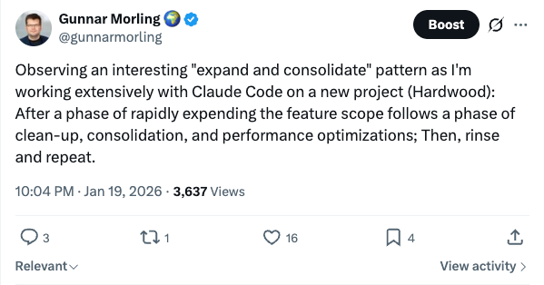
  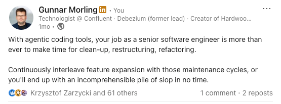
</div>

Note:
January, as an observation. August, as a job description: make time for
clean-up, interleaved with feature work, "or you'll end up with an
incomprehensible pile of slop in no time."

It isn't only hygiene. The agent works worse on a messy codebase too.

One rule in my agent instructions exists for this: search for existing patterns
in the same class or package before writing new code, and extract repeated
logic instead of duplicating it. Ordinary advice for humans, load-bearing for
agents.

---

<!-- .slide: class="hero-image" -->

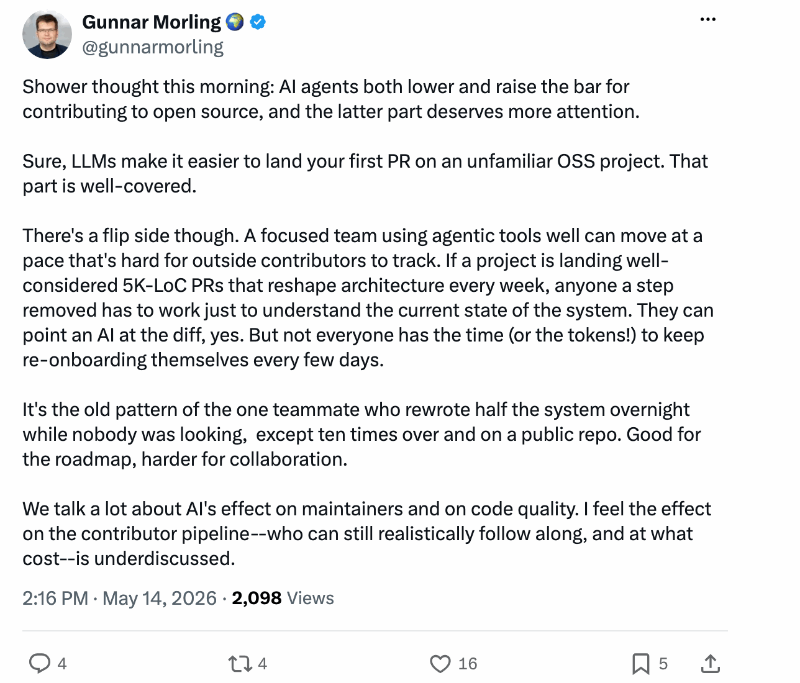

Note:
A cost that lands on other people: at agent speed, anyone a step removed has to
work just to understand the current state of the system.

For consultancies: the colleague joining mid-project, and the client team you
hand the code over to.

---

## Nine months

<div class="columns nine-months">
<div>

| | |
|---|---|
| Commits | 1,039 |
| Main code (Java) | 91k lines |
| Test code | 90k lines |
| Design docs | 90 |
| Review files | 222 |
| Issues · PRs | 728 · 503 |

</div>
<div>
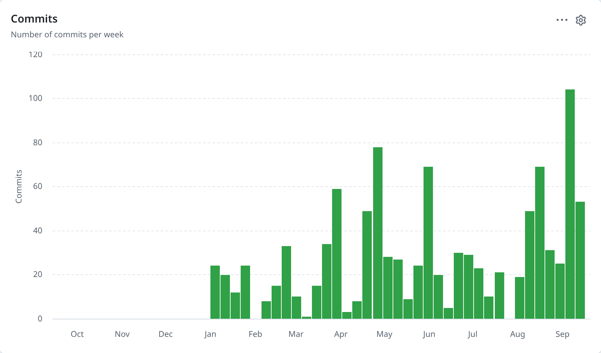
<p class="gh-caption">Commits per week, from GitHub, Sep 17</p>
</div>
</div>

Note:
The joy, in numbers: this is what one person built in nine months, next to a
day job. Don't read the table.

Point at test code being the same size as main code: that ratio is not
discipline, it is the only reason any of this was possible.

Counted Sep 17: commits on main; Java lines (including comments) under src/main
and src/test across all modules; design docs in _designs; review files in
_reviews; issues and PRs on GitHub.

The chart is GitHub's Insights > Commits (commits per week on the default branch),
screenshotted Sep 17. The tallest bar, about 100 commits, is the week the #1198
thread ran.

---

<!-- .slide: class="hero" data-background-image="images/sections/piano.jpg" data-background-opacity="0.10" -->

## AI lets you build things you otherwise just <em>wouldn't</em>.

<span class="credit-side">© OnceCaptured https://flic.kr/p/iiCcNU (CC BY 2.0)</span>

Note:
Photo: "Piano keys" by OnceCaptured (CC BY 2.0, https://flic.kr/p/iiCcNU), the
same backdrop as "I vibe-coded all of it": the note trainer thread comes back
without a word.

The joy. My own words from the post announcing the note trainer, but don't
show the post again: they've seen the project, and the piano is enough.

Their version: the internal tool nobody would staff, the pitch demo, the spike
nobody would fund. Now it's a weekend.

It's still fun.

---

<!-- .slide: class="hero" -->

## "Built with AI, not by AI" is a quality claim.

The agent owns more and more of the <em>how</em>.<br>It holds only if you're the arbiter of the <em>what</em>.

Note:
The title of this talk is a promise, the same one as the Feb 27 post: reviewed,
maintainable, correct. Like any claim, it has to be kept true.

Say the arbiter part as a role, not a loss: the answer to "what's left for us?"
You decide whether something is right, and whether it should exist at all.
"More and more": the core and the public API still get every diff.

The note trainer: never read the how, verified the what by playing it. Hardwood: the
agent writes the how, and everything in act three is machinery for verifying the
what. The geo PR: I checked the how and never asked about the what.

Loops are how you check the what without being the loop yourself.

Where the what gets written down: an issue, before any code exists. Nothing
starts without one, and every commit message carries its number. That isn't
bookkeeping — it's the claim, stated while I still have to think about it, and
it's what the diff gets reviewed against later.

---

<!-- .slide: class="hero" -->

# Review the claim, not the diff.

Note:
What the arbiter does in practice: the claim is the what, the diff is the how.
And it applies to the title too: "built with AI, not by AI" is a claim like any
PR description.

Let it stand alone. Don't add anything.

---

## Stop being the loop

<svg class="cycle cycle-monday" viewBox="0 80 1088 475" width="1088" height="475"><defs><marker id="cycle-head-monday" viewBox="0 0 10 10" refX="6" refY="5" markerWidth="3.2" markerHeight="3.2" orient="auto-start-reverse"><path d="M0 0 L10 5 L0 10 z" class="cycle-head"/></marker></defs><path class="cycle-arc" d="M581.0 186.3 L585.5 187.6 L589.9 189.1 L594.3 190.8 L598.7 192.7 L602.9 194.8 L607.1 197.0 L611.2 199.4 L615.2 201.9 L619.2 204.7 L623.0 207.5 L626.7 210.6 L630.3 213.7 L633.7 217.1 L637.1 220.5 L640.3 224.1 L643.3 227.8 L646.3 231.7 L649.0 235.6 L651.7 239.7 L654.1 243.9 L656.4 248.2 L658.6 252.5 L660.5 257.0 L662.3 261.6" marker-end="url(#cycle-head-monday)"/><path class="cycle-arc" d="M665.4 339.4 L663.9 344.2 L662.3 349.0 L660.4 353.7 L658.4 358.3 L656.2 362.8 L653.8 367.3 L651.3 371.7 L648.5 375.9 L645.6 380.1 L642.5 384.2 L639.3 388.1 L635.9 391.9 L632.4 395.6 L628.7 399.2 L624.9 402.6 L620.9 405.8 L616.8 408.9 L612.6 411.9 L608.2 414.6 L603.7 417.3 L599.2 419.7 L594.5 422.0 L589.8 424.0 L584.9 425.9" marker-end="url(#cycle-head-monday)"/><path class="cycle-arc" d="M502.1 429.0 L497.0 427.4 L492.0 425.6 L487.0 423.7 L482.1 421.5 L477.3 419.2 L472.5 416.6 L467.9 413.9 L463.4 411.0 L458.9 407.9 L454.6 404.6 L450.5 401.2 L446.4 397.6 L442.5 393.8 L438.8 389.9 L435.2 385.8 L431.7 381.6 L428.4 377.2 L425.3 372.7 L422.4 368.1 L419.6 363.4 L417.0 358.5 L414.7 353.6 L412.5 348.5 L410.5 343.4" marker-end="url(#cycle-head-monday)"/><path class="cycle-arc" d="M407.4 255.6 L409.1 250.2 L411.0 244.9 L413.0 239.6 L415.3 234.4 L417.8 229.3 L420.5 224.3 L423.4 219.4 L426.5 214.7 L429.8 210.0 L433.3 205.4 L436.9 201.0 L440.8 196.8 L444.8 192.6 L448.9 188.7 L453.2 184.9 L457.7 181.2 L462.3 177.8 L467.1 174.5 L472.0 171.4 L477.0 168.5 L482.1 165.8 L487.4 163.3 L492.7 161.0 L498.1 158.9" marker-end="url(#cycle-head-monday)"/><text class="cycle-label" x="544" y="110" text-anchor="middle"><tspan class="cycle-num">1</tspan>  Build the <tspan class="cycle-em">feedback loop</tspan></text><text class="cycle-sub" x="544" y="140" text-anchor="middle">so the agent finds out it’s wrong</text><text class="cycle-label" x="734" y="304" text-anchor="start"><tspan class="cycle-num">2</tspan>  Make it <tspan class="cycle-em">fast</tspan></text><text class="cycle-sub" x="734" y="334" text-anchor="start">or it gets skipped</text><text class="cycle-label" x="544" y="512" text-anchor="middle"><tspan class="cycle-num">3</tspan>  Review what <tspan class="cycle-em">no feedback loop</tspan> can see</text><text class="cycle-sub" x="544" y="542" text-anchor="middle">that part stays with you</text><text class="cycle-label" x="354" y="304" text-anchor="end"><tspan class="cycle-num">4</tspan>  Raise the <tspan class="cycle-em">floor</tspan></text><text class="cycle-sub" x="354" y="334" text-anchor="end">make every correction stick</text></svg>

<div class="signoff fragment">
  <strong class="signoff-thanks">Thank you!</strong>
  
  <div>
    Gunnar Morling
    <span class="signoff-role">Technologist, Confluent</span>
    <span>morling.dev · hardwood.dev · @gunnarmorling</span>
  </div>
</div>

Note:
Straight after "Review the claim, not the diff." Keep it abrupt.

On arrival, one breath, no recap per step: "Build the feedback loop, make it
fast, review what no loop can see, and raise the floor. Stop being the loop."

Click as you finish that sentence, and say it while the photo comes in: "I'm
Gunnar Morling, I work as a Technologist at Confluent. Thank you."

Then stop talking. No "any questions?"; the moderator takes it from there.
Leave this slide up through the applause and the questions.

---


<!-- .slide: class="section backburner" data-visibility="uncounted" -->

# Backburner

Note:
Not part of the talk. Candidates that might come back in; everything after this
slide is out of the running order.

---


<!-- .slide: data-visibility="uncounted" -->

## What did Hardwood cost?

<span class="subtitle">At API list prices, Jan 4 to Sep 17</span>

<svg class="proto " viewBox="0 0 1100 470" width="1100" height="470"><defs><pattern id="cost-hatch" width="8" height="8" patternUnits="userSpaceOnUse" patternTransform="rotate(45)"><rect width="8" height="8" fill="#f3e3dc"/><line x1="0" y1="0" x2="0" y2="8" stroke="#b5491f" stroke-opacity="0.35" stroke-width="3"/></pattern></defs><line x1="80" y1="410.0" x2="950" y2="410.0" stroke="#e5e7eb" stroke-width="1"/><text x="68" y="416.0" text-anchor="end" class="p-sub" fill="#666666">$0k</text><line x1="80" y1="312.5" x2="950" y2="312.5" stroke="#e5e7eb" stroke-width="1"/><text x="68" y="318.5" text-anchor="end" class="p-sub" fill="#666666">$5k</text><line x1="80" y1="215.0" x2="950" y2="215.0" stroke="#e5e7eb" stroke-width="1"/><text x="68" y="221.0" text-anchor="end" class="p-sub" fill="#666666">$10k</text><line x1="80" y1="117.5" x2="950" y2="117.5" stroke="#e5e7eb" stroke-width="1"/><text x="68" y="123.5" text-anchor="end" class="p-sub" fill="#666666">$15k</text><line x1="80" y1="20.0" x2="950" y2="20.0" stroke="#e5e7eb" stroke-width="1"/><text x="68" y="26.0" text-anchor="end" class="p-sub" fill="#666666">$20k</text><text x="80.0" y="440" text-anchor="middle" class="p-sub" fill="#666666">Jan</text><text x="175.2" y="440" text-anchor="middle" class="p-sub" fill="#666666">Feb</text><text x="270.3" y="440" text-anchor="middle" class="p-sub" fill="#666666">Mar</text><text x="375.7" y="440" text-anchor="middle" class="p-sub" fill="#666666">Apr</text><text x="477.6" y="440" text-anchor="middle" class="p-sub" fill="#666666">May</text><text x="583.0" y="440" text-anchor="middle" class="p-sub" fill="#666666">Jun</text><text x="684.9" y="440" text-anchor="middle" class="p-sub" fill="#666666">Jul</text><text x="790.3" y="440" text-anchor="middle" class="p-sub" fill="#666666">Aug</text><text x="895.6" y="440" text-anchor="middle" class="p-sub" fill="#666666">Sep</text><polygon points="80.0,410.0 80.0,404.8 83.4,402.1 86.8,398.1 90.2,394.1 93.6,394.1 97.0,394.1 100.4,394.1 103.8,389.2 107.2,388.9 110.6,388.7 114.0,388.3 117.4,388.3 120.8,388.3 124.2,387.3 127.6,386.7 131.0,382.8 134.4,382.8 137.8,382.8 141.2,380.9 144.6,380.7 148.0,380.7 151.4,380.7 154.8,377.7 158.2,377.2 161.6,377.2 165.0,375.3 168.4,372.9 171.8,369.3 175.2,369.3 178.6,369.3 182.0,369.3 185.4,369.3 188.8,369.3 192.1,369.3 195.5,369.3 198.9,369.3 202.3,369.3 205.7,369.3 209.1,367.8 212.5,367.1 215.9,367.1 219.3,367.0 222.7,366.6 226.1,364.4 229.5,363.5 232.9,363.2 236.3,362.6 239.7,360.6 243.1,360.4 246.5,359.1 249.9,356.3 253.3,354.4 256.7,354.2 260.1,353.2 263.5,353.0 266.9,351.7 270.3,351.1 273.7,347.2 277.1,346.8 280.5,346.8 283.9,346.8 287.3,346.8 290.7,346.8 294.1,346.8 297.5,346.8 300.9,346.8 304.3,343.2 307.7,343.2 311.1,343.2 314.5,343.2 317.9,343.2 321.3,342.8 324.7,341.5 328.1,340.2 331.5,340.2 334.9,340.0 338.3,336.3 341.7,335.8 345.1,335.3 348.5,331.8 351.9,331.2 355.3,330.1 358.7,328.0 362.1,323.1 365.5,320.3 368.9,315.0 372.3,313.4 375.7,311.5 379.1,311.3 382.5,311.3 385.9,311.3 389.3,311.3 392.7,311.3 396.1,311.3 399.5,311.2 402.9,311.2 406.2,311.2 409.6,311.2 413.0,311.2 416.4,311.2 419.8,311.0 423.2,311.0 426.6,311.0 430.0,310.4 433.4,310.3 436.8,303.5 440.2,301.4 443.6,300.1 447.0,298.1 450.4,291.5 453.8,290.6 457.2,290.6 460.6,278.8 464.0,276.8 467.4,272.1 470.8,270.4 474.2,268.9 477.6,266.4 481.0,266.1 484.4,266.1 487.8,265.7 491.2,263.1 494.6,262.8 498.0,261.8 501.4,261.8 504.8,261.2 508.2,261.2 511.6,253.0 515.0,249.0 518.4,247.5 521.8,247.3 525.2,247.2 528.6,247.1 532.0,247.1 535.4,247.0 538.8,247.0 542.2,247.0 545.6,247.0 549.0,247.0 552.4,247.0 555.8,247.0 559.2,247.0 562.6,246.9 566.0,246.9 569.4,244.4 572.8,243.0 576.2,241.7 579.6,240.8 583.0,240.7 586.4,239.9 589.8,237.3 593.2,235.3 596.6,233.1 600.0,232.5 603.4,231.6 606.8,231.6 610.2,231.6 613.6,231.6 617.0,230.7 620.4,230.4 623.8,230.2 627.1,230.1 630.5,230.0 633.9,230.0 637.3,230.0 640.7,230.0 644.1,230.0 647.5,230.0 650.9,229.5 654.3,229.5 657.7,229.5 661.1,228.1 664.5,227.4 667.9,226.2 671.3,225.1 674.7,223.8 678.1,223.7 681.5,221.4 684.9,221.2 688.3,214.4 691.7,214.4 695.1,214.0 698.5,211.6 701.9,211.1 705.3,211.1 708.7,210.8 712.1,210.8 715.5,209.3 718.9,207.2 722.3,207.2 725.7,207.1 729.1,207.1 732.5,205.9 735.9,205.8 739.3,205.8 742.7,204.1 746.1,204.1 749.5,203.8 752.9,203.8 756.3,203.7 759.7,203.7 763.1,199.2 766.5,199.0 769.9,199.0 773.3,199.0 776.7,199.0 780.1,199.0 783.5,199.0 786.9,199.0 790.3,199.0 793.7,199.0 797.1,199.0 800.5,197.8 803.9,197.6 807.3,197.4 810.7,197.0 814.1,195.8 817.5,195.4 820.9,195.4 824.3,195.4 827.7,195.4 831.1,195.4 834.5,195.4 837.9,195.4 841.2,195.4 844.6,195.4 848.0,195.4 851.4,195.4 854.8,195.4 858.2,195.4 861.6,195.4 865.0,195.4 868.4,195.4 871.8,195.4 875.2,195.4 878.6,195.4 882.0,195.4 885.4,195.4 888.8,195.4 892.2,195.4 895.6,195.4 899.0,195.4 902.4,195.4 905.8,195.4 909.2,195.4 912.6,195.4 916.0,195.4 919.4,195.4 922.8,195.4 926.2,195.4 929.6,195.4 933.0,195.4 936.4,195.4 939.8,195.4 943.2,195.4 946.6,195.4 950.0,195.4 950.0,410.0" fill="url(#cost-hatch)"/><polyline points="80.0,404.8 83.4,402.1 86.8,398.1 90.2,394.1 93.6,394.1 97.0,394.1 100.4,394.1 103.8,389.2 107.2,388.9 110.6,388.7 114.0,388.3 117.4,388.3 120.8,388.3 124.2,387.3 127.6,386.7 131.0,382.8 134.4,382.8 137.8,382.8 141.2,380.9 144.6,380.7 148.0,380.7 151.4,380.7 154.8,377.7 158.2,377.2 161.6,377.2 165.0,375.3 168.4,372.9 171.8,369.3 175.2,369.3 178.6,369.3 182.0,369.3 185.4,369.3 188.8,369.3 192.1,369.3 195.5,369.3 198.9,369.3 202.3,369.3 205.7,369.3 209.1,367.8 212.5,367.1 215.9,367.1 219.3,367.0 222.7,366.6 226.1,364.4 229.5,363.5 232.9,363.2 236.3,362.6 239.7,360.6 243.1,360.4 246.5,359.1 249.9,356.3 253.3,354.4 256.7,354.2 260.1,353.2 263.5,353.0 266.9,351.7 270.3,351.1 273.7,347.2 277.1,346.8 280.5,346.8 283.9,346.8 287.3,346.8 290.7,346.8 294.1,346.8 297.5,346.8 300.9,346.8 304.3,343.2 307.7,343.2 311.1,343.2 314.5,343.2 317.9,343.2 321.3,342.8 324.7,341.5 328.1,340.2 331.5,340.2 334.9,340.0 338.3,336.3 341.7,335.8 345.1,335.3 348.5,331.8 351.9,331.2 355.3,330.1 358.7,328.0 362.1,323.1 365.5,320.3 368.9,315.0 372.3,313.4 375.7,311.5 379.1,311.3 382.5,311.3 385.9,311.3 389.3,311.3 392.7,311.3 396.1,311.3 399.5,311.2 402.9,311.2 406.2,311.2 409.6,311.2 413.0,311.2 416.4,311.2 419.8,311.0 423.2,311.0 426.6,311.0 430.0,310.4 433.4,310.3 436.8,303.5 440.2,301.4 443.6,300.1 447.0,298.1 450.4,291.5 453.8,290.6 457.2,290.6 460.6,278.8 464.0,276.8 467.4,272.1 470.8,270.4 474.2,268.9 477.6,266.4 481.0,266.1 484.4,266.1 487.8,265.7 491.2,263.1 494.6,262.8 498.0,261.8 501.4,261.8 504.8,261.2 508.2,261.2 511.6,253.0 515.0,249.0 518.4,247.5 521.8,247.3 525.2,247.2 528.6,247.1 532.0,247.1 535.4,247.0 538.8,247.0 542.2,247.0 545.6,247.0 549.0,247.0 552.4,247.0 555.8,247.0 559.2,247.0 562.6,246.9 566.0,246.9 569.4,244.4 572.8,243.0 576.2,241.7 579.6,240.8 583.0,240.7 586.4,239.9 589.8,237.3 593.2,235.3 596.6,233.1 600.0,232.5 603.4,231.6 606.8,231.6 610.2,231.6 613.6,231.6 617.0,230.7 620.4,230.4 623.8,230.2 627.1,230.1 630.5,230.0 633.9,230.0 637.3,230.0 640.7,230.0 644.1,230.0 647.5,230.0 650.9,229.5 654.3,229.5 657.7,229.5 661.1,228.1 664.5,227.4 667.9,226.2 671.3,225.1 674.7,223.8 678.1,223.7 681.5,221.4 684.9,221.2 688.3,214.4 691.7,214.4 695.1,214.0 698.5,211.6 701.9,211.1 705.3,211.1 708.7,210.8 712.1,210.8 715.5,209.3 718.9,207.2 722.3,207.2 725.7,207.1 729.1,207.1 732.5,205.9 735.9,205.8 739.3,205.8 742.7,204.1 746.1,204.1 749.5,203.8 752.9,203.8 756.3,203.7 759.7,203.7 763.1,199.2 766.5,199.0 769.9,199.0 773.3,199.0 776.7,199.0 780.1,199.0 783.5,199.0 786.9,199.0 790.3,199.0 793.7,199.0 797.1,199.0 800.5,197.8 803.9,197.6 807.3,197.4 810.7,197.0 814.1,195.8 817.5,195.4 820.9,195.4" fill="none" stroke="#b5491f" stroke-width="2" stroke-dasharray="6 5"/><polygon points="820.9,195.4 820.9,195.4 824.3,193.1 827.7,192.6 831.1,191.4 834.5,191.3 837.9,191.3 841.2,191.1 844.6,191.1 848.0,189.9 851.4,184.0 854.8,180.8 858.2,173.8 861.6,163.8 865.0,163.4 868.4,162.4 871.8,159.9 875.2,159.5 878.6,158.4 882.0,156.3 885.4,151.2 888.8,150.7 892.2,149.8 895.6,148.9 899.0,148.8 902.4,148.8 905.8,147.1 909.2,132.9 912.6,132.5 916.0,121.3 919.4,115.8 922.8,110.0 926.2,99.3 929.6,94.2 933.0,91.3 936.4,91.3 939.8,86.5 943.2,81.0 946.6,80.6 950.0,80.6 950.0,195.4" fill="#b5491f" fill-opacity="0.85"/><line x1="80" y1="410.0" x2="950" y2="410.0" stroke="#354045" stroke-width="2"/><text x="962.0" y="88.6" class="p-big" fill="#354045">$17k</text><text x="302.3" y="276.9" text-anchor="middle" class="p-label" fill="#666666">extrapolated</text><text x="302.3" y="302.9" text-anchor="middle" class="p-sub" fill="#666666">lines added × $0.052 per line</text><text x="806.9" y="131.4" text-anchor="end" class="p-label" fill="#b5491f">measured</text><text x="806.9" y="157.4" text-anchor="end" class="p-sub" fill="#666666">$5,887 in 5½ weeks →</text></svg>

Note:
Q&A backup, for "what did it cost?". Measured: every API response in the session transcripts since Aug 10
(when the kept transcripts start), priced at list prices: Opus 5 at $5/$25 per
million tokens, cache writes 1.25x (5 min) or 2x (1 h), cache reads 0.1x.
$5,887 for Hardwood work, talk sessions excluded. Most of it is cache
reads: long contexts re-sent every turn.

Extrapolated: before Aug 10, each week's lines added on main (data files, reviews
and the talk excluded) times the measured cost per line added,
$0.052. That assumes spring cost per line was like August's; the models
and the way of working were different, so treat the hatched part as an order of
magnitude.

Say it as "on the order of $17k at API list prices". It isn't what I
paid: a subscription costs a fraction. And it's only the sessions in this
container.